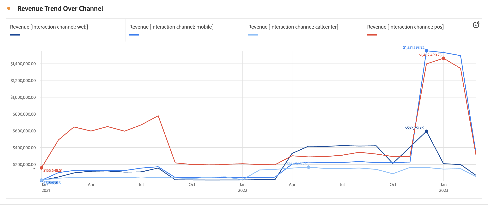

# Líneas {#line}

<!-- markdownlint-disable MD034 -->

>[!CONTEXTUALHELP]
>id="workspace_line_button"
>title="Líneas"
>abstract="Cree una visualización de líneas que muestre cómo cambian los valores con el paso del tiempo. Una visualización de líneas solo se puede usar cuando se utiliza el tiempo como dimensión."

<!-- markdownlint-enable MD034 -->

La visualización  **[!UICONTROL Line]** representa las métricas con una línea para mostrar cómo cambian los valores con el paso del tiempo. Una visualización de líneas solo se puede utilizar cuando se utiliza el tiempo como dimensión.

<!--
>[!NOTE]
>
>The Line visualization soon feature [intelligent captions](/help/analysis-workspace/visualizations/intelligent-captions.md).

The Line visualization represents metrics using a line to show how values change over a period of time. A line chart can be used only when time is used as a dimension.
-->

## Configuración

Como parte de [configuración de visualización](freeform-analysis-visualizations.md#settings), hay disponible una configuración de visualización de línea específica.

| Configuración | Descripción |
|---|---|
| **[!UICONTROL Granularidad]** | Seleccione en la lista desplegable de granularidad para cambiar una visualización de tendencias de diaria a semanal, mensual, etc. La granularidad también se actualiza en la tabla del origen de datos. |
| **[!UICONTROL Mostrar mín.]**  **[!UICONTROL Mostrar máx.]** | Puede superponer una etiqueta de valor mínimo y máximo para resaltar los valores mínimo y máximo de una métrica. Los valores mínimo/máximo se derivan de los puntos de datos visibles en la visualización, no del conjunto completo de valores dentro de una dimensión.  |
| **[!UICONTROL Mostrar línea de tendencia]** | Puede elegir agregar una regresión o una línea de tendencia de promedio móvil a la serie de líneas. Las líneas de tendencia ayudan a mostrar un patrón más claro en los datos. Cuando esté seleccionado, seleccione un modelo de la lista. Consulte [Modelos](#models) para obtener una descripción general y detallada de los modelos disponibles. . |

>[!TIP]
>
>Se recomienda aplicar las líneas de tendencia a datos que no incluyan fechas de hoy (datos parciales) o futuras. Las fechas actuales o futuras distorsionan la línea de tendencia. Sin embargo, si necesita incluir fechas futuras, quite ceros de los datos para evitar que se distorsione durante esos días. Vaya a la tabla de fuente de datos de la visualización, elija la columna de métrica y, a continuación, habilite **[!UICONTROL Configuración de columna]** > **[!UICONTROL Interpretar cero como sin valor]**.

### Modelos

Todas las líneas de tendencia del modelo de regresión se ajustan con los mínimos cuadrados normales:

| Modelo | Descripción |
| --- | --- |
| **[!UICONTROL Lineal]** | Cree una línea recta de mejor ajuste para conjuntos de datos lineales simples y resulta útil cuando los datos aumentan o disminuyen a una velocidad constante. Ecuación: `y = a + b * x` |
| **[!UICONTROL Logarítmico]** | Cree una línea curva que se ajuste mejor y que sea útil cuando la velocidad de cambio de los datos aumenta o disminuye rápidamente y luego se nivela. Una línea de tendencia logarítmica puede utilizar valores negativos y positivos. Ecuación: `y = a + b * log(x)` |
| **[!UICONTROL Exponencial]** | Crea una línea curva y resulta útil cuando los datos suben o bajan a tasas de crecimiento constantes. Esta opción no debe utilizarse si los datos contienen valores cero o negativos. Ecuación: `y = a + e^(b * x)` |
| **[!UICONTROL Potencia]** | Cree una línea curva y resulte útil para conjuntos de datos que comparan mediciones que aumentan a una velocidad específica. Esta opción no debe utilizarse si los datos contienen valores cero o negativos. Ecuación: `y = a * x^b` |
| **[!UICONTROL Cuadrático]** | Busca el mejor ajuste para un conjunto de datos con forma de parábola (cóncava arriba o abajo). Ecuación: `y = a + b * x + c * x^2` |
| **[!UICONTROL Promedio móvil]** | Cree una línea de tendencia suave basada en un conjunto de promedios. Un promedio móvil utiliza una cantidad determinada de puntos de datos (definida por su selección de [!UICONTROL Granularidad]), los promedia y utiliza el promedio como punto en la línea. Algunos ejemplos son un promedio móvil de siete días o un promedio móvil de cuatro semanas. |

>[!MORELIKETHIS]
>
>[Agregar una visualización a un panel](/help/analysis-workspace/visualizations/freeform-analysis-visualizations.md#add-visualizations-to-a-panel)
>[Configuración de visualización](/help/analysis-workspace/visualizations/freeform-analysis-visualizations.md#settings)
>[Menú contextual de visualización ](/help/analysis-workspace/visualizations/freeform-analysis-visualizations.md#context-menu)
>

