# Mapa {#map}

<!-- markdownlint-disable MD034 -->

>[!CONTEXTUALHELP]
>id="workspace_map_button"
>title="Mapa"
>abstract="Esta visualización representa las métricas superponiéndolas en un mapa. Esto resulta útil para identificar datos en diferentes regiones geográficas."

<!-- markdownlint-enable MD034 -->

<!-- markdownlint-disable MD034 -->

>[!CONTEXTUALHELP]
>id="workspace_map_bubbles"
>title="Burbujas"
>abstract="Trace eventos con burbujas."

<!-- markdownlint-enable MD034 -->

<!-- markdownlint-disable MD034 -->

>[!CONTEXTUALHELP]
>id="workspace_map_heatmap"
>title="Mapa térmico"
>abstract="Trace eventos con un mapa térmico."

<!-- markdownlint-enable MD034 -->

>[!BEGINSHADEBOX]

_Este artículo documenta la visualización de mapas en_  _&#x200B;**Customer Journey Analytics**._ _Consulte [Mapa](https://experienceleague.adobe.com/es/docs/analytics/analyze/analysis-workspace/visualizations/map-visualization) para la_  _&#x200B;**Adobe Analytics** de este artículo._

>[!ENDSHADEBOX]

La visualización  **[!UICONTROL Map]** en Analysis Workspace le permite crear un mapa visual de cualquier métrica (incluidas las métricas calculadas). Resulta útil para identificar y comparar datos de métricas entre diferentes regiones geográficas.

## Requisitos previos

### Añadir etiquetas de contexto en vistas de datos

En la configuración de vistas de datos de Customer Journey Analytics, los administradores pueden agregar [etiquetas de contexto](/help/data-views/component-settings/overview.md) a una dimensión o métrica y los servicios de Customer Journey Analytics como la visualización [!UICONTROL map] pueden usarlas para sus fines.

#### Etiquetas de contexto requeridas para latitud y longitud en la visualización de mapas

Se requieren etiquetas de contexto para que funcione la visualización del mapa. Sin las siguientes etiquetas de contexto presentes, la visualización del mapa no funciona, ya que no hay datos de latitud y longitud con los que trabajar.

* [!UICONTROL Información geográfica: Latitud]
* [!UICONTROL Información geográfica: Longitud]

Para agregar estas etiquetas de contexto:

1. En Customer Journey Analytics, seleccione **[!UICONTROL Administración de datos]** > **[!UICONTROL Vistas de datos]**.

1. En la página Vistas de datos, seleccione la vista de datos que contiene los datos que desea analizar en la visualización de mapas.

1. Seleccione la pestaña **[!UICONTROL Componentes]**.

1. (Condicional) Si utiliza la SDK web y ha configurado la latitud y longitud para que se rellenen en el flujo de datos, o si utiliza el conector de Source de Analytics para rellenar datos de evento, los campos de latitud y longitud ya deben estar disponibles en el esquema y rellenarse con las etiquetas de contexto correctas.

   Busque estos campos de esquema **[!UICONTROL Latitud]** y **[!UICONTROL Longitud]** (en **[!UICONTROL Conjuntos de datos de eventos]** > **[!UICONTROL placeContext]** > **[!UICONTROL geo]** > **[!UICONTROL _schema]**) y arrástrelos a la vista de datos como dimensiones si aún no están presentes.

   Cuando estos campos de esquema existen como dimensiones en la vista de datos, sus etiquetas de contexto se aplican automáticamente y la visualización de mapas los utiliza sin ninguna configuración adicional.

   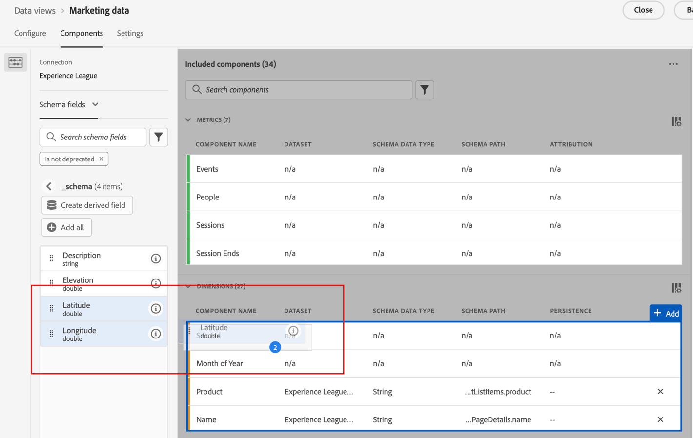

1. (Condicional) Si tiene dimensiones personalizadas que desea utilizar para los datos de latitud y longitud, puede configurar las etiquetas de contexto en los campos personalizados:

   1. En la sección **[!UICONTROL Dimensiones]**, seleccione la dimensión que contiene los datos de longitud.

   1. En la sección **[!UICONTROL Configuración de componentes]** del carril derecho, en el campo **[!UICONTROL Etiquetas de contexto]**, empiece a escribir `Longitude` y, a continuación, selecciónelo en el menú desplegable.

      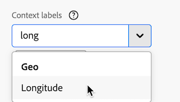

   1. Repita este proceso para agregar la etiqueta de contexto **[!UICONTROL Latitude]** a la dimensión que contiene los datos de latitud.

   1. (Opcional) De forma predeterminada, estas dimensiones son precisas para el nivel de ciudad o código postal en la visualización de mapa y muestran 2 decimales en los informes de Workspace. Puede ajustarlos para que tengan una precisión de un solo metro en la visualización del mapa y para mostrar 5 decimales en los informes de Workspace. Para obtener más información acerca de cómo ajustar el nivel de precisión, vea [Configurar ubicaciones precisas para dimensiones](#configure-precise-locations-for-dimensions).

1. Seleccione **[!UICONTROL Guardar y continuar]** > **[!UICONTROL Guardar y finalizar]**.

#### Etiquetas de contexto necesarias para las plantillas geográficas

Adobe proporciona [plantillas prediseñadas](/help/analysis-workspace/templates/use-templates.md#web-audience) que utilizan la visualización de mapas. Para utilizar cada plantilla, debe agregar la etiqueta de contexto correspondiente a una dimensión en la vista de datos.

A continuación se muestran las plantillas y la etiqueta de contexto necesaria. Sin estas etiquetas presentes, las plantillas no funcionan, ya que no hay datos geográficos con los que trabajar.

| Nombre de plantilla | Etiqueta de contexto requerida |
|---------|----------|
| Países geográficos | [!UICONTROL Información geográfica: País geográfico] |
| Regiones geográficas | [!UICONTROL Información geográfica: Región geográfica] |
| Ciudades geográficas | [!UICONTROL Ciudad geográfica: Ciudad geográfica] |
| Estados geográficos de EE. UU. | [!UICONTROL Geo: Geo State] |
| DMA de EE. UU. geográfico | [!UICONTROL Geo: Geo Dma] |

Para agregar estas etiquetas de contexto:

1. En Customer Journey Analytics, seleccione **[!UICONTROL Administración de datos]** > **[!UICONTROL Vistas de datos]**.

1. En la página Vistas de datos, seleccione la vista de datos que contiene los datos que desea analizar con plantillas creadas previamente que utilizan la visualización de mapas. En esta vista de datos, elija cinco dimensiones: una con los datos de país, otra con los datos de región, otra con los datos de ciudad, otra con los datos de estado y otra con los datos DMA. A continuación, etiquete esas dimensiones con la etiqueta de contexto correspondiente.

1. Seleccione la pestaña **[!UICONTROL Componentes]**.

1. (Condicional) Si utiliza Web SDK y ha configurado campos geográficos para que se rellenen en el flujo de datos, o si utiliza el conector de Source de Analytics para rellenar datos de evento, los campos geográficos ya deben estar disponibles en el esquema y rellenarse con las etiquetas de contexto correctas.

   Busque los campos de esquema adecuados, como **[!UICONTROL Ciudad]**, **[!UICONTROL Código postal]**, **[!UICONTROL Estado o provincia]** (en **[!UICONTROL Conjuntos de datos de eventos]** > **[!UICONTROL placeContext]** > **[!UICONTROL geo]**), y arrástrelos a la vista de datos como dimensiones si aún no están presentes.

   Cuando estos campos de esquema existen como dimensiones en la vista de datos, sus etiquetas de contexto se aplican automáticamente y las plantillas geográficas los utilizan sin ninguna configuración adicional.

   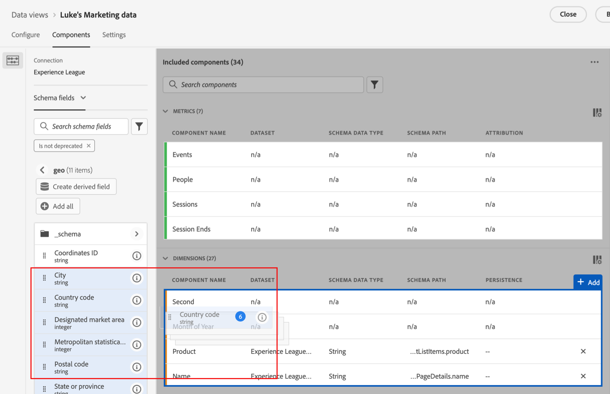

1. (Condicional) Si tiene dimensiones personalizadas que desea utilizar para los datos geográficos, puede configurar las etiquetas de contexto en los campos personalizados:

   1. Seleccione la dimensión que contiene los datos del país.

   1. En la sección **[!UICONTROL Configuración de componentes]** del carril derecho, en el campo **[!UICONTROL Etiquetas de contexto]**, empiece a escribir `Geo Country` y, a continuación, selecciónelo en el menú desplegable.

      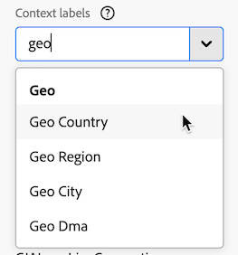

   1. Repita este proceso para agregar la etiqueta de contexto **[!UICONTROL Geo: Geo Region]**, **[!UICONTROL Geo: Geo City]**, **[!UICONTROL Geo: Geo State]** y **[!UICONTROL Geo: Dma]** a cada dimensión que contenga los datos correspondientes.

1. Seleccione **[!UICONTROL Guardar y continuar]** > **[!UICONTROL Guardar y finalizar]**.

### Los controladores gráficos deben admitir la representación WebGL

La visualización de mapas utiliza WebGL para la visualización de gráficos. Si los controladores de gráficos no admiten el procesamiento WebGL, es posible que tenga que actualizar los controladores.

## Visualización de mapas en Customer Journey Analytics frente a Adobe Analytics

La visualización de mapas en Customer Journey Analytics difiere de la visualización de mapas en Adobe Analytics de las siguientes maneras:

| Función | Customer Journey Analytics | Adobe Analytics |
|---------|----------|---------|
| Fuente de datos | Utilice cualquier segmento disponible en la vista de datos como fuente de datos. | Proporciona las siguientes opciones: <ul><li>Latitud/longitud móvil</li><li>Dimension geográfico Representa datos de segmentación geográfica según la ubicación de los visitantes, en función de su dirección IP. </li></ul> |
| Precisión | Para conjuntos de datos con precisión profunda, puede configurar las dimensiones en la vista de datos para mostrar hasta 5 decimales. Esto permite que la visualización del mapa sea precisa en un solo metro. 
Para obtener más información, vea [Configurar ubicaciones precisas para las dimensiones](#configure-precise-locations-for-dimensions).
 | Los datos son precisos para los niveles [!UICONTROL País], [!UICONTROL Región] y [!UICONTROL Ciudad]. (No se desciende al nivel del código postal ni DMA). |
| Creación de segmentos a partir de una selección | Cree un segmento basado en un área específica que seleccione en la visualización de mapas. 
Para obtener más información, consulte [Crear un segmento a partir de la visualización del mapa](#create-a-segment-from-the-map-visualization).
 | Cree un segmento basado en los datos de los que se informa en la visualización de mapas en general. |
| Crear una audiencia a partir de una selección | Cree una audiencia basada en un área específica que seleccione en la visualización de mapas. 
Para obtener más información, consulte [Crear una audiencia a partir de la visualización del mapa](#create-an-audience-from-the-map-visualization). | No se puede crear una audiencia a partir de la visualización del mapa. |
| Crear una tendencia a partir de una selección | Cree una visualización de gráfico de líneas de tendencias en función de un área específica que seleccione en la visualización de mapas. 
Para obtener más información, consulte [Crear un gráfico de líneas de tendencias a partir de la visualización del mapa](#create-a-trended-line-chart-from-the-map-visualization). <!-- is this correct? --> | No se puede crear una tendencia desde la visualización del mapa. |
| Añadir un desglose de una selección | Desglose un elemento de dimensión, métrica, segmento o intervalo de fechas específico dentro de un área específica que seleccione en la visualización de mapas. 
Para obtener más información, consulte [Agregar un desglose desde la visualización del mapa](#add-a-breakdown-from-the-map-visualization). | No se puede añadir un desglose desde la visualización del mapa. |

## Creación de una visualización de mapas {#begin-building-map}

<!-- markdownlint-disable MD034 -->

>[!CONTEXTUALHELP]
>id="workspace_map_panel"
>title="Configurar la visualización del mapa"
>abstract="Elija la métrica o métrica calculada que se utiliza como base para la visualización del mapa. También puede añadir un segmento si desea centrarse en un subconjunto específico de los datos.
Puede actualizar esta información en cualquier momento después de que se genere la visualización.
"

<!-- markdownlint-enable MD034 -->

1. Seleccione el icono [!UICONTROL **Visualizaciones**] en el carril izquierdo y, a continuación, arrastre la visualización **[!UICONTROL Mapa]**  a un panel que contenga una tabla de forma libre.

   O bien

   Agregue una visualización de mapa de cualquiera de las formas descritas en la sección [Agregar visualizaciones a un panel](/help/analysis-workspace/visualizations/freeform-analysis-visualizations.md#add-visualizations-to-a-panel) de [Información general sobre visualizaciones](/help/analysis-workspace/visualizations/freeform-analysis-visualizations.md).

   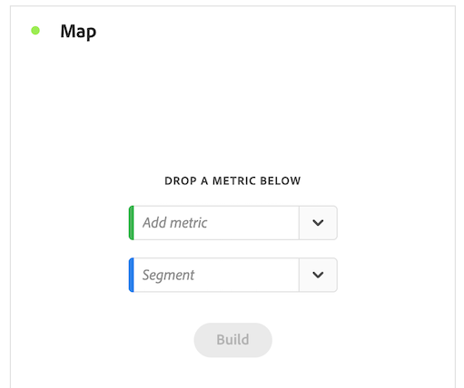{width="50%"}

1. Especifique la siguiente información básica para configurar la visualización de mapas:

   * **[!UICONTROL Agregar métrica]**: en la lista desplegable de métricas, seleccione una métrica o métrica calculada. (También puede arrastrar una métrica desde el carril izquierdo).

     >[!IMPORTANT]
     >
     >Si elige una métrica que tiene [atribución aplicada](/help/data-views/component-settings/attribution.md#attribution-models), la misma atribución se aplica a los pares de latitud y longitud dentro de la ventanilla actual de la visualización del mapa.
     >

     <!-- Only choose metrics that use Last Touch as the [attribution model](/help/data-views/component-settings/attribution.md#attribution-models) (this is the default attribution model for all metrics). Choosing a metric that has an attribution model other than Last Touch results in inaccurate map data, because attribution is applied to the latitude and longitude pairs. -->

   * **[!UICONTROL Agregar segmento]**: (Opcional) En la lista desplegable de segmento, seleccione un segmento. O bien arrastre un segmento desde la lista de segmentos.

   Puede actualizar esta información una vez creada la visualización seleccionando el icono Editar  en el encabezado de la visualización.

1. Seleccione **[!UICONTROL Generar]**.

   Se genera una visualización de mapa del mundo con burbujas.

   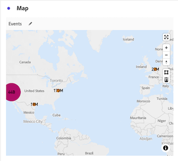

1. Continúe con [Ver una visualización de mapa](#view-a-map-visualization) y [Configurar opciones de visualización](#configure-visualization-settings).

## Visualización de una visualización de mapas

1. Si aún no lo ha hecho, cree una visualización de mapas como se describe en [Crear una visualización de mapas](#begin-building-a-map-visualization).

1. En la visualización de mapas de Analysis Workspace, realice una de las siguientes acciones:

   * **Acercar**: puede acercar el mapa para ampliar ciertas áreas de cualquiera de las siguientes maneras:

      * Haga doble clic en el mapa con el ratón.

      * Utilice la rueda de desplazamiento del ratón o una acción similar en el panel táctil.

      * Seleccione el icono de signo + 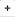 en la visualización del mapa.

     El mapa amplía en consecuencia. La dimensión requerida (país > estado > ciudad) se actualiza automáticamente, en función del nivel de zoom.

   * **Alejar**: puede alejar el mapa para ver áreas más grandes de cualquiera de las siguientes maneras:

      * Mantenga pulsada la tecla Mayús y haga doble clic en el mapa con el ratón.

      * Utilice la rueda de desplazamiento del ratón o una acción similar en el panel táctil.

      * Seleccione el icono menos 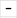 en la visualización del mapa.

     El mapa amplía en consecuencia. La dimensión requerida (país > estado > ciudad) se actualiza automáticamente, en función del nivel de zoom.

   * **Rotar**: Puede girar el mapa en 2D o 3D manteniendo pulsada la tecla [!UICONTROL Ctrl] mientras arrastra el mapa con el ratón.

     Para restablecer la alineación norte del mapa, seleccione el icono de brújula 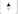.

   * **Herramienta de selección**: Puede seleccionar un área del mapa para [crear un segmento](#create-a-segment-from-the-map-visualization), [crear una tendencia](#create-a-trended-line-chart-from-the-map-visualization) o [agregar un desglose](#add-a-breakdown-from-the-map-visualization).

     Haga clic en la herramienta de selección 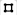 y, a continuación, arrastre el ratón para seleccionar el área que desee.

   * **Comparar**: Puede comparar dos o más visualizaciones de mapas en el mismo proyecto colocándolas una al lado de la otra.

   * **Mostrar comparaciones período tras período (por ejemplo, año tras año)**:

      * Mostrar números negativos.

        Por ejemplo, si planea crear una métrica año tras año, el mapa puede mostrar -33 % en Nueva York.

      * En cuanto a las métricas que son de tipo *por ciento*, el clústering calcula la media total de los porcentajes.

      * El esquema de colores verde y rojo indica positivo y negativo.

   * **Configuración de visualización adicional**: seleccione el icono Configuración  en el encabezado de visualización para ver la configuración adicional para la visualización de mapas. Para obtener más información, consulte [Configurar opciones de visualización](#configure-visualization-settings).

1. **Guardar** el proyecto para guardar la configuración completa del mapa (coordenadas, zoom, rotación).
1. (Opcional) La tabla de forma libre debajo de la visualización se puede rellenar arrastrando dimensiones de ubicación y métricas desde el carril izquierdo.

## Configuración de visualización

Para configurar los ajustes de la visualización de mapas:

1. En Analysis Workspace, abra una visualización de mapas existente o [cree uno nuevo](#begin-building-a-map-visualization).

1. Pase el ratón sobre la visualización del mapa y luego seleccione el icono Configuración  en el encabezado de la visualización.

   Las opciones disponibles son las siguientes:

   | Sección | Configuración | Descripción |
   | --- |--- |--- |
   | **[!UICONTROL Tipo de mapa]** | | |
   | | **[!UICONTROL Burbujas]** | Representa los eventos mediante burbujas. Un gráfico de burbujas es un gráfico multivariable a medio camino entre un diagrama de dispersión y un gráfico de superficie proporcional. Esta es la vista predeterminada. |
   | | **[!UICONTROL Mapa de calor]** | Representa los eventos mediante un mapa de calor. Se trata de una representación gráfica de datos que muestra como colores los valores individuales contenidos en una matriz. |
   | **[!UICONTROL Estilos]** | | |
   | | **[!UICONTROL Tema de color]** | Muestra el esquema de colores para el mapa de calor y las burbujas. Puede elegir entre Coral, Rojos, Verdes o Azules. El color predeterminado es Coral. |
   | | **[!UICONTROL Estilo de mapa]** | Puede elegir entre Básico, Calles, Brillante, Claro, Oscuro y Satélite. |
   | | **[!UICONTROL Radio de clúster]** | Agrupar los puntos de datos que se hallan dentro de un radio de píxeles definido. El valor predeterminado es 50.
Esta opción solo está disponible cuando **[!UICONTROL Burbujas]** está seleccionado como **[!UICONTROL Tipo de mapa]**.
 |
   | | **[!UICONTROL Valor máximo personalizado]** | Permite modificar el umbral para el valor máximo del mapa. Al ajustar este valor, se ajusta la escala de los valores (color y tamaño) de las burbujas o del mapa de calor en relación con el valor máximo personalizado que se haya definido. |
   | | **[!UICONTROL Mostrar anotaciones]** | Muestra las anotaciones realizadas para esta visualización. |
   | | **[!UICONTROL Ocultar título]** | Oculta el título de la visualización. |

## Configuración de ubicaciones precisas para dimensiones

Si tiene conjuntos de datos personalizados con precisión profunda, puede configurar la visualización de mapas para lograr la precisión de ubicación en un solo metro.

1. En Customer Journey Analytics, seleccione **[!UICONTROL Administración de datos]** > **[!UICONTROL Vistas de datos]**.

1. Seleccione la vista de datos que contiene las dimensiones que desea configurar para utilizar ubicaciones más precisas.

1. En la vista de datos, seleccione la pestaña **[!UICONTROL Componentes]**.

1. Seleccione las dimensiones que esté utilizando para la latitud y longitud que desee configurar. Para obtener más información acerca de las dimensiones que está usando, vea [Etiquetas de contexto necesarias para latitud y longitud en la visualización de mapas](#required-context-labels-for-latitude-and-longitude-in-the-map-visualization).

1. Configure el nivel de precisión de la dimensión:

   1. Con la dimensión que desea configurar aún seleccionada, expanda la sección **[!UICONTROL Formato]** en el carril derecho.

      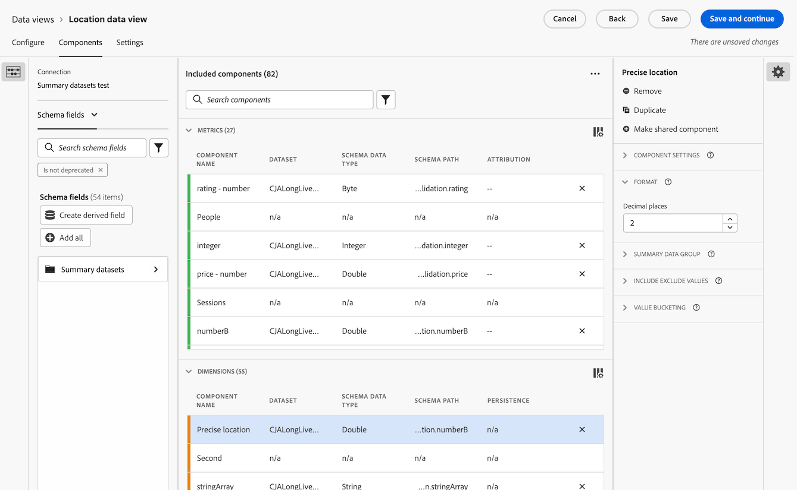

   1. En el campo **[!UICONTROL Cifras decimales]**, cambie el número de decimales para reflejar el nivel de precisión deseado:

      * **0:** precisa para la región o el nivel de país en la visualización del mapa. Muestra 0 decimales en los informes de Workspace.

      * **1:** Preciso para la región o el nivel de ciudad grande en la visualización del mapa.  Muestra 1 decimal en los informes de Workspace.

      * **2:** Preciso para el nivel de ciudad o código postal en la visualización de mapa. Muestra 2 decimales en los informes de Workspace.

        Esta es la selección predeterminada.

      * **3:** Preciso hasta el nivel de pueblo o barrio muy pequeño en la visualización del mapa. Muestra 3 decimales en los informes de Workspace.

      * **4:** precisa para un lote de terreno o nivel de edificio específico en la visualización del mapa. Muestra 4 decimales en los informes de Workspace.

      * **5:** Precisa hasta un solo medidor en la visualización del mapa. Muestra 5 decimales en los informes de Workspace.

1. Seleccione **[!UICONTROL Guardar y continuar]** > **[!UICONTROL Guardar y finalizar]**.

## Creación de segmentos a partir de la visualización de mapas {#map-create-segment}

Puede crear un segmento basado en un área específica que seleccione en la visualización de mapas. Cuando crea un segmento basado en un área seleccionada, cualquier dato que se encuentre dentro de la latitud y longitud de la selección se incluirá en el segmento.

Para crear un segmento a partir de la visualización de mapas:

1. Aplique el zoom o el desplazamiento al área del mapa que contiene los datos que desea utilizar para el segmento.

1. Realice cualquiera de los siguientes pasos:

   * **Para crear un segmento a partir de todo lo que se muestra actualmente en el mapa:** Haga clic con el botón secundario en cualquier lugar del mapa y, a continuación, seleccione **[!UICONTROL Crear segmento a partir de la vista actual]**.

   * **Para crear un segmento para un área más específica del mapa:** Haga clic en la herramienta de selección , arrastre el ratón para seleccionar el área deseada y, a continuación, seleccione **[!UICONTROL Crear segmento de selección]**.

1. Utilice el Generador de segmentos para definir el nuevo segmento. Para obtener más información, consulte [Generador de segmentos](/help/components/segments/seg-builder.md).

## Creación de una audiencia a partir de la visualización de mapas

Puede crear una audiencia basada en un área específica que seleccione en la visualización del mapa.

Para crear una audiencia a partir de la visualización del mapa:

1. Aplique el zoom o el desplazamiento al área del mapa que contiene los datos que desea utilizar para su audiencia.

1. Realice cualquiera de los siguientes pasos:

   * **Para crear una audiencia a partir de todo lo que se muestra actualmente en el mapa:** Haga clic con el botón secundario en cualquier lugar del mapa y, a continuación, seleccione **[!UICONTROL Crear audiencia a partir de la vista actual]**.

   * **Para crear una audiencia para un área más específica del mapa:** Haga clic en la herramienta de selección , arrastre el ratón para seleccionar el área deseada y, a continuación, seleccione **[!UICONTROL Crear audiencia a partir de la selección]**.

1. Utilice el Generador de audiencias para definir la nueva audiencia. Para obtener más información, consulte [Generador de audiencias](/help/components/audiences/publish.md#audience-builder) en [Crear y publicar audiencias](/help/components/audiences/publish.md)

## Creación de un gráfico de líneas de tendencias desde la visualización de mapas

Puede crear una visualización de gráfico de líneas de tendencias para los datos dentro de un área específica que seleccione en la visualización de mapas.

Para crear un gráfico de líneas de tendencias a partir de la visualización de mapas:

1. Aplique el zoom o el desplazamiento al área del mapa que contiene los datos que desea utilizar para el gráfico de líneas de tendencias.

1. Realice cualquiera de los siguientes pasos:

   * **Para crear un gráfico de líneas de tendencia a partir de todo lo que se muestra actualmente en el mapa:** Haga clic con el botón secundario en cualquier lugar del mapa y, a continuación, seleccione **[!UICONTROL Tendencia de la vista actual]**.

   * **Para crear un gráfico de líneas de tendencias para un área más específica del mapa:** Haga clic en la herramienta de selección , arrastre el mouse para seleccionar el área deseada y, a continuación, seleccione **[!UICONTROL Tendencia]**.

   Se crea una visualización de líneas que incluye una línea de tendencia. Para obtener más información sobre esta visualización, consulte [Línea](/help/analysis-workspace/visualizations/line.md).

<!--

Can you do this?

## Add a breakdown from the map visualization

You can break down a specific dimension item, metric, segment, or date range for the data within a designated area that you select in the map visualization.

To add a breakdown from the map visualization:

1. (Optional) Zoom in on the specific area of the map that contains the data where you want to add the breakdown.

1. Click the selection tool , then drag your mouse to select the desired area.

1. Select **[!UICONTROL Add breakdown]**. 

-->

<!--

Can you do this?

## Export the map visualization as a PDF

To export the map visualization in PDF format:

1. how...

-->

