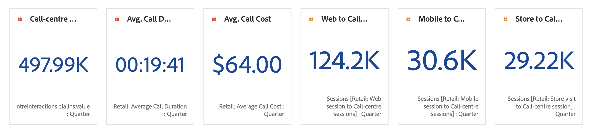

# Número de resumen y cambio de resumen

## Visualización Número de resumen {#summary-number}

Utilice la visualización Número de resumen para resaltar un gran número que es importante en un proyecto. Esta visualización se comporta de las siguientes maneras:

* Selecciona el total de la columna en caso de que no se haya seleccionado ninguna celda.
* Si se selecciona una única celda, se muestra el resumen de esta.
* Si se selecciona más de una celda, se muestra la primera celda seleccionada.
* Si se selecciona la columna, se usa el valor de la primera celda de la columna.

Haga clic en el botón **Configuración de visualización** vaya a la parte superior derecha para configurar la configuración de Número de resumen:

| Configuración | Definición |
|--- |--- |
| Porcentajes | Mostrar porcentajes en lugar de números sin procesar. |
| Leyenda visible | Muestre información sobre la métrica mostrada. |
| Valor abreviado | Elija abreviar los valores y mostrar hasta 3 decimales. |
| Valor de resumen por | Elija mostrar el máximo, el mínimo, la media, la mediana o la suma para una selección de datos. |

## Visualización Cambio de resumen {#summary-change}

Utilice la visualización Cambio de resumen para mostrar el delta (cambio) entre dos números. El color verde y rojo del cambio de resumen se puede controlar mediante [polaridad de evento personalizada](https://docs.adobe.com/content/help/es-ES/analytics/admin/admin-tools/success-events/success-event.html) o una métrica calculada [Mostrar tendencia ascendente como](https://docs.adobe.com/content/help/es-ES/analytics/components/calculated-metrics/calcmetric-workflow/cm-build-metrics.html) , seleccione una opción.

Esta visualización se comporta de las siguientes maneras:

* Si no se selecciona ninguna celda, compara los valores de las dos primeras celdas de la columna.
* Si se selecciona una celda, muestra 0, ya que compara el valor de celda con ella misma.
* Si se seleccionan dos celdas, la primera celda seleccionada se toma como numerador y la segunda como denominador.
* Si se seleccionan más de dos celdas, solo se tienen en cuenta las dos primeras para la comparación.
* Si se selecciona un intervalo de celdas, se compara la primera celda con la última seleccionada en el intervalo.
* Si se selecciona la columna, se compara el primer valor consigo mismo, lo que da como resultado un cambio de 0.

Haga clic en el botón **Configuración de visualización** vaya a la parte superior derecha para configurar los ajustes de Cambio de resumen:

| Configuración | Definición |
|--- |--- |
| Porcentajes | Mostrar porcentajes en lugar de números sin procesar. |
| Leyenda visible | Muestre información sobre la métrica mostrada. |
| Mostrar cambio de porcentaje | Muestra el cambio porcentual entre los 2 números. |
| Mostrar diferencia sin procesar | Muestra la diferencia en bruto entre los 2 números. También puede abreviar valores y mostrar hasta 3 decimales con esta opción. |
