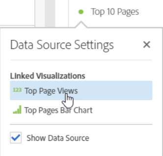

# Administración de fuentes de datos

La sincronización de visualizaciones le permite controlar qué tabla de datos o fuente de datos corresponde con una visualización.

**Sugerencia:** puede saber qué visualizaciones están relacionadas por el color del punto al lado del título. La coincidencia de colores significa que las visualizaciones están basadas en la misma fuente de datos.

Al administrar una fuente de datos, puede mostrar la fuente de datos o bloquear la selección. Esta configuración determina cómo cambia (o no) la visualización al introducir nuevos datos.

1. [Cree un proyecto](//help/analysis-workspace/home.md) con una tabla de datos y [una visualización](/help/analysis-workspace/visualizations/freeform-analysis-visualizations.md).
1. En la tabla de datos, seleccione las celdas (fuente de datos) que desee asociar con la visualización.
1. En la visualización, haga clic en el punto al lado del título para que aparezca el cuadro de diálogo **[!UICONTROL Fuente de datos]**. Seleccione **[!UICONTROL Mostrar fuente de datos]** o **[!UICONTROL Bloquear selección]**.

   

   Al sincronizar una visualización con una celda de tabla, se crea una nueva tabla (oculta) y se codifica con colores la visualización sincronizada con esa tabla.

| Elemento | Descripción |
|--- |--- |
| Visualizaciones conectadas | Si hay visualizaciones conectadas a una tabla improvisada o de cohorte, el punto superior izquierdo se abre para mostrar las visualizaciones conectadas, con una opción “mostrar” que muestra u oculta la tabla.  Al pasar el ratón por encima, se resalta la visualización vinculada y, al hacer clic en ella, se abre. |
| Mostrar fuente de datos | Le permite mostrar (al activar la casilla de verificación) u ocultar (al desactivarla) la tabla de datos correspondiente a la visualización. |
| Bloquear selección | Active este ajuste para bloquear la visualización de los datos seleccionados actualmente en la tabla de datos correspondiente. Una vez activado, elija entre:  <ul><li>**Posiciones seleccionadas**: elija esta opción si desea que la visualización permanezca bloqueada en las posiciones seleccionadas en la tabla de datos correspondiente. Estas posiciones seguirán visualizándose, incluso si cambian los elementos específicos de estas posiciones. Por ejemplo, elija esta opción si desea mostrar los cinco nombres de campaña principales en esta visualización en todo momento, independientemente de qué nombres de campaña se muestran en los cinco principales.</li> <li>**Elementos seleccionados**: elija esta opción si desea que la visualización permanezca bloqueada en elementos específicos seleccionados actualmente en la tabla de datos correspondiente. Estos elementos se seguirán visualizando, incluso si cambian su clasificación entre los elementos de la tabla. Por ejemplo, elija esta opción si desea mostrar los mismos cinco nombres de campaña específicos en esta visualización en todo momento, sin importar la posición en la clasificación de estos nombres en la campaña.</li></ul> |

La diferencia de esta nueva arquitectura con respecto a la anterior es que Analysis Workspace ya no crea una tabla oculta duplicada que almacena la selección bloqueada. Ahora, la fuente de datos apunta a la tabla desde la que creó la visualización.

**Casos de uso de ejemplo:**

* Puede crear una visualización de resumen y bloquearla en una celda de la misma tabla en la que la creó. Al activar “Mostrar fuente de datos”, se muestra la procedencia exacta de esta información en la tabla. Los datos de origen aparecerán atenuados:

   >
* Puede agregar muchas visualizaciones cuyo origen sean diferentes celdas de una misma tabla, como se muestra aquí. Esta tabla es la misma que en el ejemplo anterior, pero la celda de origen (y la métrica) es diferente:

   >
* Puede ver si existen visualizaciones conectadas a una tabla improvisada o de cohorte haciendo clic en el punto superior izquierdo (Configuración de fuente de datos). Al pasar el ratón por encima, se resalta la visualización vinculada y, al hacer clic en ella, se abre.

   >
