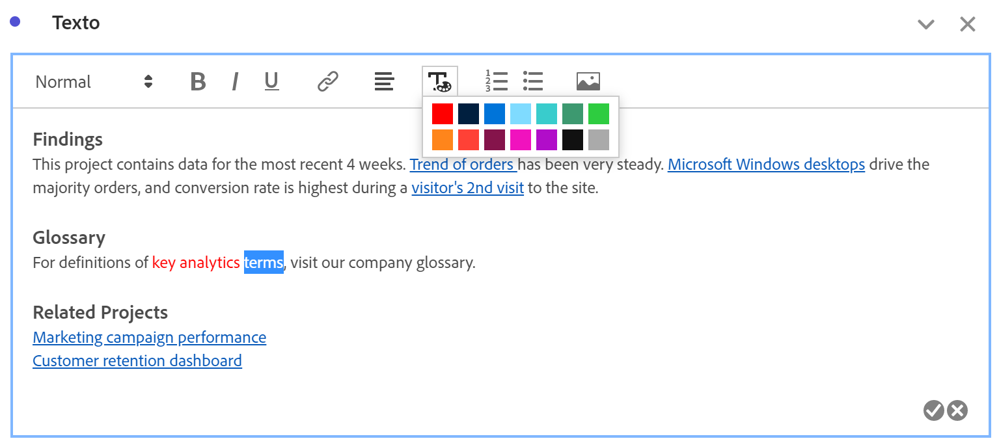
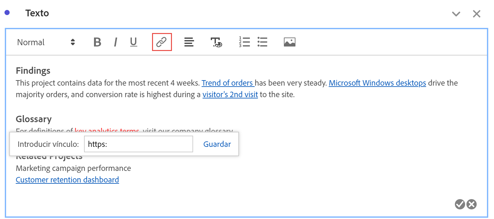
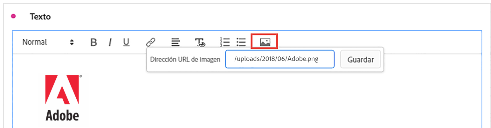

# Texto

Puede añadir texto definido por el usuario a su proyecto de Workspace mediante visualizaciones de texto o descripciones de panel/visualización (haga clic con el botón derecho en el encabezado > **[!UICONTROL Editar descripción]**). También puede cambiar el formato del texto, y añadir hipervínculos e imágenes.

## Ajuste del formato {#format}

Al editar el cuadro de texto o la descripción, puede ajustar el tamaño de fuente (niveles de encabezado), el color, el estilo (negrita, cursiva, subrayado) y la alineación del texto seleccionado. También puede añadir listas numeradas y con viñetas.

## Adición de hipervínculos {#hyperlinks}

Para añadir un hipervínculo, resalte el texto y haga clic en el icono de hipervínculo del menú. Los hipervínculos pueden vincularse a sitios web externos, páginas de documentación, [visualizaciones/paneles/proyectos de Workspace](https://experienceleague.adobe.com/docs/analytics/analyze/analysis-workspace/curate-share/shareable-links.html?lang=es) y mucho más para seguir ayudando a los destinatarios del proyecto.

## Adición de imágenes {#images}

Para añadir una imagen al proyecto, haga clic en el icono de imagen en el menú e inserte una URL de imagen pública. La dirección URL de la imagen debe ser de acceso público, comenzar por `https` y tener el formato `.png`, `.jpeg`, `.jpg` o `.gif`. Se admiten imágenes estáticas y animadas.

