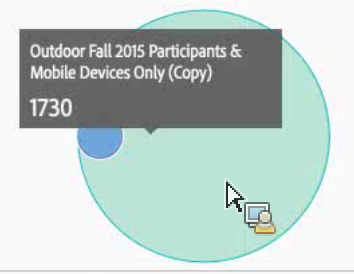
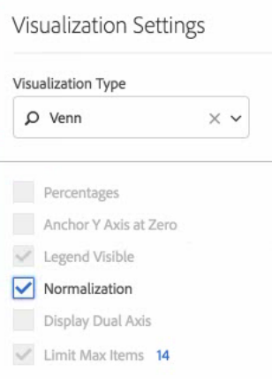

# Venn

La visualización Venn permite arrastrar hasta tres filtros (de Componentes) y una métrica para generar un diagrama de Venn.

A continuación, puede pasar el ratón por encima de los filtros para obtener más información sobre los porcentajes, etc.

Para transformar un diagrama de Venn en una tabla improvisada, haga clic en el punto de color al lado del encabezado de **[!UICONTROL Venn]** y seleccione **[!UICONTROL Administrar fuentes de datos]** > **[!UICONTROL Fuentes de datos disponibles]** > **[!UICONTROL Tabla de forma libre]**.

Para normalizar el diagrama de Venn (obtener su tamaño), vaya al icono de su Configuración de visualización y seleccione **[!UICONTROL Normalización]**.

