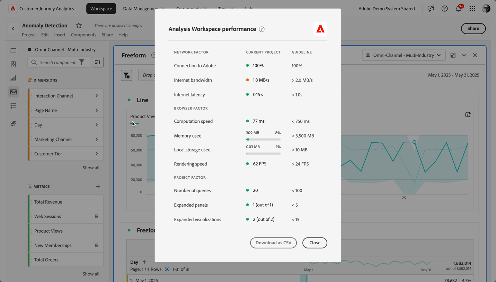

# Optimizar rendimiento de Analysis Workspace

Varios factores influyen en el rendimiento de un proyecto dentro de Analysis Workspace.  Para comprender estos factores, le ayudará a planificar y crear proyectos de la manera más óptima.

Para que insight gane en rendimiento con Analysis Workspace:

1. Seleccione **[!UICONTROL Ayuda] > [!UICONTROL Rendimiento]**.

   Puede ver un cuadro de diálogo modal que muestra los factores que afectan el rendimiento del proyecto, incluidos los de red, los del explorador y los del proyecto. Para obtener los resultados más precisos, deje que el proyecto se cargue antes que usted

   * La columna **[!UICONTROL Proyecto actual]** muestra los resultados del proyecto actual y el entorno del usuario.
   * La columna **[!UICONTROL Directriz]** muestra el umbral recomendado por Adobe para cada factor.

1. Seleccione **[!UICONTROL Descargar como CSV]** para descargar el informe de rendimiento y poder compartirlo dentro de su organización interna o con el servicio de asistencia de Adobe.

>[!NOTE]
>
>La información de la página Rendimiento varía cada vez que se abre el modal, ya que los factores están sujetos a cambios. Además, Adobe sigue perfeccionando las directrices proporcionadas a medida que se dispone de más datos.

## Factores de red

Los factores de red incluyen:

| Factor | Definición | Afectado por | Optimización |
| --- | --- | --- | --- |
| Conexión a Adobe | Adobe envía 10 llamadas de prueba cuando se abre la página de rendimiento. Estas llamadas representan el porcentaje de llamadas satisfactorias a Adobe. | Los problemas de Adobe o de red local afectan a este factor. | Consulte status.adobe.com para comprobar si hay algún problema de servicio conocido. A continuación, valide la conexión de red local. |
| Ancho de banda de internet | Disponible solo para Google Chrome. El cálculo del ancho de banda del explorador en su ubicación. La guía es de 2 MB/s. | La conexión de red local afecta a este factor. | Valide la conexión de red local. |
| Latencia de internet | Adobe envía 10 llamadas de prueba cuando se abre la página de rendimiento. Estas llamadas representan la cantidad de tiempo promedio que una solicitud tarda en llegar a Adobe y volver. Dicho de forma más sencilla, es una medida de la velocidad de Internet entre su ubicación y Adobe. La directriz es &lt;1 segundo. | Los problemas de red local, muchas fichas de explorador abiertas o problemas de Adobe afectan a este factor. | Consulte status.adobe.com para comprobar si hay algún problema de servicio conocido. A continuación, valide la conexión de red local y cierre las fichas del explorador que no se utilicen. |

## Factores del explorador

Los factores del explorador incluyen:

| Factor | Definición | Afectado por | Optimización |
| --- | --- | --- | --- |
| Velocidad de cómputo | La velocidad con la que el equipo hace una prueba de procesamiento. La guía es inferior a 750 milisegundos. | Su hardware y sus programas simultáneos afectan este factor. | Abra el Administrador de Tareas (PC) o el Monitor de Actividad (Mac) del equipo para determinar si se puede cerrar algún programa. A continuación, cierre las fichas del explorador que no se hayan utilizado u otros programas.   Si estas acciones no ayudan, comente los detalles de hardware con su equipo de TI. |
| Memoria utilizada | Disponible solo para Google Chrome. Cada ficha de Workspace de un navegador Google Chrome comparte 4 GB de memoria en total. Esta memoria utilizada representa el porcentaje de esa asignación de memoria que consume el proyecto actual. La guía es de 3500 MB, que es el punto en el que Workspace comienza a mostrar errores de memoria. | Trabajar en varias pestañas o descargar filas 50000 datos contribuye a aumentar el uso de la memoria. | Si recibe un error de memoria, cierre otras fichas de Workspace y/o ejecute 50 000 descargas de filas de a una por vez. |
| Almacenamiento local utilizado | Los datos almacenados localmente en el equipo para su uso en el explorador. Cada origen (por ejemplo, experience.adobe.com) tiene una asignación de 10 MB. | Analysis Workspace utiliza el almacenamiento local para varias funciones, como almacenar proyectos guardados automáticamente (existentes), ajustes del usuario y indicadores de características. | Para garantizar que la funcionalidad de Analysis Workspace no se interrumpa, borre el almacenamiento local del dominio experience.adobe.com. |
| Velocidad de procesamiento | FPS significa Fotogramas por segundo, que es la cantidad de veces por segundo que el navegador dibuja la página en la pantalla. 24 FPS es comúnmente lo que el ojo humano puede observar; si FPS es menor que 24 FPS, observará problemas de procesamiento en Workspace. | FPS se ve afectado por la multitarea en muchos proyectos de Workspace a la vez y por el tamaño del proyecto que se está viendo. Otros programas que se ejecutan en el equipo pueden tener un impacto, como flujo continuo, escáneres de fondo, etc. Además, el hardware influye en este factor. | Abra el Administrador de Tareas (PC) o el Monitor de Actividad (Mac) del equipo para determinar si se puede cerrar algún programa. A continuación, cierre las fichas del explorador que no se hayan utilizado u otros programas.   Si estas acciones no ayudan, comente los detalles de hardware con su equipo de TI. |

## Factores de proyecto

Los factores del proyecto incluyen:

| Factor | Definición | Optimización |
| --- | --- | --- |
| Número de solicitudes | Número total de solicitudes realizadas a Adobe para recuperar datos que se muestran en el proyecto. Las consultas incluyen solicitudes de clasificación para tablas, detección de anomalías, minigráficos, componentes mostrados en el carril izquierdo, etc. Este número excluye los paneles contraídos y las visualizaciones. La directriz es 100. | Simplifique el proyecto siempre que sea posible dividiendo los datos en varios proyectos que cumplan un propósito específico o un grupo de partes interesadas. Utilice las etiquetas para organizar los proyectos en temáticas y utilice la [vinculación directa](https://experienceleague.adobe.com/es/docs/analytics/analyze/analysis-workspace/curate-share/shareable-links) para crear una tabla de contenido interna que permita a los interesados encontrar con más facilidad lo que necesitan. |
| Paneles ampliados (de paneles totales) | Número de paneles ampliados, del número total de paneles del proyecto. La directriz es 5. | Después de dar los pasos necesarios para simplificar el proyecto, contraiga los paneles del proyecto que no necesitan visualizarse durante la carga. Cuando se abre el proyecto, solo se procesan los paneles expandidos. Los paneles contraídos no se procesan hasta que el usuario los expande. |
| Visualizaciones ampliadas (de visualizaciones totales) | Cantidad de tablas y visualizaciones expandidas del total del proyecto que incluye fuentes de datos ocultas. La directriz es 15. | Después de dar los pasos necesarios para simplificar el proyecto, contraiga las visualizaciones del proyecto que no necesitan visualizarse durante la carga. Priorice los elementos visuales que son más importantes para el consumidor del informe y desglose los elementos visuales de compatibilidad en un proyecto o panel diferente y más detallado, si es necesario. |
| Cantidad de celdas de forma libre | La cantidad total de celdas de tabla de forma libre en el proyecto, calculadas mediante filas * columnas en todas las tablas. Este número excluye las fuentes de datos ocultas. La directriz es 4000. | Reduzca la cantidad de columnas de la tabla a sólo los puntos de datos más relevantes. Reduzca la cantidad de filas de la tabla ajustando el número de filas mostradas, aplicando un filtro de tabla o aplicando un segmento. |
| Componentes disponibles | Cantidad total de componentes recuperados en el carril izquierdo del proyecto, en todos los grupos de informes del proyecto. Este número influye en la velocidad con la que se carga el carril izquierdo y en la velocidad con la que se devuelven los resultados de búsqueda dentro de él. La directriz es 2000. | Hable con el administrador del producto sobre la creación de un grupo de informes virtuales seleccionado que tenga un conjunto de componentes más personalizado. |
| Componentes utilizados | Cantidad total de componentes utilizados en el proyecto. La directriz es 100. | El número de componentes utilizados no influye directamente en el rendimiento. Sin embargo, la complejidad de esos componentes contribuye a la ejecución del proyecto. Vea las optimizaciones en la sección A[factores adicionales](#additional-factors) a continuación. |
| El intervalo de fecha más largo | Este factor muestra el intervalo de fechas más largo utilizado en el proyecto. La directriz es de 1 año. | Siempre que sea posible, no incorpore más datos de los que necesita. Reduzca el calendario del panel a las fechas relevantes para el análisis. O bien, utilice componentes del intervalo de fechas (componentes púrpura) en las tablas de forma libre. Los intervalos de fechas utilizados en una tabla anulan el intervalo de fechas del panel. Por ejemplo, puede agregar el mes pasado, la semana pasada y ayer a las columnas de la tabla para solicitar esos intervalos de datos específicos. Para obtener más información acerca del trabajo con intervalos de fechas en Analysis Workspace, consulte [este vídeo](https://experienceleague.adobe.com/es/docs/analytics-learn/tutorials/analysis-workspace/calendar-and-date-ranges/using-date-ranges-and-comparisons-in-analysis-workspace).   Además, minimice el número de comparaciones año tras año utilizadas en el proyecto. Cuando se calcula una comparación año tras año, la comparación analiza los 13 meses completos de datos entre los meses de interés. Esta comparación tiene el mismo impacto que cambiar el intervalo de fechas del panel a los últimos 13 meses. |

## Solicitar factores

Solicitar factores

Utilice el diagrama y los términos siguientes para conocer cómo se procesan las solicitudes y los distintos factores que influyen en los tiempos de procesamiento:

>[!NOTE]
>
>Las directrices recomendadas para estos factores se basan en una puntuación de complejidad de medio para las solicitudes de creación de informes.

### Diagrama del procesamiento de solicitudes

### Términos de procesamiento de solicitud

| Factor | Definición | Optimización |
| --- | --- | --- |
| [!UICONTROL **Tiempo promedio de solicitud**] | El tiempo necesario desde el momento en que se inicia la solicitud hasta el momento en que se completa. La guía es de 15 segundos. 
En el diagrama [Procesamiento de solicitudes](#request-processing-diagram) anterior, el tiempo de solicitud representa el proceso completo, desde la **solicitud de Analysis Workspace iniciada** hasta la **solicitud de Analysis Workspace completada**.
 |  |
| [!UICONTROL **Tiempo de solicitud más largo**] | El tiempo necesario desde el momento en que se inicia la solicitud hasta el momento en que se completa. 
En el diagrama [Procesamiento de solicitudes](#request-processing-diagram) anterior, el tiempo de solicitud representa el proceso completo, desde la **solicitud de Analysis Workspace iniciada** hasta la **solicitud de Analysis Workspace completada**.
 |  |
| [!UICONTROL **Tiempo medio de búsqueda**] | Dado que Analysis Workspace almacena únicamente el hash de las cadenas que se usen en cualquier segmento, cada vez que se procesa un proyecto, se realizan **búsquedas** para hacer coincidir los hash con los valores apropiados. La guía es de menos de 2 segundos.
Estas búsquedas pueden ser un proceso que consume muchos recursos, según el número de valores que podrían coincidir con el hash. 

En el diagrama [Procesamiento de solicitudes](#request-processing-diagram) anterior, el tiempo de búsqueda se representa en la fase **Búsquedas** (en el momento del procesamiento de **Motor de solicitudes**).
 | Si las solicitudes se están ralentizando aquí, probablemente se deba a que tiene demasiados segmentos de cadena en el proyecto o a que tiene cadenas con valores demasiado genéricos que tienen demasiadas coincidencias potenciales. |
| [!UICONTROL **Tiempo medio en cola**] | Tiempo total de espera en la cola antes de procesar las solicitudes. La guía es de 5 segundos.
En el diagrama [Procesamiento de solicitudes](#request-processing-diagram) anterior, el tiempo de cola se representa en la fase **Cola del motor de solicitudes** y en la fase **Cola del servidor**.
 | Si las solicitudes se ralentizan aquí, puede deberse a demasiadas solicitudes que se ejecutan simultáneamente en su organización. Intente ejecutar la solicitud en un momento de menor actividad. |
| [!UICONTROL **Tiempo medio de procesamiento del servidor**] | Cantidad media de tiempo que se tarda en procesar la solicitud.
En el diagrama [Procesamiento de solicitudes](#request-processing-diagram) anterior, el tiempo promedio de procesamiento del servidor se representa en la fase **Cola de servidores** y en la fase **Procesamiento de servidores**. La guía es de 10 segundos | Si las solicitudes se ralentizan aquí, es probable que el proyecto tenga intervalos de fechas demasiado largos o visualizaciones complejas. Intente acortar el intervalo de fechas del proyecto para reducir los tiempos de procesamiento. |
| [!UICONTROL **Complejidad**] | No todas las solicitudes requieren la misma cantidad de tiempo para procesarse. La complejidad de la solicitud puede ayudar a proporcionar una idea general sobre el tiempo necesario para procesar la solicitud. La directriz es Medium o inferior. 
Entre los posibles valores están:
 <ul><li>[!UICONTROL **Bajo**]</li><li>[!UICONTROL **Medio**]</li><li>[!UICONTROL **Alto**]</li></ul>Este valor se ve influido por los valores de las siguientes columnas:<ul><li>[!UICONTROL **Límites mensuales**]</li><li>[!UICONTROL **Columnas**]</li><li>[!UICONTROL **Segmentos**]</li></ul> |  |
| [!UICONTROL **Límites mensuales**] | El número de meses que se incluyen en una solicitud. Más límites de mes aumentan la complejidad de la solicitud. La directriz es 6 o menos. | Si las solicitudes se ralentizan aquí, puede deberse a que los límites de mes del proyecto son demasiado grandes. Intente reducir el número de meses. |
| [!UICONTROL **Columnas**] | El número de métricas y desgloses de la solicitud. Más columnas añaden complejidad a la solicitud. La directriz es 10 o menos. | Si las solicitudes se ralentizan aquí, puede deberse a que hay demasiadas columnas en el proyecto. Intente reducir el número de columnas. |
| [!UICONTROL **Segmentos**] | El número de segmentos aplicados a la solicitud. Más segmentos añaden complejidad a la solicitud. La directriz es 5 o menos. | Si las solicitudes se ralentizan aquí, puede deberse a que hay demasiados segmentos en el proyecto. Intente reducir el número de segmentos. |

## Factores adicionales

Otros factores que no se incluyen en Ayuda > Rendimiento son:

| Factor | Definición | Afectado por | Optimización |
| --- | --- | --- | --- |
| Complejidad de segmento | Los segmentos intrincados pueden tener un impacto significativo en el desempeño del proyecto. | Los factores que añaden complejidad a un segmento (en orden descendente de impacto) son: <ul><li>Los operadores de **[!UICONTROL contiene]**, **[!UICONTROL contiene cualquiera de]**, **[!UICONTROL coincide]**, **[!UICONTROL comienza con]** o **[!UICONTROL termina con]**/ </li><li>Segmentación secuencial, sobre todo cuando se utilizan restricciones de dimensión (Dentro/Después) </li><li>El número de elementos de dimensión únicos dentro de las dimensiones utilizadas en el segmento (por ejemplo, Página = &quot;A&quot; cuando Página tiene 10 elementos únicos es más rápido que Página = &quot;A&quot; cuando Página tiene 100000 elementos únicos) </li><li>El número de dimensiones diferentes utilizadas (por ejemplo, Página = &quot;Home&quot; y Página = &quot;Search results&quot; es más rápido que eVar 1 = &quot;red&quot; y eVar 2 = &quot;blue&quot;)</li><li>Muchos operadores OR (en lugar de AND)</li><li>Contenedores anidados que varían en ámbito (por ejemplo, Visita individual dentro de la visita dentro del visitante)</li></ul> | Aunque algunos de los factores de complejidad no se pueden prevenir, busque opciones para reducir la complejidad de sus segmentos. En general, cuanto más específico pueda ser con sus criterios de segmento, mejor. Por ejemplo:<ul><li>Con los contenedores, el uso de un solo contenedor en la parte superior del segmento es más rápido que una serie de contenedores anidados.</li><li>Con los operadores, **[!UICONTROL es igual que]** es más rápido que **[!UICONTROL contiene]**, y **[!UICONTROL es igual a cualquiera de]** es más rápido que **[!UICONTROL contiene cualquiera de]**.</li><li>Con muchos criterios, los operadores AND son más rápidos que varios operadores OR.</li></ul> Busque oportunidades para reducir muchas condiciones &quot;OR&quot; en una sola condición **[!UICONTROL es igual a cualquiera de]**. |
| Complejidad de la visualización (segmentos, métricas, filtros) | El tipo de visualización (por ejemplo, abandonos o tabla de forma libre) no influye mucho en el rendimiento del proyecto. La complejidad de la visualización se añade al tiempo de procesamiento. | Entre los factores que aumentan la complejidad de una visualización están:<ul><li>Intervalo de datos solicitado</li><li>El número de segmentos aplicados; por ejemplo, los segmentos utilizados como columnas de una tabla de forma libre.</li><li>Uso de segmentos complejos</li><li>Filas o columnas de [elementos manuales](https://experienceleague.adobe.com/es/docs/analytics/analyze/analysis-workspace/visualizations/freeform-table/column-row-settings/manual-vs-dynamic-rows) en tablas de forma libre</li><li>Los filtros aplicados a las filas de una tabla de forma libre.</li><li>El número de métricas incluidas, en especial las métricas calculadas que utilizan segmentos.</li></ul> | Si ha notado que sus proyectos no se cargan tan rápido como le gustaría, pruebe a sustituir algunos segmentos por eVars y filtros, si es posible.  Si usa constantemente segmentos y métricas calculadas para puntos de datos que son importantes para su negocio, plantéese mejorar su implementación para capturar estos puntos de datos de forma más directa. El uso de etiquetas en Adobe Experience Platform y de las reglas de procesamiento de Adobe pueden hacer que los cambios de implementación sean rápidos y sencillos. |
| Tamaño del conjunto de informes | Cantidad de datos recopilados en el grupo de informes. | - | Consulte con su equipo de implementación o con un experto en Adobe para determinar si se pueden realizar mejoras en la implementación para mejorar la experiencia general en Adobe Analytics. |
| Consultas concurrentes | Número de consultas que su organización solicita a Adobe al mismo tiempo. Cada organización tiene derecho a un mínimo de 5 consultas simultáneas. | Si un informe está tardando mucho tiempo, está en cola con otros informes, lo que significa que su organización está intentando ejecutar muchas solicitudes simultáneas en un grupo de informes específico. Las consultas pueden provenir de solicitudes de API, IU de informes (Analysis Workspace, Report Builder), proyectos programados, informes programados, alertas programadas y usuarios simultáneos que realizan solicitudes de informes. | Distribuya las solicitudes y programaciones del grupo de informes de forma más uniforme durante todo el día. Además, si es posible, cambie las solicitudes a horas de menor actividad. Lunes por la mañana, martes por la mañana y el primero de cada mes son las horas más ajetreadas para creación de informes. |

## Sugerencias para aumentar la productividad en Analysis Workspace

>[!BEGINSHADEBOX]

Vea  [Sugerencias para aumentar la productividad](https://video.tv.adobe.com/v/31157?quality=12&learn=on){target="_blank"} para ver un vídeo de demostración.

>[!ENDSHADEBOX]
