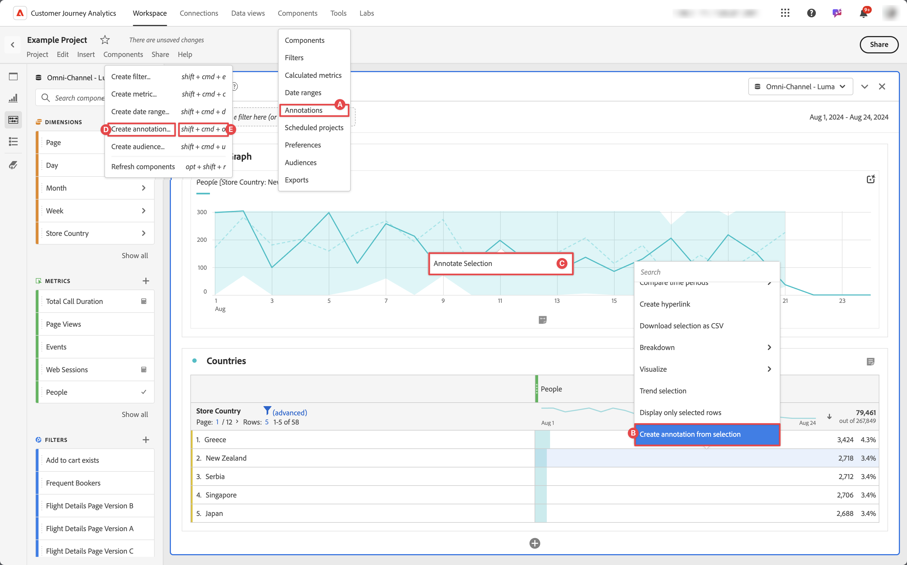
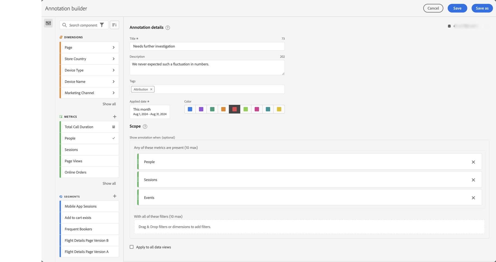
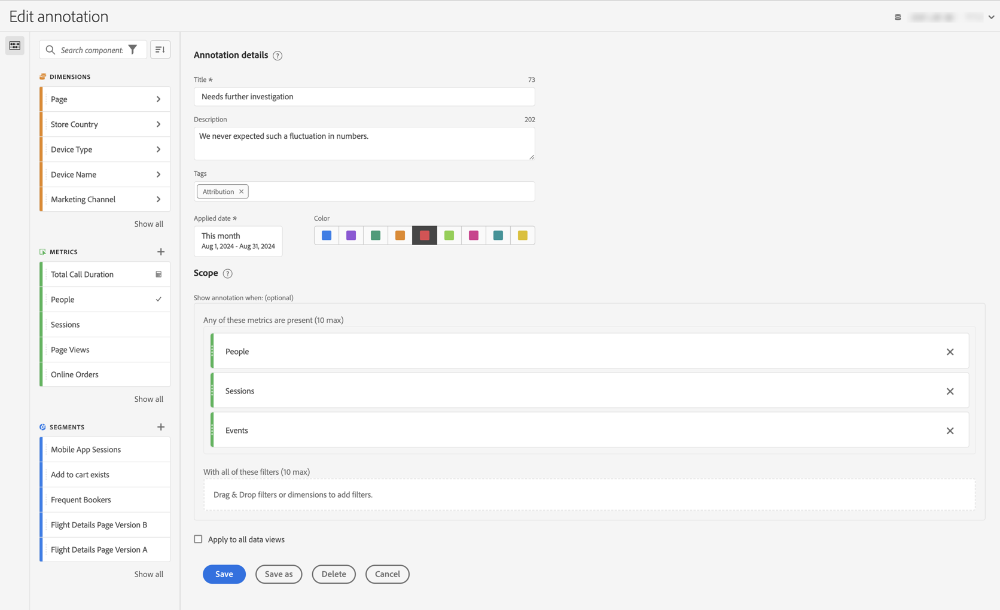

# Creación de anotaciones

De forma predeterminada, solo los administradores pueden crear anotaciones. Los usuarios tienen derechos para ver las anotaciones como lo hacen con otros componentes (como segmentos, métricas calculadas, etc.).

Sin embargo, los administradores pueden dar permiso a **[!UICONTROL Creación de anotaciones]** para **[!UICONTROL Herramientas de informes]** en **[!UICONTROL Editar permisos para el acceso de CJA Workspace]** a los usuarios a través del Admin Console. Consulta [Control de acceso de nivel de usuario](/help/technotes/access-control.md#user-level-access) para obtener más información.

Puedes crear una anotación de las siguientes maneras:

* **A**. En la interfaz principal, seleccione **[!UICONTROL Componentes]** y seleccione **[!UICONTROL Anotaciones]**. Selecciona  [!UICONTROL **[!UICONTROL Añadir]**] desde el administrador de[[!UICONTROL &#x200B; Anotaciones]](/help/components/annotations/manage-annotations.md).
* **B**. En un proyecto de Workspace, en el menú contextual de una visualización, seleccione **[!UICONTROL Crear anotación a partir de la selección]**.
* **C**. En un proyecto de Workspace, en el menú contextual de un gráfico de líneas, seleccione **[!UICONTROL Anotar selección]**.
* **D**. En un proyecto de Workspace, seleccione **[!UICONTROL Componentes]** en el menú, y **[!UICONTROL Crear anotación]**.
* **E**.  En un proyecto de Workspace, utilice el método abreviado **[!UICONTROL ctrl+mayús+o]** (Windows) o **[!UICONTROL mayús+comando+o]** (macOS).

Para definir la anotación, utilice el [[!UICONTROL Generador de anotaciones]](#annotation-builder).

<!-- Should we really mention API here. If so, we can do it all over the place in the docs...
| **Use the [Customer Journey Analytics Annotations API](https://developer.adobe.com/cja-apis/docs/endpoints/annotations/)** | The Customer Journey Analytics Annotations APIs allow you to create, update, or retrieve annotations programmatically through Adobe Developer. These APIs use the same data and methods that Adobe uses inside the product UI. |
-->

## Generador de anotaciones {#annotation-builder}

<!-- markdownlint-disable MD034 -->

>[!CONTEXTUALHELP]
>id="components_annotations_details"
>title="Detalles de anotación"
>abstract="Las anotaciones le permiten comunicar de forma eficaz los matices y perspectivas de datos contextuales a su organización. Permiten enlazar eventos de calendario con dimensiones/métricas específicas. "

<!-- markdownlint-enable MD034 -->

<!-- markdownlint-disable MD034 -->

>[!CONTEXTUALHELP]
>id="components_annotations_scope"
>title="Ámbito"
>abstract="El ámbito te permite personalizar qué datos se van a anotar. Las métricas y los segmentos calculados no heredarán automáticamente las anotaciones aplicadas a los componentes utilizados en sus definiciones. Puedes agregar nuevas métricas calculadas a la sección de ámbito de una anotación existente. Los nuevos segmentos requieren una nueva anotación."

<!-- markdownlint-enable MD034 -->

El cuadro de diálogo **[!UICONTROL Generador de anotaciones]** se usa para crear anotaciones nuevas o editar las existentes. El cuadro de diálogo se titula **[!UICONTROL Nueva anotación]** o **[!UICONTROL Editar anotación]** para las anotaciones que crees o administres desde el administrador de [[!UICONTROL Anotaciones]](/help/components/annotations/manage-annotations.md).

>[!BEGINTABS]

>[!TAB Creador de anotaciones]

>[!TAB Crear/Editar una anotación]

>[!ENDTABS]

1. Especifica los siguientes detalles ( es obligatorio):

   | Elemento | Descripción |
   | --- | --- |
   | **[!UICONTROL Vista de datos]** | Puedes seleccionar la vista de datos para la anotación. La anotación que definas estará disponible como anotación en los proyectos de Workspace en función de la vista de datos seleccionada. Se anula esta selección cuando se habilita [!UICONTROL Aplicar a todas las vistas de datos]. |
   | **[!UICONTROL Anotación solo de proyecto]** | Un cuadro de información para explicar que la anotación que crees solo está visible en el proyecto de Workspace en el que estás trabajando. Habilita **[!UICONTROL Hacer que esta anotación esté disponible para todos sus proyectos]**, para que la anotación sea visible para todos tus proyectos. Este cuadro de información solo está visible cuando se crea una anotación desde un proyecto de Workspace. |
   | **[!UICONTROL Título]**  | Asigna un nombre a la anotación como, por ejemplo, `Needs further investigation` |
   | **[!UICONTROL Descripción]** | Proporciona una descripción para la anotación, por ejemplo, `We never expected such a fluctuation in numbers.`. |
   | **[!UICONTROL Etiquetas]** | Organiza la anotación creando o aplicando una o varias etiquetas. Empieza a escribir para buscar las etiquetas existentes que puedes seleccionar. O presiona **[!UICONTROL Entrar]** para agregar una etiqueta nueva. Selecciona  para quitar una etiqueta. |
   | **[!UICONTROL Fecha de aplicación]**  | Selecciona la fecha o el intervalo de fechas que debe estar presente para que la anotación sea visible. Cuando se crea una anotación mediante el acceso directo, la anotación toma el valor predeterminado de un intervalo de datos solo para el día. Cuando se crea una anotación utilizando una selección en una visualización, la anotación toma el valor predeterminado del intervalo de datos en función del intervalo de fechas del panel al que pertenece la visualización. |
   | **[!UICONTROL Color]** | Aplique un color a la anotación. La anotación aparece en el proyecto con el color seleccionado. El color se puede utilizar para categorizar anotaciones, como festivos, eventos externos, problemas de seguimiento, etc. |
   | **[!UICONTROL Ámbito]** | Arrastra y suelta las métricas del panel de componentes que activan la anotación. Por ejemplo, Personas, Sesiones y Eventos. A continuación, arrastre y suelte las dimensiones o segmentos del panel de componentes que actúan como segmentos para determinar si desea mostrar o no la anotación. Si no especificas un ámbito, la anotación se aplicará a todos los datos.  Existen dos opciones:<ul><li>**[!UICONTROL Cualquiera de estas métricas está presente]**: arrastra y suelta hasta 10 métricas que activarán la anotación para mostrar. Por ejemplo, la métrica Ingresos ha dejado de recopilar datos para un intervalo de fechas específico. Arrastra la métrica Ingresos a este cuadro.</li><li>**[!UICONTROL Con todos estos segmentos]**: Arrastre y suelte hasta 10 dimensiones o segmentos que segmentan si se muestra la anotación.</li></ul>

**Nota:** Cualquier anotación aplicada a un componente que luego se utiliza como parte de una métrica calculada o definición de segmento NO hereda automáticamente la anotación. La métrica calculada deseada también debe agregarse a la sección de ámbito para mostrar la anotación. Sin embargo, se debe crear una nueva anotación para cualquier segmento que desee anotar con la misma información. Ejemplo: aplica una anotación a [!UICONTROL Pedidos] en un día específico. A continuación, utilice [!UICONTROL Pedidos] en una métrica calculada para el mismo intervalo de fechas. La nueva métrica calculada no muestra automáticamente la anotación de los pedidos. Agrega también la métrica calculada a la sección ámbito para que se muestre la anotación. |
   | **[!UICONTROL Aplicar a todas las vistas de datos]** | De forma predeterminada, la anotación se aplica a la vista de datos de origen. Al marcar esta casilla, puede hacer que la anotación se aplique a todas las vistas de datos de la compañía. |

   {style="table-layout:auto"}

1. Select
   * Selecciona **[!UICONTROL Guardar]** para guardar la anotación.
   * **[!UICONTROL Guardar como]** para guardar una copia de la anotación.
   * **[!UICONTROL Eliminar]** para eliminar una anotación.
   * **[!UICONTROL Cancelar]** para cancelar los cambios realizados en una anotación o cancelar la creación de una nueva anotación.
