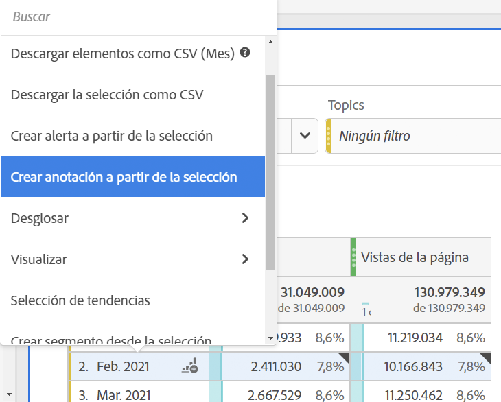
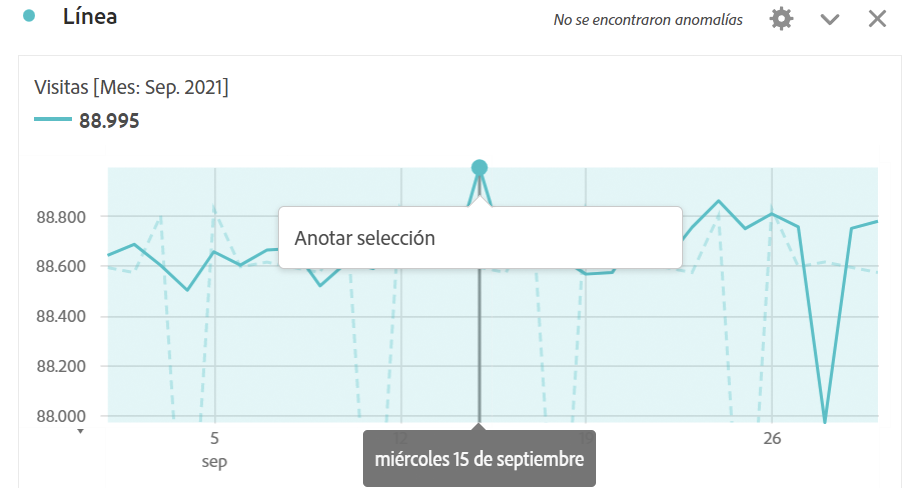
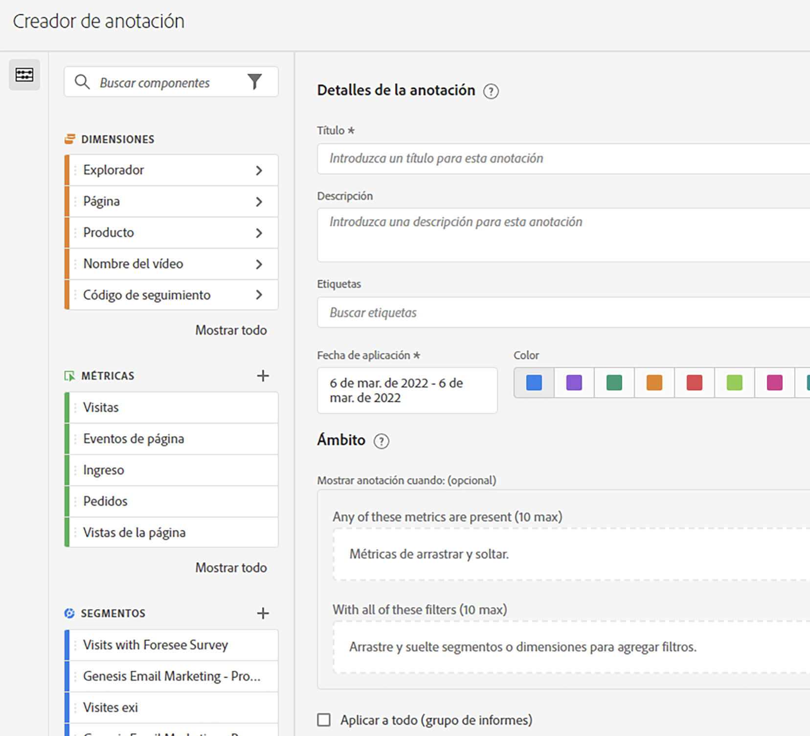

# Creación de anotaciones

1. Para crear anotaciones, tiene varias formas de empezar:

| Método de creación | Detalles |
| --- | --- |
| **Vaya a [!UICONTROL Componentes] > [!UICONTROL Anotación].** | Se abre la página Administrador de anotaciones. Haga clic en [!UICONTROL Crear nueva anotación] y se abrirá el [!UICONTROL Generador de anotaciones]. |
| **Haga clic con el botón derecho en un punto de una tabla.** | Se abre el [!UICONTROL Generador de anotaciones]. Tenga en cuenta que, de forma predeterminada, las anotaciones creadas de esta forma solo son visibles en el proyecto en el que se crearon. No obstante, puede ponerlas a disposición de todos los proyectos. Observe que las fechas y cualquier métrica, etc., ya se han rellenado.
 |
| **Haga clic con el botón derecho en un punto de un gráfico de [!UICONTROL Líneas].** | Se abre el [!UICONTROL Generador de anotaciones]. Tenga en cuenta que, de forma predeterminada, las anotaciones creadas de esta forma solo son visibles en el proyecto en el que se crearon. No obstante, puede ponerlas a disposición de todos los proyectos. Observe que las fechas y cualquier métrica, etc., ya se han rellenado.
 |
| **En Espacio de trabajo, vaya a [!UICONTROL Componentes] > [!UICONTROL Crear anotación].** | Se abre el [!UICONTROL Generador de anotaciones.] |
| **Utilice esta tecla de acceso directo** para abrir el Generador de anotaciones: (PC) `ctrl` `shift` + o, (Mac) `shift` + `command` + o | Tenga en cuenta que al utilizar la tecla de acceso directo para crear una anotación, se crea una anotación de un solo día para la fecha actual, sin ningún ámbito preseleccionado (métricas o dimensiones). |
| **Utilice la [API de anotaciones de CJA](https://developer.adobe.com/cja-apis/docs/endpoints/annotations/)** | Las API de anotaciones de CJA permiten crear, actualizar o recuperar anotaciones mediante programación a través de Adobe Developer. Estas API utilizan los mismos datos y métodos que el Adobe utiliza en la interfaz de usuario del producto. |

1. Rellene los elementos del [!UICONTROL Creador de anotaciones.]

   

   | Elemento | Descripción |
   | --- | --- |
   | [!UICONTROL Título] | Asigne un nombre a la anotación, por ejemplo, “Día de la Independencia”. |
   | [!UICONTROL Descripción] | (Opcional) Proporcione una descripción para la anotación, por ejemplo, “Día festivo celebrado en los Estados Unidos”. |
   | [!UICONTROL Etiquetas] | (Opcional) Organice las anotaciones creando o aplicando una etiqueta. |
   | [!UICONTROL Fecha de aplicación] | Seleccione la fecha o el intervalo de fechas que debe estar presente para que la anotación sea visible. |
   | [!UICONTROL Color] | Aplique un color a la anotación. La anotación aparece en el proyecto con el color seleccionado. El color se puede utilizar para categorizar anotaciones, como festivos, eventos externos, problemas de seguimiento, etc. |
   | [!UICONTROL Ámbito] | (Opcional) Arrastre y suelte las métricas que activan la anotación. A continuación, arrastre y suelte las dimensiones o segmentos que actúen como filtros (es decir, con los que la anotación será visible). Si no especifica un ámbito, la anotación se aplicará a todos los datos.<ul><li>**[!UICONTROL Cualquiera de estas métricas está presente]**: arrastre y suelte hasta 10 métricas que activarán la anotación para mostrar.</li><li>**[!UICONTROL Con todos estos filtros]**: arrastre y suelte hasta 10 dimensiones o segmentos que filtrarán cuando se muestre la anotación.</li></ul>
Casos de uso: una eVar ha dejado de recopilar datos para un intervalo de fechas específico. Arrastre la eVar al diálogo **[!UICONTROL Cualquiera de estas métricas está presente]**. O la métrica [!UICONTROL Visitas] no genera informes de ningún dato; siga el mismo proceso.
**Nota:** Cualquier anotación aplicada a un componente que luego se utiliza como parte de una métrica calculada o definición de segmento NO hereda automáticamente la anotación. La métrica calculada deseada también debe agregarse a la sección de ámbito para mostrar la anotación. Sin embargo, se debe crear una nueva anotación para cualquier segmento que desee anotar con la misma información.
Ejemplo: Aplica una anotación a [!UICONTROL Pedidos] en un día específico. A continuación, utilice [!UICONTROL Pedidos] en una métrica calculada para el mismo intervalo de fechas. La nueva métrica calculada no mostrará automáticamente la anotación de los pedidos; la métrica calculada también debe agregarse a la sección ámbito para que se muestre la anotación. |
   | [!UICONTROL Aplicar a todos los conjuntos de informes] | De forma predeterminada, la anotación se aplica al grupo de informes de origen. Al marcar esta casilla, puede hacer que la anotación se aplique a todos los grupos de informes de la compañía. |
   | [!UICONTROL Aplicar a todos los proyectos] | De forma predeterminada, la anotación se aplica al proyecto actual. Al marcar esta casilla, puede hacer que la anotación se aplique a todos los proyectos que posea. Tenga en cuenta que esta casilla de verificación solo aparece al iniciar el Generador de anotaciones desde el Creador de anotaciones. |

   {style=&quot;table-layout:auto&quot;}

1. Haga clic en **[!UICONTROL Guardar]**.
