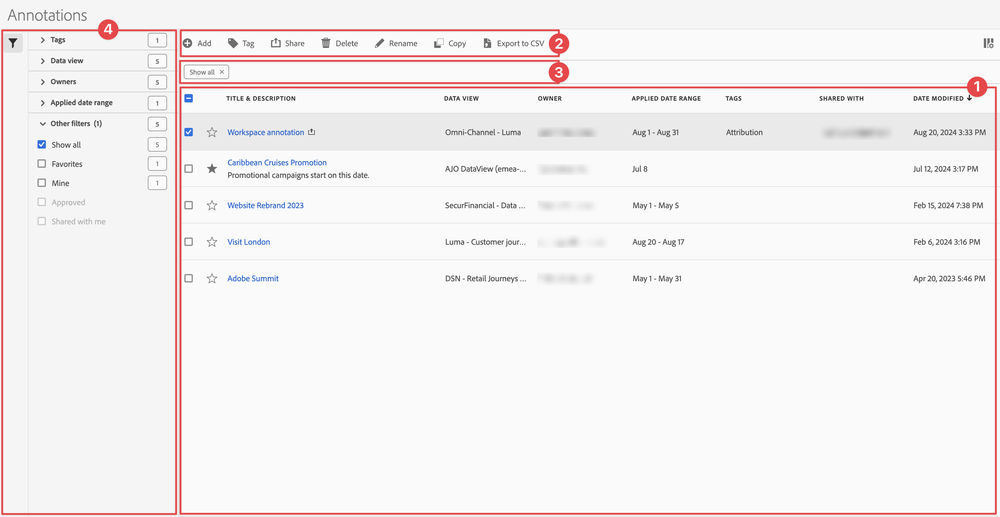

# Administración de anotaciones

Puede compartir, filtrar, etiquetar, aprobar, copiar, eliminar anotaciones y marcar anotaciones como favoritas desde una interfaz de administración central de [!UICONTROL Anotaciones]. Para administrar anotaciones:

* Seleccione **[!UICONTROL Componentes]** en la interfaz principal y luego seleccione **[!UICONTROL Anotaciones]**.

>[!NOTE]
>
>Las anotaciones que cree en un proyecto específico de Workspace no aparecerán en el administrador de [!UICONTROL Anotaciones], a menos que haya puesto la anotación a disposición de todos los proyectos.
>

## Administrador de anotaciones

El administrador Anotaciones tiene los siguientes elementos de interfaz:

### Lista de anotaciones

La lista de anotaciones ➊ muestra todas las anotaciones que posee, las anotaciones que se han asignado a todos los proyectos y las anotaciones que se han compartido con usted. La lista tiene las columnas siguientes:

| Columna | Descripción |
| --- | --- | 
|  | Seleccione para favorecer a  o para anular el favor de  de una anotación. |
| **[!UICONTROL Título y descripción]** | Aparecen en el Generador de anotaciones. Para editar el título y la descripción, seleccione el vínculo del título: abre el [Generador de anotaciones](/help/components/annotations/create-annotations.md#annotation-builder). Se indica una anotación compartida con . |
| **[!UICONTROL Vista de datos]** | Las vistas de datos a las que se aplica esta anotación. |
| **[!UICONTROL Propietario]** | El propietario de la anotación. Como usuario, solo verá las anotaciones que le pertenecen o las anotaciones que se han compartido con usted. |
| **[!UICONTROL Intervalo de fecha aplicado]** | La fecha o el intervalo de fechas al que se aplica esta anotación. |
| **[!UICONTROL Etiquetas]** | Las etiquetas de esta anotación. |
| **[!UICONTROL Compartido con]** | Las personas o grupos con los que compartió la anotación. Seleccione para abrir el cuadro de diálogo **[!UICONTROL Compartir componente]**. |
| **[!UICONTROL Fecha de modificación]** | Muestra la fecha y la hora de la última modificación de la anotación. |

{style="table-layout:auto"}

Use  para especificar qué columnas desea mostrar.

### Barra de acciones

Puede realizar acciones en las anotaciones mediante el ➋ de barra de acciones. La barra de acciones contiene las siguientes acciones:

| Acción | Descripción |
|---|---|
|  **[!UICONTROL Agregar]** | Agregue otra anotación con el [Generador de anotaciones](create-annotations.md#annotation-builder). |
|  [!UICONTROL *Buscar por título*] | Cuando no se selecciona ninguna anotación en la lista, busque anotaciones mediante este campo de búsqueda. |
|  **[!UICONTROL Etiqueta]** | Etiquetar las anotaciones seleccionadas. En el cuadro de diálogo **[!UICONTROL Componente de etiqueta]**, seleccione o anule la selección de las etiquetas para las anotaciones seleccionadas. Seleccione **[!UICONTROL Guardar]** para guardar las etiquetas de las anotaciones seleccionadas. |
|  **[!UICONTROL Compartir]** | Compartir las anotaciones seleccionadas. En el cuadro de diálogo **[!UICONTROL Compartir componente]**, puede  *Buscar individuos o grupos* o puede seleccionar **[!UICONTROL Organización]** o **[!UICONTROL Grupos]**. Seleccione **[!UICONTROL Guardar]** para guardar los detalles de uso compartido de las anotaciones seleccionadas. Consulte [Compartir anotaciones](#share-annotations) para obtener más información. |
|  **[!UICONTROL Eliminar]** | Eliminar las anotaciones seleccionadas. Se le pedirá una confirmación. |
|  **[!UICONTROL Cambiar nombre]** | Cambiar el nombre de una sola anotación seleccionada. Cuando se selecciona, puede cambiar el nombre de la anotación en línea. |
|  **[!UICONTROL Copiar]** | Copie las anotaciones seleccionadas. Las nuevas anotaciones se crean con el mismo nombre y sufijo (Copiar) |
|  **[!UICONTROL Exportar a CSV]** | Exportar las anotaciones a un archivo de `Annotations List.csv`. |

### Barra de filtro activa

La ➌ de la barra de filtros muestra los filtros activos (si los hay). Puede quitar rápidamente un filtro con . Si se especifica más de un filtro, puede quitar todos los filtros usando **[!UICONTROL Quitar todos]**.

### Panel Filtro

Puede filtrar anotaciones mediante el ➍ del panel izquierdo **[!UICONTROL Filtrar]**. El panel Filtro muestra el tipo de filtro y el número de anotaciones que lo respetan. Seleccione  para alternar la visualización del panel de filtros.

Para filtrar la lista de filtros:

1. Seleccione  para abrir el panel Filtros. Si necesita más espacio para la lista Filtros, puede seleccionar  una vez más para cerrar el panel.
1. Puede filtrar las anotaciones mediante cualquiera de las [secciones de filtro](#filter-sections) disponibles.

   >[!INFO]
   >
   >*Elementos* hacen referencia a los elementos de anotación mostrados en la [lista de anotaciones](manage-annotations.md#annotations-list).
   > 

#### Filtrar secciones

{{tagfiltersection}}
{{dataviewfiltersection}}
{{ownerfiltersection}}
{{daterangefiltersection}}
{{otherfiltersfiltersection}}

La [lista de anotaciones](manage-annotations.md#annotations-list) se actualiza automáticamente según la configuración del filtro. Puede ver los filtros configurados en la [barra de filtros activa](manage-annotations.md#active-filter-bar).

## Edición de anotaciones

Puede editar una anotación de dos formas:

* En un proyecto de Workspace, use el icono [Información del componente](/help/components/use-components-in-workspace.md#component-info).

* En la lista [[!UICONTROL Anotaciones]](#annotations-list), seleccione el título de la anotación.

Utiliza el [Generador de anotaciones](/help/components/annotations/create-annotations.md#annotation-builder) para editar la anotación.

## Compartir anotaciones

Lo siguiente se aplica cuando se comparten anotaciones o se trabaja con anotaciones compartidas con usted:

* Las anotaciones solo de proyecto de un proyecto que comparta con otros usuarios se mostrarán para esos usuarios. Los usuarios no pueden editar ni eliminar estas anotaciones solo de proyecto.
* Si guarda una anotación y la comparte directamente con un usuario, ese usuario solo puede editarla y eliminarla si tiene derechos de administrador.

* Si se comparte un proyecto con usted, las anotaciones creadas en ese proyecto solo se mostrarán en ese proyecto. Si una anotación se comparte directamente con usted, la anotación se muestra en todos los proyectos en los que se puede mostrar.

## Anotaciones y zonas horarias

Todas las anotaciones se crean con una marca de tiempo, pero no con información de hora o zona horaria. En el momento del informe, se utiliza la zona horaria de la vista de datos configurada para el panel.
