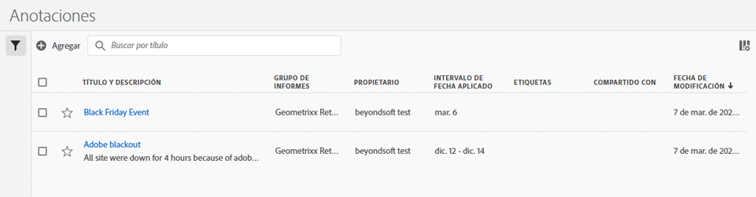

# Administración de anotaciones

El administrador [!UICONTROL Componentes] > [!UICONTROL Anotaciones] ofrece numerosas maneras de conservar las anotaciones, como compartir, filtrar, etiquetar, aprobar, copiar, eliminar y marcar como favoritos.

El administrador [!UICONTROL Anotaciones] le muestra todas las anotaciones que posee que se han asignado a todos sus proyectos y que se han compartido con usted.

>[!NOTE]
>
>Las [!UICONTROL anotaciones] que haya creado únicamente para un proyecto específico no aparecen en el administrador.

## Interfaz de usuario del Administrador de anotaciones

| Elemento de la IU | Descripción |
| --- | --- | 
| [!UICONTROL Título y descripción] | Aparecen en el Generador de anotaciones. Para editar el título y la descripción, haga clic en el vínculo del título. Se le redirigirá al Generador de anotaciones. |
| [!UICONTROL Grupo de informes] | Los grupos de informes a los que se aplica esta anotación. |
| [!UICONTROL Propietario] | Indica a quién pertenece la anotación. Si no es el administrador, solo podrá ver las anotaciones que le pertenecen o que se han compartido con usted. |
| [!UICONTROL Intervalo de fecha aplicado] | La fecha o el intervalo de fechas al que se aplica esta anotación. |
| [!UICONTROL Compartido con] | Indica cuántos individuos o grupos han compartido la anotación. Haga clic para ver más detalles. |
| [!UICONTROL Fecha de modificación] | Muestra la fecha y la hora de la última modificación de la anotación. |

{style=&quot;table-layout:auto&quot;}

## Edición de anotaciones

Editar una anotación significa que puede ajustar intervalos de fechas, colores, ámbito o si se aplica o no a todos los grupos de informes o proyectos. Puede editar las anotaciones de dos formas:

* En un gráfico de líneas, pase el ratón sobre la anotación y haga clic en el icono de lápiz dentro de la ventana emergente.

* En el [!UICONTROL Administrador de anotaciones], haga clic en el título de la anotación.

Ambas opciones le permiten volver a acceder al Generador de anotaciones. Aquí puede realizar los ajustes necesarios y guardar la nueva versión.

## Compartir anotaciones

Cuando comparta anotaciones o trabaje con anotaciones que se compartieron con usted, tenga esto en cuenta:

* Supongamos que crea un proyecto con anotaciones solo de proyecto y luego comparte el proyecto con otro usuario. Se mostrarán estas anotaciones, pero ninguna persona con la que comparta el proyecto puede editarlas o eliminarlas.

* Si guarda una anotación y la comparte directamente con un usuario, solo podrá editarla o eliminarla si tiene derechos de administrador.

* Para recapitular, si el proyecto se comparte con usted, solo se mostrará en ese proyecto. Si la anotación se comparte directamente con usted, aparecerá en todos los proyectos en los que se pueda mostrar.

## Anotaciones y zonas horarias

Todas las anotaciones se crean con una marca de tiempo, pero no con información de “hora” o “zona horaria”. En el momento del informe, siempre se aplica la zona horaria de la vista de datos del panel. Por lo tanto, una anotación creada para Navidad se produce el 25 de diciembre, independientemente de la zona horaria del grupo de informes en la que se encuentre.

Otro ejemplo es el Día de Año Nuevo. Cada hora, una zona horaria diferente inicia fuegos artificiales a medida que comienza el año nuevo. A las 22:00, hora de las montañas de EE. UU., la costa este de EE. UU. está preparando los fuegos artificiales porque ya son las 00:00 en el este.

## Otras tareas de anotaciones

El Administrador de anotaciones permite a los administradores editar, añadir, etiquetar, eliminar, cambiar el nombre, aprobar, copiar, exportar y filtrar anotaciones. No es visible para los usuarios que no son administradores.

Solo tiene que seleccionar una o varias anotaciones y aparecerá la barra de tareas.

| Tarea | Descripción |
| --- | --- |
| Agregar | Le lleva al Generador de anotaciones, donde puede crear nuevas anotaciones. |
| Etiqueta | Todos los usuarios pueden crear etiquetas para las anotaciones y aplicar una o más a una anotación. Sin embargo, solo puede ver etiquetas de los segmentos de los que es propietario. ¿Qué tipo de etiquetas debería crear? A continuación encontrará una serie de sugerencias para crear etiquetas útiles:<ul><li>Etiquetas basadas en nombres de equipos, como Marketing social o Marketing móvil</li><li>Etiquetas de proyectos (etiquetas de análisis), como análisis de Páginas de entrada</li><li>Etiquetas de categorías: Para hombres o Área geográfica</li><li>Etiquetas de flujo de trabajo: Revisado para (unidad comercial específica); Aprobado</li></ul> |
| Eliminar | Al eliminar una anotación, esta se elimina de cualquier proyecto de su organización. |
| Cambiar nombre | Al cambiar el nombre de una anotación, se le cambia el nombre en todos los proyectos a los que se ha aplicado. |
| Copiar | Crea una copia distinta con su nuevo ID de anotación, pero con el mismo nombre y definición. |
| Exportar a CSV | Exporte la definición de la anotación a un archivo .csv. |
| Filtro (carril izquierdo) | Filtre por etiquetas, grupo de informes, propietarios y otros filtros (Míos, Aprobados, Favoritos, Compartidos conmigo y Mostrar todo). |

{style=&quot;table-layout:auto&quot;}
