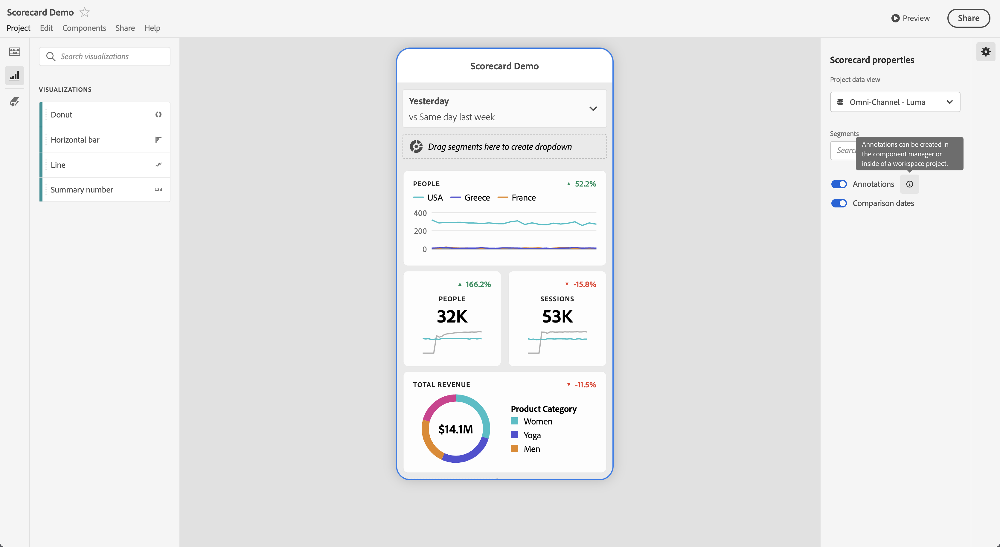
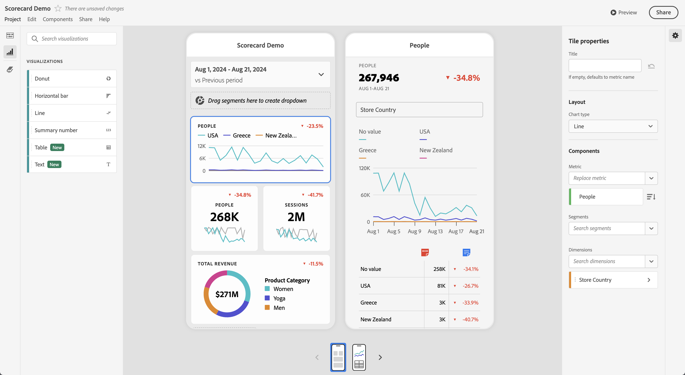
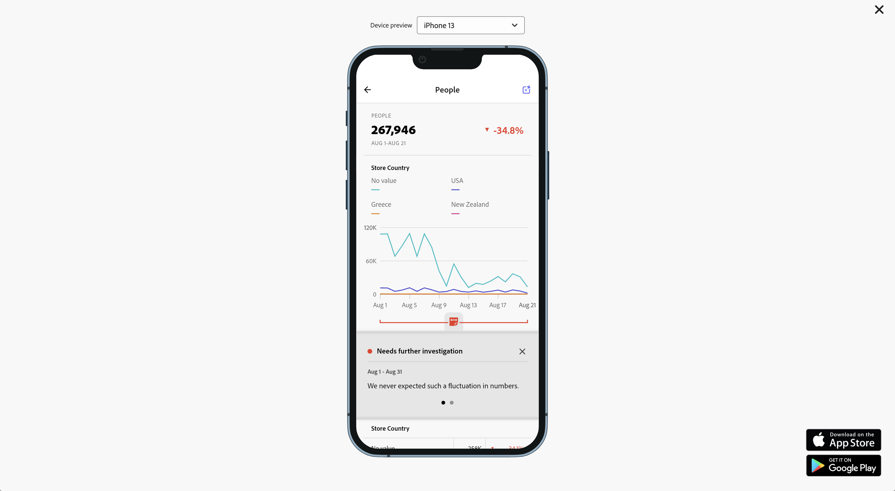

# Compartir anotaciones en cuadros de resultados móviles

Puede mostrar anotaciones creadas en Workspace en cuadros de resultados móviles. Las anotaciones en los cuadros de resultados móviles permiten compartir matices de datos contextuales y perspectivas sobre su organización y campañas.

## Mostrar anotaciones en cuadros de resultados móviles

Para que aparezcan anotaciones en cuadros de resultados móviles, primero cree la anotación desde proyectos de Workspace o desde el menú de componentes.

Para obtener información sobre cómo crear anotaciones, consulte [Crear anotaciones](create-annotations.md). Las anotaciones están desactivadas en los cuadros de resultados móviles de forma predeterminada y deben habilitarse para cada cuadro de resultados que desee que aparezca en los cuadros de resultados móviles.

1. Activar anotaciones. Para activar las anotaciones, consulte [Activar o desactivar anotaciones](overview.md#turn-annotations-on-or-off).

1. Cree una anotación y asegúrese de que se comparta con todos sus proyectos. Consulte [Crear anotaciones](create-annotations.md) para obtener más información.

1. Seleccione **[!UICONTROL Mostrar anotaciones]** para mostrar la anotación en los cuadros de resultados móviles.

   

   Opcionalmente, puede confirmar que **[!UICONTROL Mostrar anotaciones]** está seleccionado en **[!UICONTROL Proyecto]** > **[!UICONTROL Información y configuración del proyecto]**

## Ver anotaciones en cuadros de resultados móviles

Cuando las anotaciones están activadas, los iconos de anotación se pueden ver en el Generador de cuadros de resultados. Las anotaciones solo aparecen en los gráficos y tablas de la vista detallada. Las anotaciones no están visibles desde la vista de mosaico principal del cuadro de resultados.

Cuando los iconos de anotación están visibles, no se puede ver ni interactuar con las anotaciones en el lienzo del generador. Use  **[!UICONTROL Preview]** para ver e interactuar con anotaciones tal y como aparecen en la aplicación.

Los colores de anotación se seleccionan cuando la anotación se crea en Workspace. Las anotaciones grises indicaban la presencia de más de una anotación.

## Previsualizar anotaciones

Puede obtener una vista previa de la anotación mediante la Vista previa de . Seleccione una anotación para abrir los detalles de la anotación.

Si hay más anotaciones disponibles, verá varios puntos (●) en la parte inferior de la anotación. Deslice a izquierda o derecha para cambiar entre anotaciones.
