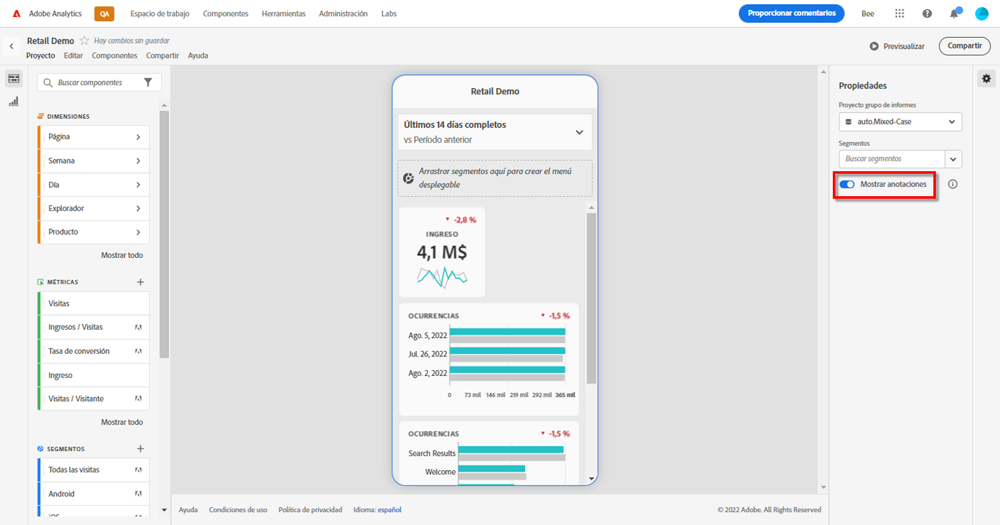
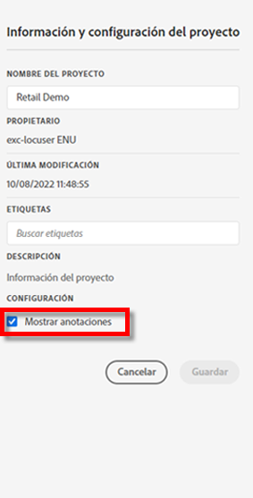
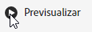
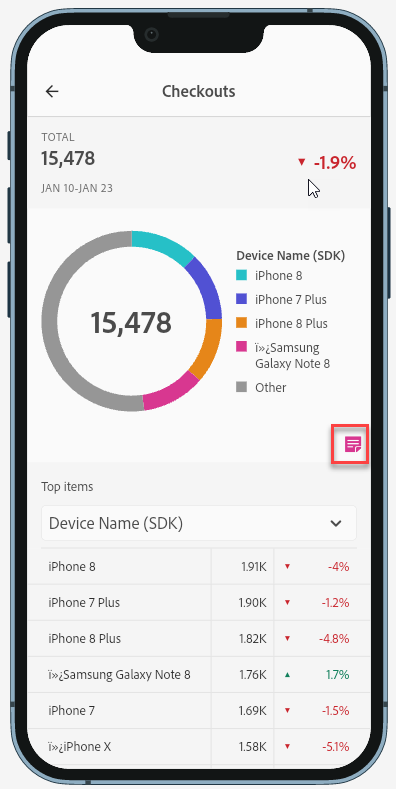

# Uso compartido de anotaciones en informes de valoración móviles

Puede mostrar anotaciones creadas en Workspace en informes de valoración móviles. Esto le permite compartir matices de datos contextuales y perspectivas sobre su organización y campañas directamente dentro de proyectos de informes de valoración móviles, visibles en la aplicación móvil de paneles de Analytics .

## Anotaciones de superficie en informes de valoración móviles

Para que aparezcan anotaciones en informes de valoración móviles, cree primero la anotación desde proyectos de Workspace o desde el menú de componentes.

Para obtener información sobre la creación de anotaciones, consulte [Crear anotaciones](create-annotations.md). Las anotaciones están desactivadas en los informes de valoración móviles de forma predeterminada y deben habilitarse para cada informe de valoración que desee que aparezca en los informes de valoración móviles.

1. Activar anotaciones. Para activar las anotaciones, consulte [Activar o desactivar anotaciones](overview.md#annotations-on-off).

1. Cree una anotación y asegúrese de que se comparta con todos sus proyectos. Para crear una anotación en Workspace, consulte [Crear anotaciones](create-annotations.md).

1. Select **[!UICONTROL Mostrar anotaciones]** para mostrar la anotación en los informes de valoración móviles.

   

1. Confirme que la opción mostrar anotaciones está seleccionada y vaya a **[!UICONTROL Proyecto]** > **[!UICONTROL Información y configuración del proyecto]**.

   

## Ver anotaciones en informes de valoración móviles

Cuando las anotaciones están activadas, los iconos de anotación se pueden ver en el Generador de informes de valoración. Las anotaciones aparecen únicamente en los gráficos y tablas de la vista detallada. Las anotaciones no están visibles desde la vista de mosaico principal del informe de valoración.

Cuando los iconos de anotación están visibles, no se puede ver ni interactuar con las anotaciones en el lienzo del generador. Utilice el modo de vista previa para ver e interactuar con anotaciones tal y como aparecen en la aplicación. 

Los colores de anotación se seleccionan cuando la anotación se crea en el espacio de trabajo. Las anotaciones grises indicaban la presencia de más de una anotación.  

## Ver anotaciones de gráfico

| Fecha | Aspecto |
| --- | --- |
| **[!UICONTROL Un solo día]y** |    |
| **[!UICONTROL Intervalo de fechas]** |  |
| **[!UICONTROL Anotaciones superpuestas]** |   Para ver los detalles de las anotaciones en la aplicación de paneles de Analytics, pulse un icono de anotación.   Cuando vea una anotación en un gráfico, puede deslizar hacia la izquierda y hacia la derecha para navegar por todas las anotaciones presentes en el gráfico. Cuando vea una anotación en la tabla, deslice hacia la izquierda y la derecha para navegar por todas las anotaciones asociadas con ese elemento de fila en la tabla.      En gráficos que no tienen una base de tiempo *eje x*, como los gráficos de barras circulares u horizontales, las anotaciones que se aplican al gráfico se pueden ver tocando el icono situado en la esquina inferior derecha.    |
