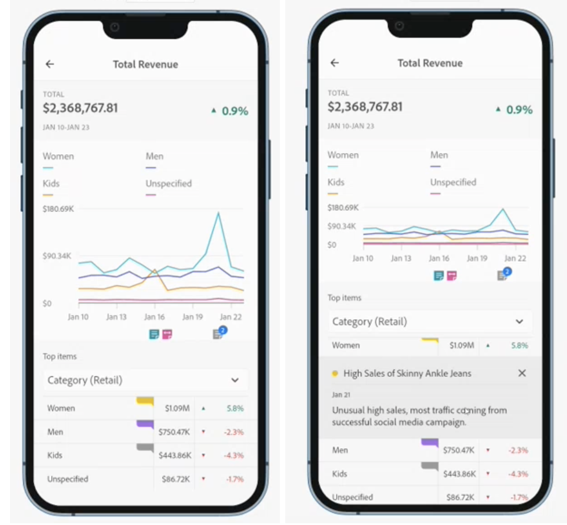
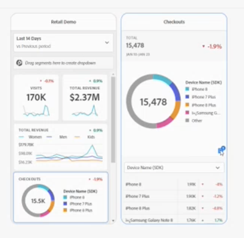

# Uso compartido de anotaciones en informes de valoración móviles

Puede mostrar anotaciones creadas en Workspace en informes de valoración móviles. Esto le permite compartir matices y perspectivas de datos contextuales con su organización y campañas directamente dentro de los informes de valoración.

Las anotaciones de los informes de valoración móviles funcionan de forma similar a las anotaciones de Workspace con algunas funciones adicionales. En Workspace, por ejemplo, puede crear anotaciones de nivel de tabla para un intervalo de fechas. En los informes de valoración móviles, se ven las anotaciones de categoría. Esto proporciona contexto adicional para los usuarios de informes de valoración móviles.
__añadir un ejemplo: o más información que describa la diferencia

?? ¿qué funciones adicionales tiene Mobile?

## Agregar anotaciones a informes de valoración móviles

Las anotaciones que se muestran en los informes de valoración móviles se crean en Workspace empleando los métodos de creación de anotaciones de Workspace. Para obtener información sobre la creación de anotaciones, consulte [Crear anotaciones](create-annotations.md).

1. Activar anotaciones. Para activar las anotaciones, consulte [Activar o desactivar anotaciones](https://experienceleague.adobe.com/docs/analytics-platform/using/cja-components/annotations/overview.html?lang=en#turn-annotations-on-or-off).

1. Cree una anotación y asígnela a proyectos _globales. Para crear una anotación en Workspace, consulte [Crear anotaciones](create-annotations.md).

1. Select **Mostrar anotaciones** para mostrar la anotación en los informes de valoración móviles.

Para confirmar que la opción mostrar anotaciones está seleccionada, vaya a **Proyecto** > **Información y configuración del proyecto**.

## Ver anotaciones en informes de valoración móviles

En Workspace, puede verificar anotaciones en el Generador. También puede utilizar el modo de vista previa para ver el informe de valoración móvil con anotaciones.

Para ver anotaciones en un dispositivo móvil, en los informes de valoración móviles, pulse un icono de anotación. Deslice hacia la izquierda o la derecha para ver anotaciones adicionales. Esto le permite ver rápidamente todas las anotaciones.

Al ver un __donut, se encuentra un resumen de las anotaciones aplicadas a una métrica en la esquina inferior derecha.

## Consideraciones de anotación del informe de valoración móvil

* Si se aplica una anotación a una categoría y un usuario cambia de esa vista de categoría, la anotación desaparece. Las anotaciones solo se muestran en una categoría asociada.

* Las anotaciones están desactivadas de forma predeterminada.

## Colores de anotación

Al crear una anotación, se asigna un color específico a la anotación que se muestra en el informe de valoración. Las anotaciones que aparecen en gris indican que se han asignado varias anotaciones a la misma categoría. De lo contrario, la anotación aparece en el color definido en Workspace.
