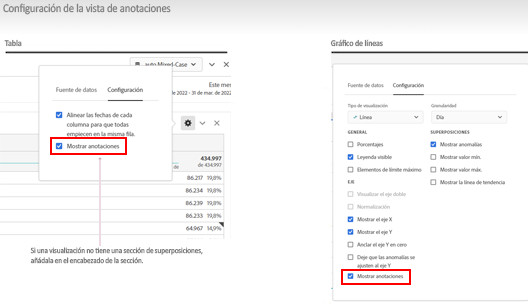
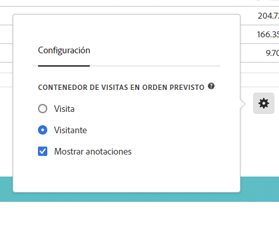

# Descripción general de anotaciones

Las anotaciones le permiten comunicar de forma eficaz los matices y perspectivas de datos contextuales a su organización. Permiten enlazar eventos de calendario con dimensiones/métricas específicas. Puede anotar una fecha o un intervalo de fechas con problemas de datos conocidos, días festivos, lanzamientos de campañas, etc. Entonces, puede mostrar gráficamente los eventos y ver si las campañas u otros eventos han afectado al tráfico del sitio, los ingresos o alguna otra métrica.

Por ejemplo, supongamos que comparte proyectos con su organización. Si tuvo un pico importante en el tráfico debido a una campaña de marketing, puede crear una anotación &quot;Fecha de inicio de la campaña&quot; y ampliarla para toda la vista de datos. Cuando los usuarios ven cualquier conjunto de datos que incluya esa fecha, ven la anotación dentro de sus proyectos, junto con sus datos.

Recuerde:

* Las anotaciones se pueden asociar a una sola fecha o a un intervalo de fechas.

* Pueden aplicarse a todo el conjunto de datos o a métricas, dimensiones o filtros especificados.

* Pueden aplicarse al proyecto en el que se crearon (predeterminado) o a todos los proyectos.

* Pueden aplicarse a la vista de datos en la que se crearon (predeterminada) o a todas las vistas de datos.

## Permisos

De forma predeterminada, solo los administradores pueden crear anotaciones. Los usuarios tienen derechos para ver las anotaciones como lo hacen con otros componentes de Analytics (como filtros, métricas calculadas, etc.).

Sin embargo, los administradores pueden dar el permiso de [!UICONTROL Creación de anotaciones] (Herramientas de Analytics) a los usuarios a través de [Adobe Admin Console](https://experienceleague.adobe.com/docs/analytics/admin/admin-console/permissions/analytics-tools.html?lang=es).

## Activación o desactivación de anotaciones {#annotations-on-off}

Las anotaciones se pueden activar o desactivar en varios niveles:

* En el nivel de visualización: configuración de [!UICONTROL Visualización] > [!UICONTROL Mostrar anotaciones]

* En el nivel de proyecto: [!UICONTROL Información y configuración del proyecto] > [!UICONTROL Mostrar anotaciones]

* En el nivel de usuario: [!UICONTROL Componentes] > [!UICONTROL Preferencias de usuario] > [!UICONTROL Datos] > [!UICONTROL Mostrar anotaciones]

