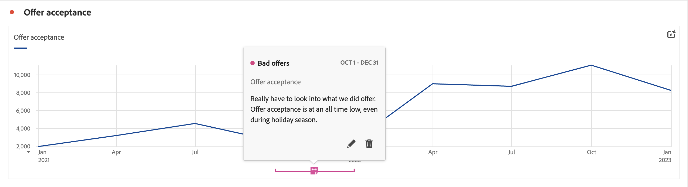

# Descripción general de anotaciones

Las anotaciones le permiten comunicar de forma eficaz los matices y perspectivas de datos contextuales a su organización. Las anotaciones le permiten enlazar los eventos de calendario con dimensiones y métricas específicas. Puede anotar una fecha o un intervalo de fechas con problemas de datos conocidos, días festivos, lanzamientos de campañas, etc. A continuación, puede mostrar gráficamente los eventos y ver si las campañas u otros eventos han afectado al tráfico del sitio, al uso de aplicaciones móviles, a los ingresos o a alguna otra métrica.

Por ejemplo, supongamos que comparte proyectos con su organización. Si tuviera un fallo importante en las ofertas que se aceptan, podría crear una anotación de **Ofertas incorrectas** y ampliarla para toda la vista de datos. Cuando los usuarios ven cualquier conjunto de datos que incluya esa fecha, verán la anotación dentro de sus proyectos, junto a sus datos.

Las anotaciones se pueden aplicar a:

* Una sola fecha o un intervalo de fechas.

* Todo el conjunto de datos o métricas, dimensiones o segmentos específicos.

* Proyecto en el que se crean las anotaciones (predeterminado) para todos los proyectos.

* La vista de datos en la que se crean las anotaciones (predeterminada) o todas las vistas de datos.

Consulte [Crear anotaciones](/help/components/annotations/create-annotations.md) para ver las distintas opciones disponibles para crear anotaciones. A continuación, puede generar, modificar y guardar anotaciones en [Generador de anotaciones](create-annotations.md#annotation-builder).

Utilice [Administrador de anotaciones](manage-annotations.md) para administrar anotaciones.

## Activación o desactivación de anotaciones

Las anotaciones se pueden activar o desactivar en varios niveles:

| Nivel | Cómo... |
|---|---|
| **Visualización** | Habilitar o deshabilitar  > **[!UICONTROL Configuración]** > **[!UICONTROL Mostrar anotaciones]**.  |
| **Proyecto** | En el menú de un proyecto de Workspace, seleccione **[!UICONTROL Proyecto]** > **[!UICONTROL Información y configuración del proyecto]** y habilite o deshabilite **[!UICONTROL Mostrar anotaciones]**.  |
| **Usuario** | En la pestaña **[!UICONTROL Componentes]**, seleccione **[!UICONTROL Preferencias]** o, en el menú de un proyecto de Workspace, seleccione **[!UICONTROL Proyecto]** > **[!UICONTROL Preferencias de usuario]**.  En **[!UICONTROL Preferencias]**, seleccione **[!UICONTROL Proyectos y análisis]**. En la barra de pestaña de la izquierda, seleccione **[!UICONTROL Datos]**. En la parte inferior, habilite o deshabilite **[!UICONTROL Mostrar anotaciones]** debajo del encabezado de **[!UICONTROL Tabla de forma libre]**.  |
