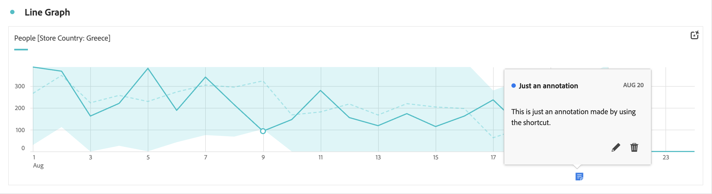
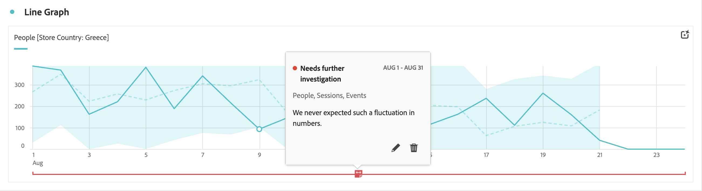
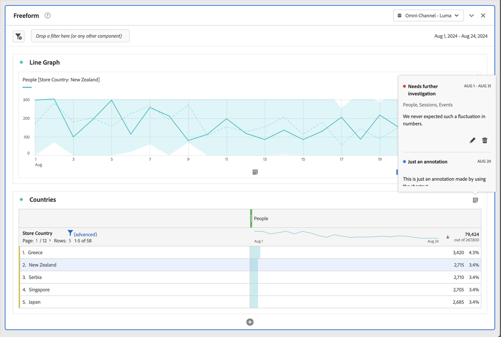
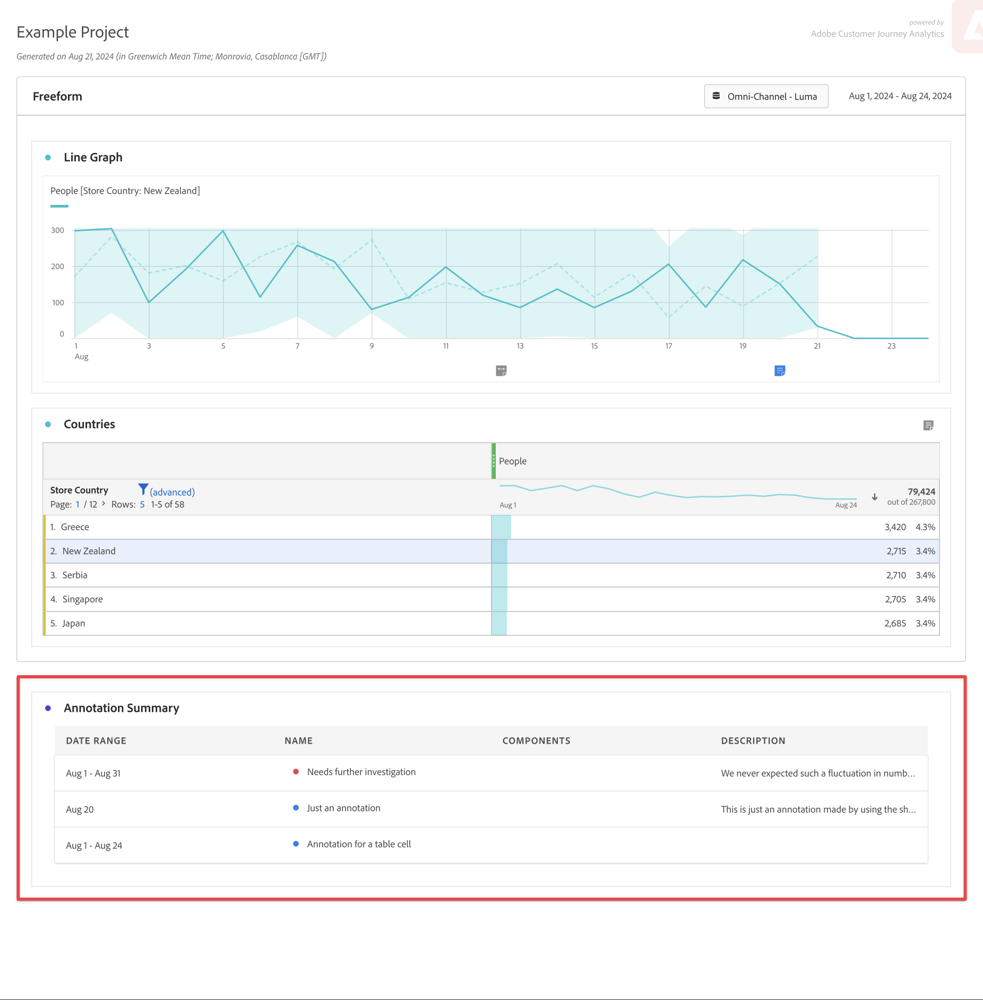

# Visualización de anotaciones

Las anotaciones se manifiestan de forma ligeramente diferente, según dónde aparezcan y si abarcan un solo día o un intervalo de fechas.

## Visualización de anotaciones en gráficos de líneas o tablas

| Tipo de  visualización | Descripción |
| --- | --- |
| **Línea &#x200B;** **Un solo día** | Cuando seleccionas  en una visualización de líneas, verás una ventana emergente con los detalles de la anotación.  Para editar y editar la anotación en el [Creador de anotaciones](create-annotations.md#annotation-builder), selecciona . Para eliminar la anotación, selecciona . |
| **Línea &#x200B;** **Intervalo de fecha** | Al seleccionar , verás una ventana emergente con los detalles de la anotación y una línea en la parte inferior que indica el intervalo de fechas. Para editar la anotación en el [Generador de anotaciones](create-annotations.md#annotation-builder), selecciona . Para eliminar la anotación, selecciona . |
| **Tabla de forma libre** | En una tabla de forma libre, puedes acceder a todas las anotaciones desde el botón anotaciones en la parte superior derecha de la visualización. Selecciona  para ver una (lista de desplazamiento) de todas las anotaciones.  Para cada anotación, puedes seleccionar  para editar la anotación en el [Generador de anotaciones](create-annotations.md#annotation-builder) y  para eliminar la anotación. |

{style="table-layout:auto"}

## Visualización de anotaciones en un archivo PDF

Cuando se descarga el proyecto como PDF o se envía el proyecto como PDF, las anotaciones se resumen en PDF en la sección Resumen de anotaciones.

