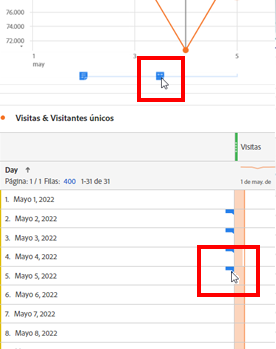
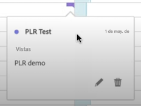
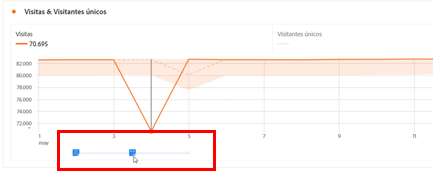
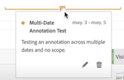
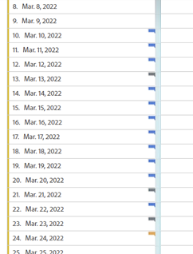
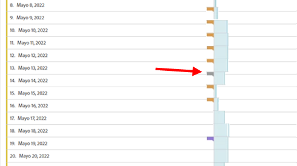
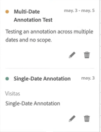
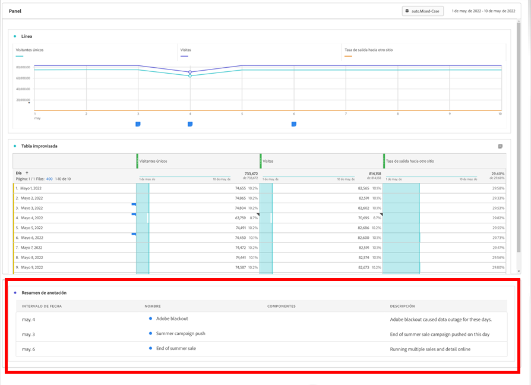
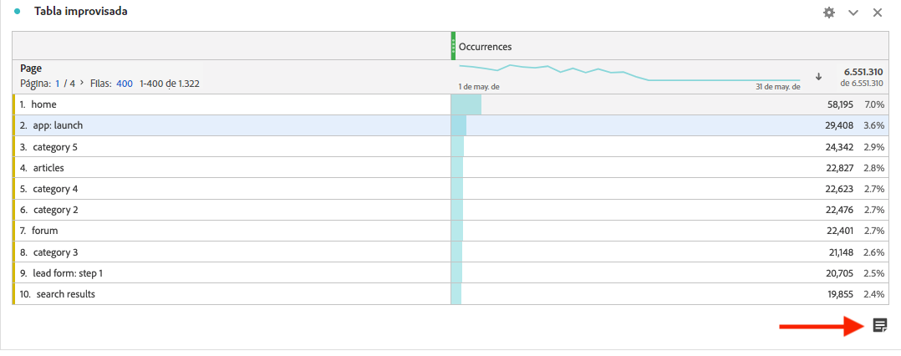
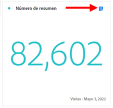

# Visualización de anotaciones

Las anotaciones se manifiestan de forma ligeramente diferente, en función de si abarcan un solo día o un intervalo de fechas.

## Visualización de anotaciones en gráficos de líneas o tablas

| Fecha | Aspecto |
| --- | --- |
| **Día único** | 
Cuando pasa el ratón por encima de la anotación, puede ver sus detalles, puede editarla seleccionando el icono de la pluma o puede eliminarla:
  |
| **Intervalo de fechas** | El icono cambia y, cuando pasa el ratón por encima, aparece el intervalo de fechas.

Cuando lo selecciona en el gráfico de líneas, aparecen los metadatos de la anotación y puede editarlos o eliminarlos:
En una tabla, aparece un icono en cada fecha del intervalo de fechas.
 |
| **Anotaciones superpuestas** | En los días que tengan más de una anotación vinculada a ellos, el icono será de color gris.

Cuando pasa el ratón por encima del icono gris, aparecen todas las anotaciones superpuestas:
 |

{style=&quot;table-layout:auto&quot;}

## Visualización de anotaciones en un archivo .pdf

Dado que no puede pasar el ratón sobre los iconos de un archivo .pdf, este archivo (tras la exportación) proporciona notas de explicaciones en la parte inferior de un panel. Vea el siguiente ejemplo:

## Visualización de anotaciones con datos sin tendencias

A veces, las anotaciones se muestran con datos sin tendencias, pero vinculados a una dimensión específica. En ese caso, solo aparecen en una anotación de resumen en la esquina inferior derecha. Vea el siguiente ejemplo:

El gráfico de resumen aparece en todos los tipos de visualización de la esquina, no solo en tablas improvisadas sin tendencias y números de resumen. También aparece en visualizaciones como [!UICONTROL Anillo], [!UICONTROL Flujo], [!UICONTROL Visita en orden previsto], [!UICONTROL Cohorte], etc.

