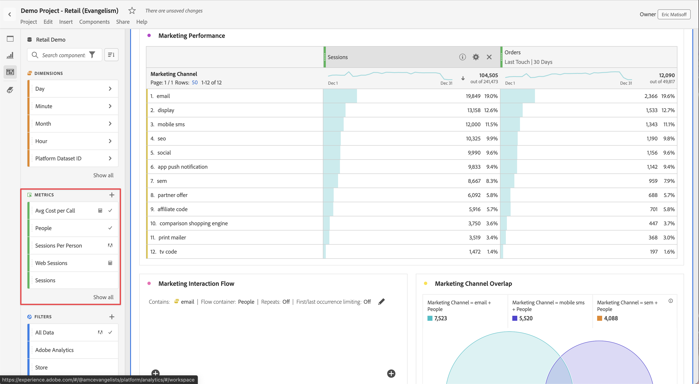

# Métricas

Las métricas permiten cuantificar los puntos de datos en Analysis Workspace. Normalmente se utilizan como columnas en una visualización y están vinculadas a las dimensiones.

## Tipos de métricas

Adobe ofrece varios tipos de métricas para usar en Analysis Workspace:

* **Métricas estándar**: Ejemplo de métricas estándar son Personas, Sesiones y Eventos.

* **Métricas calculadas** : métricas definidas por el usuario que se basan en métricas estándar, números estáticos o funciones algorítmicas.

* **Plantillas de métricas calculadas**   : métricas definidas por el Adobe que se comportan de manera similar a las métricas calculadas. Puede utilizarlos tal cual en los proyectos de Workspace o guardar una copia para personalizar su lógica.

Puede ver si una métrica está aprobada   o no. Si desea obtener más detalles sobre una métrica, pase el ratón sobre ella y seleccione .

Las métricas son flexibles en su uso dentro de Analysis Workspace. Arrastre una métrica a una tabla de forma libre vacía para ver las tendencias de esa métrica durante el período de fecha del proyecto. También puede arrastrar una métrica cuando una dimensión esté presente para verla comparada con cada elemento de dimensión. Al arrastrar una métrica sobre un encabezado de métrica existente, se reemplaza y al arrastrar una métrica junto a un encabezado, puede ver ambas métricas en paralelo.

## Métricas calculadas 

Las métricas calculadas permiten ver fácilmente cómo se relacionan entre sí las métricas mediante operadores simples o funciones estadísticas. Existen varias formas de crear métricas calculadas:

Puede seleccionar **[!UICONTROL Componentes]** > **[!UICONTROL Métricas calculadas]**. Esto le lleva al [Generador de métricas calculadas](/help/components/calc-metrics/calc-metr-overview.md), donde puede crear métricas personalizadas a partir de métricas existentes.

Con el fin de facilitar la creación rápida de métricas calculadas, se ha añadido la opción **[!UICONTROL Crear métrica a partir de la selección]** al menú de columna que se abre al hacer clic con el botón secundario en las tablas improvisadas. Esta opción se muestra cuando se selecciona al menos una celda de columna de encabezado.

[Métricas calculadas: métricas sin implementación](https://experienceleague.adobe.com/docs/analytics-learn/tutorials/components/calculated-metrics/calculated-metrics-implementationless-metrics.html?lang=es) (3:42)

## Comparar métricas con diferentes modelos de atribución

Si desea comparar rápida y fácilmente un modelo de atribución con otro, haga clic con el botón derecho en una métrica y seleccione **[!UICONTROL Comparar modelos de atribución]**:

Este método abreviado permite comparar rápida y fácilmente un modelo de atribución con otro sin tener que arrastrar una métrica y configurarla dos veces.
