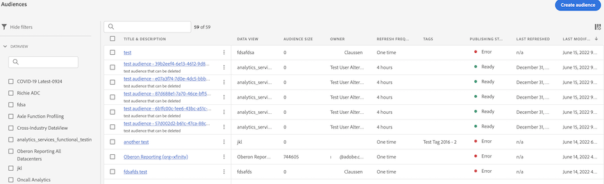

# Administrar audiencias creadas en Customer Journey Analytics

>[!NOTE]
>
>Actualmente, esta función está en [prueba limitada](/help/release-notes/releases.md).

La administración de audiencias creadas anteriormente le permite

* **Programar o desprogramar** actualizaciones automáticas de audiencias. La caducidad máxima de la programación es de 1 año.
* **Renovar la programación de actualizaciones de una audiencia** cuando esté a punto de caducar. Las audiencias que caducan se tratan de manera similar a los informes programados que caducan: el administrador recibe un correo electrónico un mes antes de que la programación caduque.
* Consultar el **intervalo de actualización** y la **última vez que se actualizó una audiencia**
* Obtenga información sobre la **cantidad de tiempo que se tardó en producir una audiencia** de Customer Journey Analytics (CJA) y la cantidad de tiempo que tardó la audiencia en aparecer en el Perfil del cliente en tiempo real con fines de activación.
* Vea si las audiencias de CJA están **siendo utilizadas activamente por el Perfil del cliente en tiempo real** o (idealmente) cualquier aplicación de Experience Platform que consuma las audiencias creadas por CJA.

## Interfaz de usuario de administración

| Configuración de la interfaz de usuario | Definición |
| --- | --- |
| Ocultar/Mostrar filtros | Permite mostrar u ocultar los siguientes filtros del carril izquierdo: <ul><li>[!UICONTROL Vista de datos]</li><li>[!UICONTROL Propietario]</li><li>[!UICONTROL Frecuencia de actualización]</li><li>[!UICONTROL Etiquetas]</li></ul> |
| [!UICONTROL Título y descripción] | El título y la descripción que se dieron a la audiencia cuando se creó. |
| [!UICONTROL Vista de datos] | La vista de datos en la que se creó esta audiencia. |
| [!UICONTROL Tamaño de la audiencia] | El número total de personas en esta audiencia. |
| [!UICONTROL Propietario] | El propietario de la audiencia: la persona que la creó. |
| [!UICONTROL Frecuencia de actualización] | El intervalo de actualización configurado al crear la audiencia. |
| [!UICONTROL Etiquetas] | Las etiquetas aplicadas a esta audiencia. |
| [!UICONTROL Estado de publicación] | Puede mostrar [!UICONTROL Listo], [!UICONTROL En curso] o [!UICONTROL Error]. |
| [!UICONTROL  Última actualización] | La última vez que se actualizó la audiencia. |
| [!UICONTROL Última modificación] | La última vez que se editó o modificó la audiencia. |

{style=&quot;table-layout:auto&quot;}
