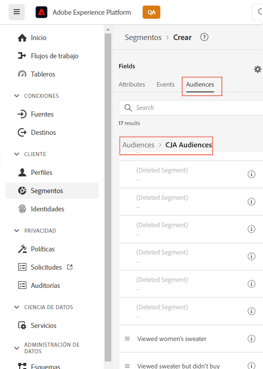
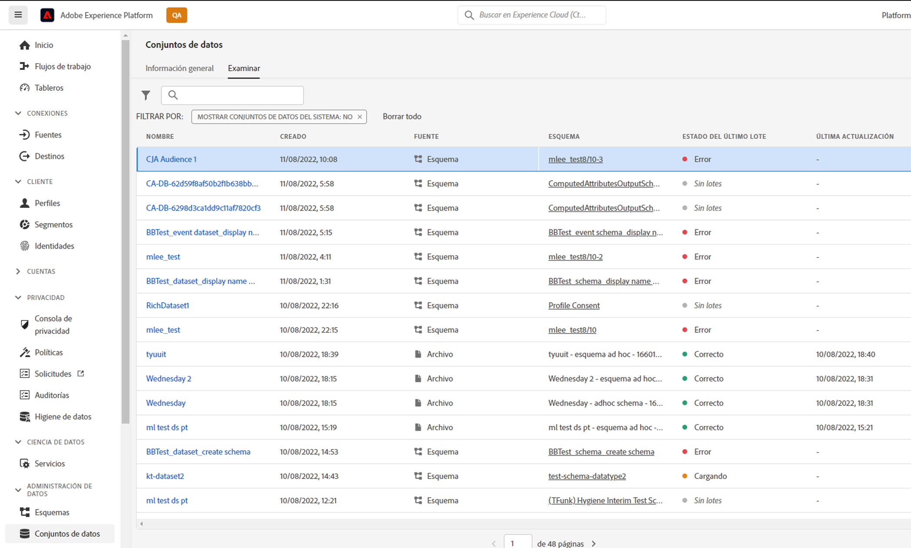

# Administrar audiencias creadas en el Customer Journey Analytics

La administración de audiencias creadas anteriormente le permite

* **Programar o anular la programación** actualización/actualización automática de la audiencia. La caducidad máxima del programa es de 1 año.
* **Renovar una programación de actualización de audiencia** cuando esté a punto de caducar. Las audiencias que caducan se tratan de manera similar a los informes programados que caducan: el administrador recibe un correo electrónico un mes antes de que caduque la programación.
* Consulte la **la última vez que se actualizó una audiencia**
* Obtenga información sobre **cantidad de tiempo que se tardó en producir una audiencia** del Customer Journey Analytics (CJA) y la cantidad de tiempo que tardó en que la audiencia apareciera en el Perfil del cliente en tiempo real con fines de activación.
* Ver si las audiencias en CJA son **ser utilizado activamente por el perfil del cliente en tiempo real** o (idealmente) cualquier aplicación de Experience Platform que consuma las audiencias creadas por CJA.

## Interfaz de usuario de administración

captura de pantalla

| Configuración de la interfaz de usuario | Definición |
| --- | --- |
| Ocultar/Mostrar filtros | Permite mostrar u ocultar los siguientes filtros en el carril izquierdo: <ul><li>Vista de datos</li><li>Propietario</li><li>Frecuencia de actualización</li><li>Etiquetas</li></ul> |
| Título y descripción |  |
| Vista de datos |
| Tamaño de la audiencia |  |
| Propietario |  |
| Frecuencia de actualización |  |
| Etiquetas |  |
| Última actualización |  |
| Última modificación |  |

{style=&quot;table-layout:auto&quot;}

## Ver y usar audiencias de CJA en Experience Platform

Para ver las audiencias de CJA en Platform, vaya a [!UICONTROL Segmentos] > [!UICONTROL Crear segmentos] > [!UICONTROL Audiencias] pestaña > [!UICONTROL Audiencias de CJA].

Puede arrastrar audiencias de CJA a la definición del segmento para segmentos de AEP.

Si decide exportar esta audiencia al lago de datos de AEP, aparecerá como un conjunto de datos que se ajuste a la clase de esquema de perfil individual XDM:

