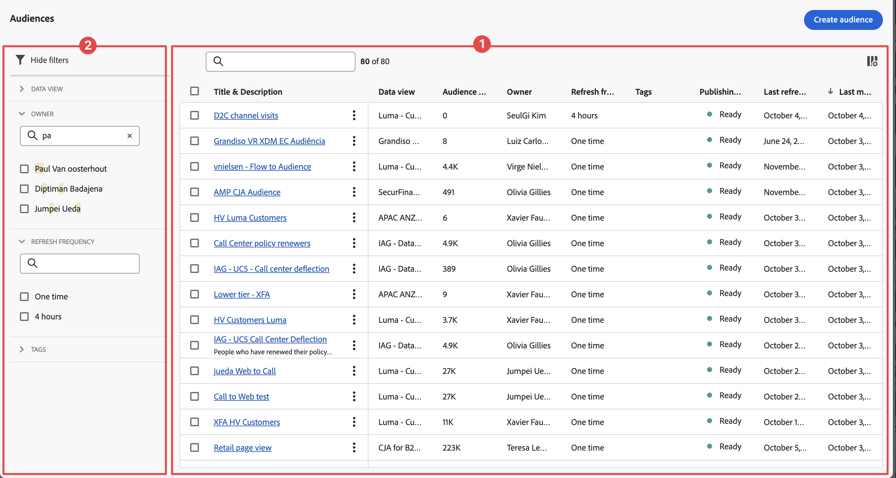

# Administrar audiencias publicadas

Los públicos se pueden administrar en Customer Journey Analytics mediante **[!UICONTROL Componentes]** > **[!UICONTROL Públicos]**.

## Comprender las tareas de gestión de público

La administración de públicos creados anteriormente le permite:

* **Programar o desprogramar** actualizaciones automáticas de públicos. La caducidad máxima de la programación es de 1 año.
* **Renovar una programación de actualización de público** cuando esté a punto de caducar. Los públicos que caducan se tratan de manera similar a los informes programados que caducan: el administrador recibe un correo electrónico un mes antes de que la programación caduque.
* Consultar el **intervalo de actualización** y la **última vez que se actualizó un público**
* Obtener información sobre **cuánto tiempo se tardó en producir un público** de Customer Journey Analytics. Y la cantidad de tiempo que tardó el público en aparecer en Real-Time Customer Platform con fines de activación.
* Compruebe si **Real-Time Customer Platform** está usando los públicos de Customer Journey Analytics activamente. O, idealmente, cualquier aplicación de Experience Platform que consuma los públicos creados por Customer Journey Analytics.

Si cuenta con acceso a [Vista de públicos](/help/technotes/access-control.md#user-level-access), podrá ver los públicos. Si cuenta con acceso a [Crear público](/help/technotes/access-control.md#user-level-access), podrá editar y eliminar públicos. 

## Buscar públicos en la lista de Públicos

La lista de Públicos ➊ muestra los públicos existentes.

Para ver la lista Público:

1. En Customer Journey Analytics, seleccione **[!UICONTROL Componentes]** > **[!UICONTROL Audiencias publicadas]**.

1. (Opcional) Utilice  para configurar qué columnas mostrar.

1. (Opcional) Busque un público utilizando .

   Las siguientes columnas están disponibles con información sobre cada público:

   | Columna | Descripción |
   | --- | --- |
   |  | Cuando se seleccionan uno o varios públicos, aparece una barra de acciones azul en la parte inferior de la interfaz de Públicos. Consulte la sección [Acciones](#actions) para obtener más información. |
   | **[!UICONTROL Título y descripción]** | El título y la descripción que introdujo al crear el público. |
   | **[!UICONTROL Vista de datos]** | La vista de datos en la que se creó este público. |
   | **[!UICONTROL Tamaño del público]** | El número total de personas en este público. |
   | **[!UICONTROL Propietario]** | El propietario del público: la persona que lo creó. |
   | **[!UICONTROL Frecuencia de actualización]** | El intervalo de actualización configurado al crear el público. |
   | **[!UICONTROL Etiquetas]** | Las etiquetas aplicadas a este público. |
   | **[!UICONTROL Estado de publicación]** | Puede aparecer  **[!UICONTROL Listo]**,  **[!UICONTROL En curso]** o  **[!UICONTROL Error]**. |
   | **[!UICONTROL Última actualización]** | La marca de tiempo de la última vez que se actualizó el público. |
   | **[!UICONTROL Última modificación]** | La marca de tiempo de la última vez que se editó o modificó el público. |

## Editar públicos

Puede editar la configuración de un público en cualquier momento. Cuando edita un público (ya sea un público único o recurrente), se requiere volver a publicar.

Para editar un público, haga lo siguiente:

1. En Customer Journey Analytics, seleccione **[!UICONTROL Componentes]** > **[!UICONTROL Audiencias publicadas]**.

   Se muestra la página Públicos.

1. Seleccione el título del público que desea editar.

   Se muestra el cuadro de diálogo **[!UICONTROL Editar público]**.

1. Puede actualizar cualquiera de los campos disponibles para el público. Para obtener información sobre los campos que puede actualizar, consulte [Generador de públicos](/help/components/audiences/publish.md#audience-builder) en el artículo [Crear y publicar públicos](/help/components/audiences/publish.md).

1. Seleccione **[!UICONTROL Volver a publicar]**.

## Acciones

Las siguientes son acciones comunes en el administrador de proyectos programados. Puede seleccionar acciones en el menú contextual:

| Icono | Acción | Descripción |
|:---:|---|---|
|  | **[!UICONTROL Etiqueta]** | Etiquetar los públicos seleccionados. En el cuadro de diálogo **[!UICONTROL Actualizar etiquetas: *nombre de público *]**, seleccione las etiquetas en el menú desplegable o escriba una o varias etiquetas nuevas. Seleccione**[!UICONTROL Guardar ]**para guardar. |
|  | **[!UICONTROL Eliminar]** | Eliminar los públicos seleccionados. |
|  | **[!UICONTROL Cambiar el nombre]** | Cambiar el nombre del público seleccionado. Use el cuadro de diálogo **[!UICONTROL Cambiar nombre: *nombre de público *]**para cambiar el nombre del público y seleccione**[!UICONTROL Guardar ]**para guardar. |

Las siguientes acciones están disponibles en la barra de acciones azul al seleccionar uno o más proyectos programados.

| Icono | Acción | Descripción |
|:---:|---|---|
|  | **[!UICONTROL *x *seleccionada]** | Seleccionar para anular la selección de los públicos seleccionados. |
|  | **[!UICONTROL Eliminar]** | Eliminar los públicos seleccionados. |
|  | **[!UICONTROL Exportar a CSV]** | Exportar los públicos seleccionados a un archivo lkanado `audiences.csv`. |

## Filtrado de la lista de públicos

Puede filtrar la [Lista de públicos](#audiences-list) mediante el panel de filtro ➋. Para mostrar u ocultar el panel de filtro, utilice .

El panel de filtro consta de las siguientes secciones.

### Vista de datos

| Vista de datos | Descripción |
|---|---|
| {width="300"} | La sección **[!UICONTROL Vista de datos]** le permite filtrar las vistas de datos. <ul><li>Utilice la opción  para buscar vistas de datos que desea usar para filtrar.</li><li>Puede seleccionar más de una vista de datos.</li></ul> |

### Propietarios

| Propietario | Descripción |
|---|---|
| {width="300"} | La sección **[!UICONTROL Propietario]** le permite filtrar por propietarios. <ul><li>Utilice la opción  para buscar los propietarios que desea usar para filtrar.</li><li>Puede seleccionar más de un propietario. </li></ul> |

## Frecuencia de actualización

| Frecuencia de actualización | Descripción |
|---|---|
| {width="300"} | La sección **[!UICONTROL Frecuencia de actualización]** le permite filtrar la frecuencia de actualización. <ul><li>Utilice la opción  para buscar la frecuencia de actualización que desea usar para filtrar.</li><li>Solo se muestran como opciones disponibles las frecuencias de actualización definidas para los públicos  de la [Lista de públicos](#audiences-list).</li></ul> |

### Etiquetas

| Etiquetas | Descripción |
|---|---|
| {width="300"} | La sección **[!UICONTROL Etiquetas]** le permite filtrar las etiquetas. <ul><li>Utilice la opción  para buscar etiquetas que desea usar para filtrar. |
