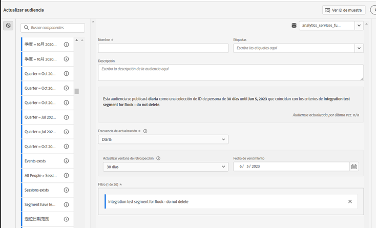
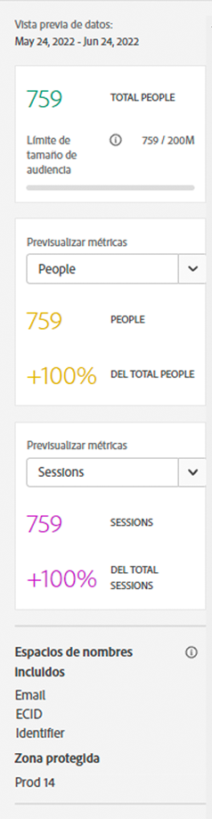

# Crear y publicar audiencias

>[!NOTE]
>
>Esta funcionalidad se encuentra actualmente en [pruebas limitadas](/help/release-notes/releases.md).

En este tema se explica cómo crear y publicar audiencias identificadas en Customer Journey Analytics (CJA) para [Perfil del cliente en tiempo real](https://experienceleague.adobe.com/docs/experience-platform/profile/home.html?lang=es) en Adobe Experience Platform para personalización y segmentación de clientes.

Lea esto [información general](/help/components/audiences/audiences-overview.md) para familiarizarse con el concepto de audiencias de CJA.

## Crear audiencia

1. Para crear audiencias, tiene tres formas de empezar:

   | Método de creación | Detalles |
   | --- | --- |
   | Desde el principal **[!UICONTROL Componentes] > [!UICONTROL Audiencias]** menú | Se abre la página Administrador de audiencias . Haga clic en **[!UICONTROL Crear audiencia]** y [!UICONTROL Generador de audiencias] se abre. |
   | Desde una tabla improvisada | Haga clic con el botón derecho en un elemento de una tabla improvisada y seleccione **[!UICONTROL Crear una audiencia a partir de una selección]**. El uso de este método rellena previamente el filtro con la dimensión o el elemento de dimensión seleccionado en la tabla. |
   | Desde la interfaz de usuario de creación/edición de filtros | Marque la casilla que dice **[!UICONTROL Crear una audiencia a partir de este filtro]**. El uso de este método rellena previamente el filtro. |

   {style=&quot;table-layout:auto&quot;}

1. Crear la audiencia.

   Configure estos ajustes para poder publicar la audiencia.

   

   | Configuración | Descripción |
   | --- | --- |
   | [!UICONTROL Nombre] | Nombre de la audiencia. |
   | [!UICONTROL Etiquetas] | Cualquier etiqueta que desee asignar a la audiencia con fines organizativos. Puede utilizar una etiqueta preexistente o introducir una nueva. |
   | [!UICONTROL Descripción] | Añada una buena descripción de la audiencia para diferenciarla de otras. |
   | [!UICONTROL Frecuencia de actualización] | Frecuencia con la que desea actualizar la audiencia.<ul><li>Puede elegir crear una audiencia única (predeterminada) que no necesite ser actualizada. Por ejemplo, esto podría resultar útil para campañas únicas específicas.</li><li>Puede seleccionar otros intervalos de actualización. Para la frecuencia de 4 horas, hay un límite de 75 o 150 audiencias, según su derecho de CJA. Para otros intervalos, no hay un número máximo de audiencias.</li></ul> |
   | Fecha de caducidad | Cuándo dejará de actualizarse la audiencia. El valor predeterminado es 1 año a partir de la fecha de creación. Las audiencias que caducan se tratan de manera similar a los informes programados que caducan: el administrador recibe un correo electrónico un mes antes de que la audiencia caduque. |
   | Actualizar ventana de retrospección | Especifica cuánto tiempo atrás en la ventana de datos desea recorrer al crear esta audiencia. El máximo es de 90 días. |
   | [!UICONTROL Intervalo de fecha de una sola vez] | Intervalo de fechas en el que desea que se publique la audiencia única. |
   | [!UICONTROL Filtro] | Los filtros son la entrada principal a la audiencia. Se pueden agregar hasta 20 filtros. Estos filtros se pueden unir con `And` o `Or` operadores. |
   | [!UICONTROL Ver ID de muestra] | Una muestra de los ID de esta audiencia. Utilice la barra de búsqueda para buscar ID de ejemplo. |

   {style=&quot;table-layout:auto&quot;}

1. Interpretar la vista previa de datos.

   La vista previa de la audiencia aparece en el carril derecho. Permite realizar un análisis resumido de la audiencia que ha creado.

   

   | Configuración de vista previa | Descripción |
   | --- | --- |
   | [!UICONTROL Vista previa de datos] window | El intervalo de fechas de la audiencia. |
   | [!UICONTROL Personas totales] | Un número de resumen del número total de personas en esta audiencia. Puede llegar a los 100 millones de personas. Si la audiencia supera los 100 millones de personas, debe reducir el tamaño de la audiencia para poder publicarla. |
   | [!UICONTROL Límite de tamaño de audiencia] | Muestra hasta dónde está el límite de 100 millones de audiencias. |
   | [!UICONTROL Retorno estimado de la audiencia] | Esta configuración es útil para volver a dirigirse a los clientes de esta audiencia que regresan al sitio. (En otras palabras, que se ven de nuevo en este conjunto de datos). 
Aquí puede seleccionar el lapso de tiempo (7 días siguientes, 2 semanas siguientes, mes siguiente) para la cantidad estimada de clientes que pueden regresar. |
   | [!UICONTROL Estimación de retorno] | Este número proporciona un número estimado de clientes que regresan durante el lapso de tiempo seleccionado en la lista desplegable. Observamos la tasa de pérdida histórica para esta audiencia para predecir este número. |
   | [!UICONTROL Previsualizar métricas] | Esta configuración le permite observar métricas específicas para ver si esta audiencia contribuye en una cantidad desproporcionada a esta métrica, como &quot;[!UICONTROL Ingresos]&#39; o &#39;[!UICONTROL Promedio de tiempo en el sitio]&#39;. Proporciona el recuento agregado de la métrica, así como el porcentaje del total que representa. Puede seleccionar cualquier métrica que esté disponible en la vista de datos. |
   | [!UICONTROL Espacios de nombres incluidos] | Los espacios de nombres específicos asociados a las personas de la audiencia. Algunos ejemplos son ECID, CRM ID, direcciones de correo electrónico, etc. |
   | [!UICONTROL Entorno de pruebas] | La variable [Espacio aislado del Experience Platform](https://experienceleague.adobe.com/docs/experience-platform/sandbox/home.html?lang=es) en la que reside esta audiencia. Cuando publica esta audiencia en Platform, solo puede trabajar con ella dentro de los límites de este entorno limitado. |

   {style=&quot;table-layout:auto&quot;}

1. Compruebe la configuración de la audiencia y haga clic en **[!UICONTROL Publicación]**.

   Si todo salió bien, recibirá un mensaje de confirmación de que se publicó la audiencia. Solo toma un minuto o dos para que esta audiencia aparezca en el Experience Platform. (Incluso para audiencias con millones de miembros, debería tardar menos de 5 minutos).

1. Haga clic en **[!UICONTROL Ver la audiencia en AEP]** dentro del mismo mensaje y se le redirigirá al [Interfaz de usuario de segmentos](https://experienceleague.adobe.com/docs/experience-platform/segmentation/ui/overview.html?lang=en) en Adobe Experience Platform. Para obtener más información, vaya más abajo.

## Usar audiencias de CJA en Experience Platform

Ahora, CJA toma todas las combinaciones de espacio de nombres e ID de la audiencia publicada y las transmite al Perfil del cliente en tiempo real (RTCP). A continuación, RTCP examina cada combinación de espacio de nombres e ID y busca un perfil del que pueda formar parte. Un perfil es básicamente un clúster de áreas de nombres, ID y dispositivos vinculados. Si encuentra un perfil, agregará el área de nombres y el ID a los demás ID de este perfil como un atributo de pertenencia a un segmento. Ahora, por ejemplo, &quot;user@adobe.com&quot; se puede dirigir a todos sus dispositivos y canales. Si no se encuentra un perfil, se crea uno nuevo.

Para ver las audiencias de CJA en Platform, vaya a **[!UICONTROL Segmentos]** > **[!UICONTROL Crear segmentos]** > **[!UICONTROL Audiencias]** pestaña > **[!UICONTROL Audiencias de CJA]**.

Puede arrastrar audiencias de CJA a la definición del segmento para segmentos de AEP.

## Pasos siguientes

* Para administrar esta audiencia, vaya a la [Interfaz de usuario de administración](/help/components/audiences/manage.md).
