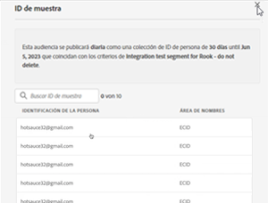

# Crear y publicar audiencias

>[!NOTE]
>
>Esta funcionalidad se encuentra actualmente en [pruebas limitadas](/help/release-notes/releases.md).

En este tema se explica cómo publicar audiencias descubiertas en Customer Journey Analytics (CJA) en [Perfil del cliente en tiempo real](https://experienceleague.adobe.com/docs/experience-platform/profile/home.html?lang=es) en Adobe Experience Platform para personalización y segmentación de clientes.

Lea esto [información general](/help/components/audiences/audiences-overview.md) para familiarizarse con el concepto de audiencias de CJA.

## Crear audiencia

1. Para crear audiencias, tiene tres formas de empezar:

   | Método de creación | Detalles |
   | --- | --- |
   | Desde el principal **[!UICONTROL Componentes] > [!UICONTROL Audiencias]** menú | Se abre la página Administrador de audiencias . Haga clic en **[!UICONTROL Crear audiencia]** y [!UICONTROL Generador de audiencias] se abre. |
   | Desde una tabla improvisada | Haga clic con el botón derecho en un elemento de una tabla improvisada y seleccione **[!UICONTROL Crear una audiencia a partir de una selección]**. El uso de este método rellena previamente el filtro con la dimensión o el elemento de dimensión seleccionado en la tabla. |
   | Desde la interfaz de usuario de creación/edición de filtros | Marque la casilla que dice **[!UICONTROL Crear una audiencia a partir de este filtro]**. El uso de este método rellena previamente el filtro. |

   {style=&quot;table-layout:auto&quot;}

1. Crear la audiencia.

   Configure estos ajustes para poder publicar la audiencia.

   

   | Configuración | Descripción |
   | --- | --- |
   | [!UICONTROL Nombre] | Nombre de la audiencia. |
   | [!UICONTROL Etiquetas] | Cualquier etiqueta que desee asignar a la audiencia con fines organizativos. Puede utilizar una etiqueta preexistente o introducir una nueva. |
   | [!UICONTROL Descripción] | Añada una buena descripción de la audiencia para diferenciarla de otras. |
   | [!UICONTROL Frecuencia de actualización] | Frecuencia con la que desea actualizar la audiencia.<ul><li>Puede elegir crear una audiencia única (predeterminada) que no necesite ser actualizada, lo que sería útil para campañas únicas específicas, por ejemplo.</li><li>Puede seleccionar otros intervalos de actualización. Para la frecuencia de 4 horas, hay un límite de 150 audiencias, ya que esta frecuencia de actualización es muy intensiva en el procesamiento. Para otros intervalos, no hay un número máximo de audiencias.</li></ul> |
   | Fecha de caducidad | Cuándo dejará de actualizarse la audiencia. El valor predeterminado es 1 año a partir de la fecha de creación. Las audiencias que caducan se tratan de manera similar a los informes programados que caducan: el administrador recibe un correo electrónico un mes antes de que la audiencia caduque. |
   | Actualizar ventana de retrospección | Especifica cuánto tiempo atrás en la ventana de datos desea recorrer al crear esta audiencia. El máximo. es de 90 días. |
   | [!UICONTROL Intervalo de fecha de una sola vez] | Intervalo de fechas en el que desea que se publique la audiencia única. |
   | [!UICONTROL Filtro] | Los filtros son la entrada principal a la audiencia. Se pueden agregar hasta 20 filtros. Estos filtros se pueden unir con `And` o `Or` operadores. |
   | [!UICONTROL Ver ID de muestra] | Una muestra de los ID de esta audiencia. Utilice la barra de búsqueda para buscar ID de ejemplo.
! |

   {style=&quot;table-layout:auto&quot;}

1. Interpretar la vista previa de datos.

   La vista previa de la audiencia aparece en el carril derecho. Permite realizar análisis avanzados de la audiencia que ha creado.

   

   | Configuración de vista previa | Descripción |
   | --- | --- |
   | [!UICONTROL Vista previa de datos] window | El intervalo de fechas de la audiencia. |
   | [!UICONTROL Personas totales] | Un número de resumen del número total de personas en esta audiencia. Puede llegar a los 100 millones de personas. Si la audiencia supera los 100 millones de personas, debe reducir el tamaño de la audiencia para poder publicarla. |
   | [!UICONTROL Límite de tamaño de audiencia] | Muestra hasta dónde está el límite de 100 millones de audiencias. |
   | [!UICONTROL Retorno estimado de la audiencia] | Esta configuración es útil para volver a dirigirse a los clientes de esta audiencia que regresan al sitio. (En otras palabras, que se ven de nuevo en este conjunto de datos). 
Aquí puede seleccionar el lapso de tiempo (7 días siguientes, 2 semanas siguientes, mes siguiente) para la cantidad estimada de clientes que pueden regresar. |
   | [!UICONTROL Estimación de retorno] | Este número proporciona un número estimado de clientes que regresan durante el lapso de tiempo seleccionado en la lista desplegable. Observamos la tasa de pérdida histórica para esta audiencia para predecir este número. |
   | [!UICONTROL Previsualizar métricas] | Esta configuración le permite observar métricas específicas para ver si esta audiencia contribuye en una cantidad desproporcionada a esta métrica, como &quot;[!UICONTROL Ingresos]&#39; o &#39;[!UICONTROL Promedio de tiempo en el sitio]&#39;. Proporciona el recuento agregado de la métrica, así como el porcentaje del total que representa. Puede seleccionar cualquier métrica que esté disponible en la vista de datos. |
   | Espacios de nombres incluidos | Los espacios de nombres específicos asociados a las personas de la audiencia. Algunos ejemplos son ECID, CRM ID, direcciones de correo electrónico, etc. |
   | Entorno de pruebas | El simulador para pruebas de Experience Platform en el que reside esta audiencia. Cuando publica esta audiencia en Platform, solo puede trabajar con ella dentro de los límites de este entorno limitado. |

   {style=&quot;table-layout:auto&quot;}

1. Si todo parece correcto, haga clic en **[!UICONTROL Publicación]**.

## Pasos siguientes

* Para administrar esta audiencia, vaya a la [Interfaz de usuario de administración](/help/components/audiences/manage.md).
* Para trabajar con esta audiencia en Adobe Experience Platform, vaya aquí.
