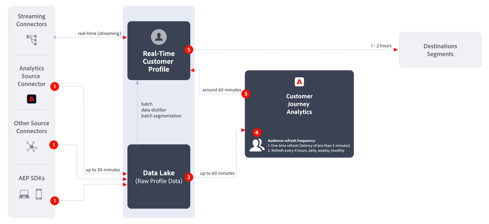

# Crear y publicar audiencias

En este tema se explica cómo crear y publicar audiencias identificadas en Customer Journey Analytics con [Perfil del cliente en tiempo real](https://experienceleague.adobe.com/docs/experience-platform/profile/home.html?lang=es) en Adobe Experience Platform para la segmentación y personalización de clientes.

Lea esto [descripción general](/help/components/audiences/audiences-overview.md) para familiarizarse con el concepto de audiencias de Customer Journey Analytics.

## Crear audiencias {#create}

1. Para crear audiencias, tiene tres maneras de empezar:

   | Método de creación | Detalles |
   | --- | --- |
   | Desde el menú principal **[!UICONTROL Componentes] > [!UICONTROL Audiencias]** | Se abre la página Administrador de audiencias. Haga clic en **[!UICONTROL Crear audiencia]** para que se abra el [!UICONTROL Generador de audiencias]. |
   | Desde una tabla de forma libre | Haga clic con el botón derecho en un elemento de una tabla de forma libre y seleccione **[!UICONTROL Crear una audiencia a partir de la selección]**. Mediante este método se rellena previamente el filtro con la dimensión o el elemento de dimensión que haya seleccionado en la tabla. |
   | Desde la interfaz de usuario de creación/edición de filtros | Marque la casilla que dice **[!UICONTROL Crear una audiencia a partir de este filtro]**. Mediante este método se rellena previamente el filtro. |

   {style="table-layout:auto"}

1. Cree la audiencia.

   Configure estos ajustes para poder publicar la audiencia.

   

   | Configuración | Descripción |
   | --- | --- |
   | [!UICONTROL Nombre] | El nombre de la audiencia. |
   | [!UICONTROL Etiquetas] | Las etiquetas que quiera asignar a la audiencia con fines organizativos. Puede utilizar una etiqueta preexistente o introducir una nueva. |
   | [!UICONTROL Descripción] | Agregue una buena descripción de la audiencia para diferenciarla de otras. |
   | [!UICONTROL Frecuencia de actualización] | La frecuencia con la que desea actualizar la audiencia.<ul><li>Puede elegir crear una audiencia única (opción predeterminada) que no necesite ninguna actualización. Por ejemplo, esto podría resultar útil para campañas únicas concretas.</li><li>Puede seleccionar otros intervalos de actualización. Para la frecuencia de actualización de 4 horas, existe un límite de 75 a 150 actualizaciones de audiencia, según los derechos del Customer Journey Analytics.</li></ul> |
   | Fecha de caducidad | Cuando la audiencia deje de actualizarse. El valor predeterminado es 1 año a partir de la fecha de creación. Las audiencias que caducan se tratan de manera similar a los informes programados que caducan: el administrador recibe un correo electrónico un mes antes de que la audiencia caduque. |
   | Actualizar ventana de retrospección | Especifica cuánto tiempo en la ventana de datos va a retroceder al crear la audiencia. El máximo es de 90 días. |
   | [!UICONTROL Intervalo de fecha único] | Intervalo de fecha en el que desea que se publique la audiencia única. |
   | [!UICONTROL Filtro] | Los filtros son la entrada principal a la audiencia. Se pueden agregar hasta 20 filtros. Estos filtros se pueden unir con los operadores `And` o `Or`. |
   | [!UICONTROL Ver ID de muestra] | Una muestra de los ID de esta audiencia. Utilice la barra de búsqueda para buscar ID de ejemplo. |

   {style="table-layout:auto"}

1. Interprete la vista previa de datos.

   La vista previa de la audiencia aparece en el carril derecho. Permite realizar un análisis resumido de la audiencia que ha creado.

   

   | Configuración de la vista previa | Descripción |
   | --- | --- |
   | Ventana [!UICONTROL Vista previa de datos] | El intervalo de fecha de la audiencia. |
   | [!UICONTROL Personas totales] | Un número de resumen del total de personas en esta audiencia. Puede llegar a los 20 millones de personas. Si la audiencia supera los 20 millones de personas, debe reducir el tamaño de la audiencia para poder publicarla. |
   | [!UICONTROL Límite de tamaño de audiencia] | Muestra a qué distancia del límite de 20 millones está esta audiencia. |
   | [!UICONTROL Retorno calculado de la audiencia] | Esta configuración es útil para volver a dirigirse a los clientes de esta audiencia que regresan al sitio. (En otras palabras, que se ven de nuevo en este conjunto de datos). 
Aquí puede seleccionar el lapso de tiempo (7 días siguientes, 2 semanas siguientes, mes siguiente) para la cantidad estimada de clientes que es posible que regresen. |
   | [!UICONTROL Cálculo de retorno] | Este número proporciona un número estimado de clientes que regresan durante el lapso de tiempo seleccionado en la lista desplegable. Para predecir este número, miramos la tasa de pérdida histórica para esta audiencia. |
   | [!UICONTROL Previsualizar métricas] | Esta configuración le permite mirar métricas concretas para ver si esta audiencia contribuye en una cantidad desproporcionada a esta métrica, como “[!UICONTROL Ingresos]” o “[!UICONTROL Promedio de tiempo en el sitio]”. Proporciona el recuento agregado de la métrica, así como el porcentaje del total que representa. Puede seleccionar cualquier métrica que esté disponible en la vista de datos. |
   | [!UICONTROL Espacios de nombres incluidos] | Los espacios de nombres específicos asociados a las personas de la audiencia. Algunos ejemplos son ECID, CRM ID, direcciones de correo electrónico, etc. |
   | [!UICONTROL Zona protegida] | La [zona protegida de Experience Platform](https://experienceleague.adobe.com/docs/experience-platform/sandbox/home.html?lang=es) en la que reside esta audiencia. Cuando publica esta audiencia en Platform, solo puede trabajar con ella dentro de los límites de esta zona protegida. |

   {style="table-layout:auto"}

1. Compruebe la configuración de la audiencia y haga clic en **[!UICONTROL Publicar]**.

   Si todo salió bien, recibirá un mensaje de confirmación conforme se ha publicado la audiencia. La audiencia solo tardará un minuto o dos en mostrarse en Experience Platform. (Incluso las audiencias con millones de miembros deberían tardar menos de 5 minutos).

1. Haga clic en **[!UICONTROL Ver la audiencia en AEP]** dentro del mismo mensaje y se le redirigirá a la [Interfaz de usuario de segmentos](https://experienceleague.adobe.com/docs/experience-platform/segmentation/ui/overview.html?lang=es) en Adobe Experience Platform. Para obtener más información, vaya más abajo.

## ¿Qué sucede después de crear una audiencia? {#after-audience-created}

Después de crear una audiencia, Adobe crea un segmento de flujo continuo de Experience Platform para cada nueva audiencia de Customer Journey Analytics. Solo se creará un segmento de streaming de Adobe Experience Platform si su organización está configurada para la segmentación de streaming.

* El segmento de Adobe Experience Platform comparte el mismo nombre/descripción que la audiencia del Customer Journey Analytics, pero el nombre se adjuntará con el ID de audiencia del Customer Journey Analytics para garantizar que sea único.
* Si el nombre/descripción de la audiencia del Customer Journey Analytics cambia, el nombre/descripción del segmento de Adobe Experience Platform también refleja ese cambio.
* Si un usuario elimina una audiencia de Customer Journey Analytics, el segmento de Adobe Experience Platform NO se elimina. El motivo es que la audiencia del Customer Journey Analytics puede recuperarse más adelante.

## Consideraciones de latencia {#latency}

En varios puntos antes, durante y después de la publicación de audiencias, se pueden producir latencias. A continuación se muestra una información general de las posibles latencias.

| # | Punto de latencia | Duración de la latencia |
| --- | --- | --- |
| No se muestra | Conector de origen de Adobe Analytics a Analytics (A4T) | Hasta 30 minutos |
| 1 | Ingesta de datos en el lago de datos (desde el conector de origen de Analytics u otras fuentes) | Hasta 90 minutos |
| 2 | Ingesta de datos del lago de datos de Experience Platform en Customer Journey Analytics | Hasta 90 minutos |
| 3 | Publicación de audiencias en el Perfil del cliente en tiempo real, incluida la creación automática del segmento de streaming y que permite que el segmento esté listo para recibir los datos. | Unos 60 minutos |
| 4 | Frecuencia de actualización para audiencias | <ul><li>Actualización única (latencia inferior a 5 minutos)</li><li>Actualizar cada 4 horas, diariamente, semanalmente, mensualmente (la latencia va de la mano con la velocidad de actualización) |
| 5 | Creación del destino en Adobe Experience Platform: Activación del nuevo segmento | 1 a 2 horas |

{style="table-layout:auto"}

## Usar audiencias de Customer Journey Analytics en Experience Platform {#audiences-aep}

Customer Journey Analytics toma todas las combinaciones de área de nombres e ID de la audiencia publicada y las transmite al Perfil del cliente en tiempo real (RTCP). Customer Journey Analytics envía la audiencia al Experience Platform con la identidad principal establecida, según lo que se haya seleccionado como [!UICONTROL ID de persona] cuando se configuró la conexión.

A continuación, el RTCP examina cada combinación de área de nombres e ID y busca un perfil del que pueda formar parte. Un perfil es básicamente un clúster de áreas de nombres, ID y dispositivos vinculados. Si encuentra un perfil, agregará el área de nombres y el ID a los demás ID de este perfil como un atributo de pertenencia a un segmento. Ahora, por ejemplo, “user@adobe.com” se puede dirigir a todos sus dispositivos y canales. Si no se encuentra un perfil, se crea uno nuevo.

Para ver las audiencias de los Customer Journey Analytics en Platform, vaya a **[!UICONTROL Segmentos]** > **[!UICONTROL Creación de segmentos]** > **[!UICONTROL Audiencias]** pestaña > **[!UICONTROL Audiencias de CJA]**.

Puede arrastrar audiencias de Customer Journey Analytics a la definición del segmento para segmentos de Adobe Experience Platform.

## Preguntas frecuentes {#faq}

Preguntas más frecuentes sobre la publicación de audiencias.

+++**¿Qué sucede si un usuario ya no es miembro de una audiencia en Customer Journey Analytics?**

En este caso, se envía un evento de salida al Experience Platform desde el Customer Journey Analytics.

+++

+++**¿Qué sucede si se elimina una audiencia en Customer Journey Analytics?**

Cuando se elimina una audiencia de Customer Journey Analytics, esta ya no aparecerá en la interfaz de usuario de Experience Platform. Sin embargo, en Platform no se eliminan perfiles asociados a esa audiencia.

+++

+++**Si no existe un perfil correspondiente en RTCDP, ¿se creará un perfil nuevo?**

Efectivamente.

+++

+++**¿Customer Journey Analytics envía los datos de audiencia como eventos de canalización o como archivo sin formato que también va al lago de datos?**

Customer Journey Analytics transmite los datos a RTCP a través de la canalización y estos datos también se recopilan en un conjunto de datos del sistema en el lago de datos.

+++

+++**¿Qué identidades envía el Customer Journey Analytics?**

Los pares de identidad/área de nombres especificados en la variable [Configuración de conexión](https://experienceleague.adobe.com/docs/analytics-platform/using/cja-connections/create-connection.html?lang=es#create-connection). Específicamente, el paso cuando un usuario selecciona el campo que desea utilizar como “ID de persona”.

+++

+++**¿Qué ID se elige como identidad principal?**

Véase más arriba. Solo enviamos una identidad por &quot;persona&quot; Customer Journey Analytics.

+++

+++**¿Procesa RTCP también los mensajes del Customer Journey Analytics? ¿Puede Customer Journey Analytics añadir identidades a un gráfico de identidad de perfil mediante el uso compartido de audiencias?**

No. Solo enviamos una identidad por “persona”, por lo que no habría bordes de gráficos para que RTCP los consumiera.

+++

+++**¿A qué hora del día se producen las actualizaciones diarias, semanales y mensuales? ¿Qué día de la semana se producen las actualizaciones semanales?**

El momento de la actualización se basa en el momento en el que se publicó la audiencia original y se ancla a esa hora del día (y al día de la semana o del mes).

+++

+++**¿Pueden configurar los usuarios el tiempo de actualización diario, semanal y mensual?**

No, los usuarios no pueden configurarlas.

+++

## Pasos siguientes

* Para administrar esta audiencia, vaya a la [interfaz de usuario de administración](/help/components/audiences/manage.md).
