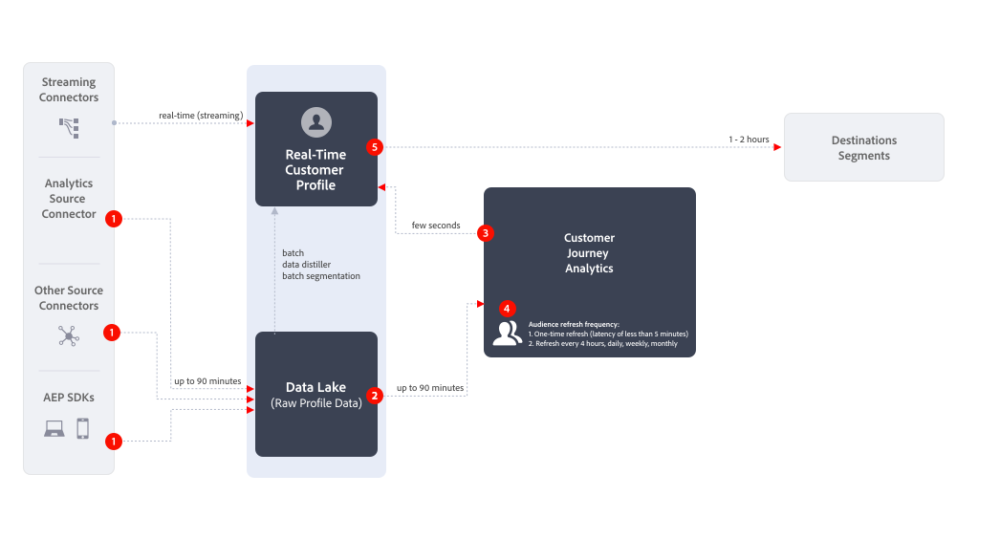
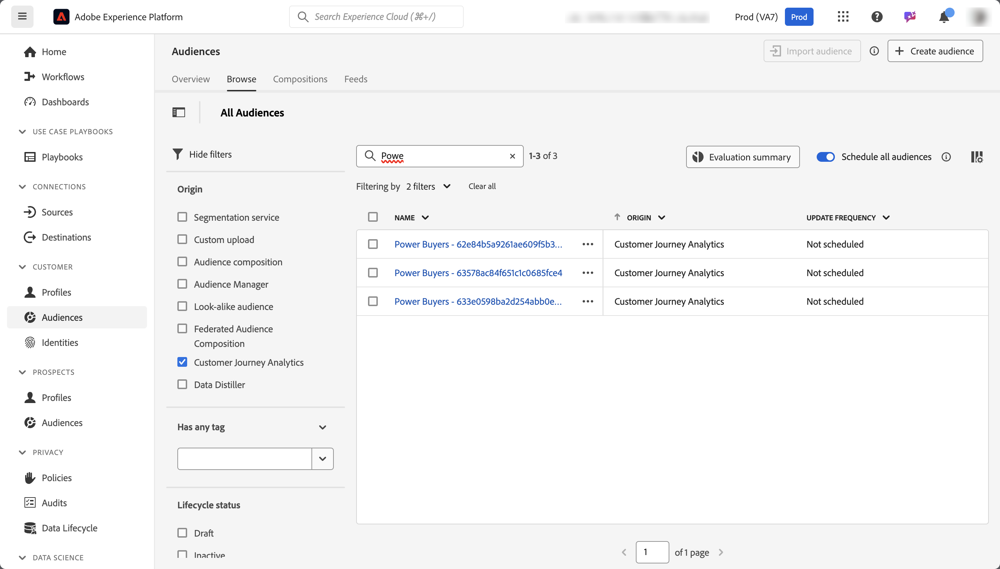

# Creación y publicación de públicos {#create-and-publish-audiences}

<!-- markdownlint-disable MD034 -->

>[!CONTEXTUALHELP]
>id="components_audiences_refreshfrequency"
>title="Frecuencia de actualización"
>abstract="Vea la frecuencia con la que se reevalúa el abono de un público. Los públicos únicos solo se evalúan una vez."

<!-- markdownlint-enable MD034 -->

<!-- markdownlint-disable MD034 -->

>[!CONTEXTUALHELP]
>id="components_audiences_audiencelimit"
>title="Límite de público"
>abstract="Los públicos actualizados están limitados a la frecuencia con la que se actualizan."

<!-- markdownlint-enable MD034 -->

<!-- markdownlint-disable MD034 -->

>[!CONTEXTUALHELP]
>id="component_audiences_refreshlookbackwindow"
>title="Actualizar ventana de retrospección"
>abstract="Defina el número de días de retrospectiva a partir de hoy en los que se evaluará a un público."

<!-- markdownlint-enable MD034 -->

<!-- markdownlint-disable MD034 -->

>[!CONTEXTUALHELP]
>id="component_audiences_audiencesizelimit"
>title="Límite de tamaño de público"
>abstract="Los públicos no pueden exceder un tamaño de 20 millones de miembros."

<!-- markdownlint-enable MD034 -->

<!-- markdownlint-disable MD034 -->

>[!CONTEXTUALHELP]
>id="component_audiences_namespacesincluded"
>title="Espacios de nombres incluidos"
>abstract="Las identidades de este público se comprenden en los espacios de nombres a continuación."

<!-- markdownlint-enable MD034 -->

En este tema se explica cómo crear y publicar públicos identificados en Customer Journey Analytics en el [perfil del cliente en tiempo real](https://experienceleague.adobe.com/es/docs/experience-platform/profile/home) en Adobe Experience Platform para la segmentación y personalización de clientes.

Lea esta [información general](/help/components/audiences/audiences-overview.md) para familiarizarse con el concepto de públicos de Customer Journey Analytics.

## Creación y publicación de un público {#create}

1. Para crear y publicar un público, siga uno de estos procedimientos:

   | Método de creación | Detalles |
   | --- | --- |
   | Desde la interfaz **[!UICONTROL Públicos]** | Seleccione **[!UICONTROL Componentes]** > **[!UICONTROL Públicos]** en el menú principal de Customer Journey Analytics. Se muestra la interfaz Públicos. Seleccione **[!UICONTROL Generar público]** y se abrirá el [!UICONTROL Generador de públicos]. |
   | Desde una visualización en Analysis Workspace | Muchas visualizaciones en Analysis Workspace permiten crear un público utilizando el menú contextual. Por ejemplo, puede seleccionar **[!UICONTROL Crear público]** en el menú contextual de un elemento en una [tabla de forma libre](/help/analysis-workspace/visualizations/freeform-table/freeform-table.md) o en un nodo en [Lienzo de recorridos](/help/analysis-workspace/visualizations/journey-canvas/journey-canvas.md).
Mediante este método se rellena previamente el segmento del Generador de públicos con la dimensión o el elemento de dimensión que haya seleccionado.

Las siguientes visualizaciones le permiten crear un público utilizando el menú contextual:
<ul><li>[Tabla de cohorte](/help/analysis-workspace/visualizations/cohort-table/cohort-analysis.md)</li><li>[Visita en orden previsto](/help/analysis-workspace/visualizations/fallout/fallout-flow.md)</li><li>[Flujo](/help/analysis-workspace/visualizations/c-flow/flow.md)</li><li>[Tabla de forma libre](/help/analysis-workspace/visualizations/freeform-table/freeform-table.md)</li><li>[Lienzo de recorridos](/help/analysis-workspace/visualizations/journey-canvas/journey-canvas.md)</li><li>[Mapa ](/help/analysis-workspace/visualizations/map.md#create-an-audience-from-the-map-visualization) **Nota:** Esta visualización se encuentra en la fase de Prueba limitada de la versión y es posible que aún no esté disponible en su entorno.</li><li>[Venn](/help/analysis-workspace/visualizations/venn.md)</li></ul>
**Nota:** Los públicos no pueden incluir métricas calculadas. Si intenta crear un público que contenga una métrica calculada, ésta no se incluirá en la definición de público.
 |
   | Desde la interfaz de usuario de creación/edición de segmentos | Marque la casilla que dice **[!UICONTROL Crear un público a partir de este segmento]**. Mediante este método se rellena previamente el segmento. Consulte [Crear segmentos](/help/components/segments/seg-create.md) para obtener más información. |

   {style="table-layout:auto"}

1. Genere el público mediante el [Generador de públicos](#audience-builder).

1. Interprete los datos con el panel [Vista previa de la fecha](#data-preview).

1. Seleccione **[!UICONTROL [!UICONTROL Ver ID de muestra]]** para ver una muestra de los ID de este público. En el cuadro de diálogo **[!UICONTROL ID de muestra]** puede utilizar  [!UICONTROL *Búsqueda de los ID de muestra*] para buscar los ID de muestra.

1. Compruebe la configuración del público y seleccione **[!UICONTROL Publicar]**.
Recibirá un mensaje de confirmación que indica que el público se ha publicado. La publicación solo tardará un minuto o dos en mostrarse en Experience Platform. 

1. Seleccione **[!UICONTROL Ver el público en AEP]** dentro del mismo mensaje y se le redirigirá a la [Interfaz de usuario de segmentos](https://experienceleague.adobe.com/es/docs/experience-platform/segmentation/ui/overview) en Adobe Experience Platform. Para obtener más información, vaya más abajo.

## Generador de públicos

Configure estas opciones para definir o actualizar el público.

| Configuración | Descripción |
| --- | --- |
|  | Seleccione una vista de datos para utilizarla para la creación de públicos. |
| **[!UICONTROL Nombre]** | El nombre del público. Por ejemplo, `Really Interested in Potential Car Buyers` |
| **[!UICONTROL Etiquetas]** | Cualquier etiqueta que desee asignar al público con fines organizativos. Puede seleccionar una o varias etiquetas preexistentes o introducir una nueva. |
| **[!UICONTROL Descripción]** | Descripción del público, para diferenciarlo de otros. Por ejemplo, `Build an audience of really interested potential car buyers` |
| **[!UICONTROL Frecuencia de actualización]** | La frecuencia con la que desea actualizar la audiencia.
Puede cambiar entre <ul><li>Público **[!UICONTROL único]**: público (predeterminado) que no necesita ninguna actualización. Por ejemplo, esto podría resultar útil para campañas únicas y específicas. Debe especificar un **[!UICONTROL intervalo de fechas único]**. Puede utilizar  para especificar un intervalo de fechas.</li><li>Un público que se actualiza. Puede seleccionar las siguientes opciones:<ul><li>**[!UICONTROL Cada 4 horas]**: un público que se actualiza cada 4 horas.</li><li>**[!UICONTROL Diario]**: un público que se actualiza diariamente</li><li>**[!UICONTROL Semanal]**: un público que se actualiza semanalmente.</li><li>**[!UICONTROL Mensual]**: un público que se actualiza mensualmente</li></ul></li>Para actualizar públicos, debe especificar lo siguiente:<ul><li>**[!UICONTROL Actualice la ventana de retroactividad]**. Defina el número de días retroactivos a partir de hoy en los que se evaluará a un público. Puede seleccionar entre las opciones o definir un tiempo personalizado. El máximo es de 90 días.</li><li>**[!UICONTROL Fecha de caducidad]**: defina cuándo la audiencia dejará de actualizarse. Puede utilizar  para seleccionar una fecha. El valor predeterminado es 1 año a partir de la fecha de creación. Los públicos que caducan se tratan de manera similar a los informes programados que caducan. El administrador recibe un correo electrónico un mes antes de que la audiencia caduque.</li></ul> Tenga en cuenta que hay un límite de 75 a 150 actualizaciones de público, según los derechos de Customer Journey Analytics.</li></ul> |
| **[!UICONTROL Filtro]** | Los filtros son la entrada principal a la audiencia. Arrastre y suelte uno o varios segmentos del panel izquierdo  **[!UICONTROL Segmento]** en el área Segmento. Puede utilizar  [!UICONTROL *Buscar segmentos*] para buscar segmentos. Se pueden añadir hasta 20 segmentos. Los segmentos pueden unirse con los operadores **[!UICONTROL And]** o **[!UICONTROL Or]**.
Al crear un público a partir de una visualización en Analysis Workspace (como una tabla de forma libre o un lienzo de recorridos), se conservan los segmentos aplicados al panel o a la columna. Puede quitar cualquier segmento que se aplique automáticamente.
 |
| **[!UICONTROL Previsualización de datos]** | Seleccione  para mostrar u ocultar la [previsualización de datos](#data-preview) para el intervalo de fechas seleccionado. |

## Previsualización de datos

El panel Previsualización de datos proporciona la siguiente información.

| Elemento | Descripción |
| --- | --- |
| **[!UICONTROL Personas totales]** | Un número de resumen del total de personas en esta audiencia. El tamaño máximo es de 20 millones de personas. Si el público supera los 20 millones de personas, debe reducir el tamaño del público para poderlo publicar. |
| **[!UICONTROL Límite de tamaño de audiencia]** | Muestra lo lejos que está esta audiencia del límite de 20 millones. |
| **[!UICONTROL Retorno calculado de la audiencia]** | Puede utilizar este valor para redirigirse a las personas de este público que regresan a su sitio, aplicación móvil u otro canal.
Puede seleccionar el lapso de tiempo (**[!UICONTROL Próximos 7 días]**, **[!UICONTROL Próximas 2 semanas]** o **[!UICONTROL Próximo mes]**) para la cantidad estimada de clientes que es posible que regresen. |
| **[!UICONTROL Cálculo de retorno]** | Este número proporciona un número estimado de clientes que regresan durante el lapso de tiempo seleccionado. Este número se predice usando la tasa histórica de cancelación de este público. |
| **[!UICONTROL Previsualizar métricas]** | Puede seleccionar una métrica específica para ver cómo se basan los datos de esa métrica en el público que defina.  Cada métrica de vista previa muestra un total para la métrica en función del público. Y un porcentaje de la métrica basada en el público del total general de la métrica, según lo definido por la vista de datos. Por ejemplo, 381 personas (la métrica que seleccionó) son el resultado de su definición de público que es el 5 % del total de personas disponibles en la vista de datos. Puede seleccionar cualquier métrica que esté disponible en la vista de datos. |
| **[!UICONTROL Espacios de nombres incluidos]** | Los espacios de nombres específicos asociados a las personas de la audiencia. Algunos ejemplos son ECID, CRM ID, direcciones de correo electrónico, etc. |
| **[!UICONTROL Zona protegida]** | La [zona protegida de Experience Platform](https://experienceleague.adobe.com/es/docs/experience-platform/sandbox/home) en la que reside esta audiencia. Cuando publica este público en Platform, solo puede trabajar con él dentro de los límites de esta zona protegida. |

{style="table-layout:auto"}

## ¿Qué sucede después de crear y publicar un público? {#after-audience-created}

Después de crear y publicar un público en Customer Journey Analytics, estará disponible en Experience Platform y podrá verse en el [portal del público](https://experienceleague.adobe.com/es/docs/experience-platform/segmentation/ui/audience-portal). Con el público disponible en Experience Platform, se puede utilizar en otras aplicaciones de Experience Platform, como Adobe Journey Optimizer.

Solo se creará un segmento de streaming de Adobe Experience Platform si su organización se ha configurado para la segmentación de streaming.

Tenga en cuenta lo siguiente cuando trabaje con públicos que se publican desde Customer Journey Analytics en Experience Platform:

* El público de Experience Platform comparte el mismo nombre y la misma descripción que el público de Customer Journey Analytics. El nombre se añade con el ID de audiencia de Customer Journey Analytics para garantizar que el público sea único.
* Cualquier cambio realizado en el nombre o la descripción del público en Customer Journey Analytics se reflejará en Experience Platform.
* Si se elimina un público Customer Journey Analytics, permanecerá disponible en Experience Platform hasta que caduque el perfil al que pertenece el público. La pertenencia al perfil caduca pasados 420 días en el caso de públicos únicos y después de 16 días en el caso de públicos recurrentes.

## Consideraciones de latencia {#latency}

En varios puntos antes, durante y después de la publicación del público, pueden producirse latencias. A continuación se muestra una información general de las posibles latencias.

|  | Punto de latencia | Duración de la latencia |
| --- | --- | --- |
| No se muestra | Conector de origen de Adobe Analytics a Analytics (A4T) | Hasta 30 minutos |
| 1 | Ingesta de datos en el lago de datos (desde el conector de origen de Analytics u otras fuentes) | Hasta 90 minutos |
| 2 | Ingesta de datos del lago de datos de Experience Platform en Customer Journey Analytics | Hasta 90 minutos |
| 3 | Publicar el público en el perfil del cliente en tiempo real, incluida la creación automática del segmento de streaming y permitir que el segmento esté listo para recibir los datos. | Unos segundos |
| 4 | Frecuencia de actualización para audiencias | <ul><li>Actualización única (latencia inferior a 5 minutos)</li><li>Actualizar cada 4 horas, diariamente, semanalmente, mensualmente (la latencia va de la mano con la velocidad de actualización) |
| 5 | Creación del destino en Adobe Experience Platform: activación del nuevo segmento | 1 a 2 horas |

{style="table-layout:auto"}

## Uso de públicos de Customer Journey Analytics en Experience Platform {#audiences-aep}

Customer Journey Analytics toma todas las combinaciones de espacio de nombres e ID de audiencia publicado y las transmite a Real-Time Customer Data Platform. Customer Journey Analytics envía el público a Experience Platform con la identidad principal establecida en el valor que se haya seleccionado como [!UICONTROL ID de la persona] cuando se configuró la conexión.

A continuación, Real-Time Customer Data Platform examina cada combinación de área de nombres e ID y busca un perfil del que pueda formar parte. Un perfil es básicamente un clúster de áreas de nombres, ID y dispositivos vinculados. Si encuentra un perfil, añade el área de nombres y el ID a los demás ID de este perfil como un atributo de pertenencia al segmento. Por ejemplo, <user@adobe.com> se puede dirigir a todos sus dispositivos y canales. Si no se encuentra un perfil, se crea uno nuevo.

Para ver los públicos de Customer Journey Analytics en Platform:

1. Expanda **[!UICONTROL Cliente]** en el panel izquierdo y, a continuación, seleccione **[!UICONTROL Públicos]**. <!-- is there a folder called "Customer Journey Analytics? -->

1. Seleccione la pestaña **[!UICONTROL Examinar]**. 

1. Para localizar el público que publicó desde Customer Journey Analytics, realice una de las siguientes acciones:

   

   * Ordene la tabla por la columna **[!UICONTROL Origen]** para ver los públicos que muestran [!UICONTROL **Customer Journey Analytics**] como origen.

   * Filtre  en **[!UICONTROL Origen]** y seleccione **[!UICONTROL Customer Journey Analytics]**.

   * Utilice el campo de búsqueda .

Para obtener más información sobre el uso de públicos en Platform, consulte la sección [Públicos](https://experienceleague.adobe.com/es/docs/experience-platform/segmentation/ui/segment-builder) en la [guía de la interfaz de usuario del generador de segmentos](https://experienceleague.adobe.com/es/docs/experience-platform/segmentation/ui/segment-builder) en la documentación de Experience Platform.

### Comprender las discrepancias en los recuentos de público

Pueden producirse discrepancias en los recuentos de audiencias entre Customer Journey Analytics y Real-Time Customer Data Platform.

<!--

-->

#### Recuentos estimados versus deterministas

La metodología mediante la cual se calculan los números de miembros de público difiere entre las dos aplicaciones, como se describe a continuación.

* **Customer Journey Analytics**: La métrica **[!UICONTROL Total de personas]** de Customer Journey Analytics es un valor estimado. Esto significa que el recuento es una estimación basada en las reglas de la audiencia y que puede cambiar entre intervalos de actualización.
* **Real-Time Customer Data Platform**: el recuento en Real-Time Customer Data Platform es determinista, se basa en los trabajos de evaluación diarios y se corrigió en el momento en que la audiencia termina de publicar en el portal de públicos.

#### Intervalo y velocidad de publicación

Los públicos publican en Real-Time Customer Data Platform a una velocidad de 1500 registros por segundo (RPS). Por ejemplo, un público de 20 millones de miembros tardará aproximadamente 3,7 horas en publicarse completamente (20 millones/1500 RPS/3600 segundos por hora). Durante este tiempo, es probable que haya diferencias en la pertenencia a públicos entre las dos aplicaciones.

#### Fragmentación de perfiles

Si los perfiles importados de Customer Journey Analytics ya existen en Real-Time Customer Data Platform, no se cuentan como perfiles nuevos. Esto puede provocar recuentos de perfiles inferiores a los esperados en Real-Time Customer Data Platform.

#### Públicos por lotes frente a públicos en streaming

Los públicos de Customer Journey Analytics no se incluyen en el trabajo de evaluación por lotes diario y permanecen fijos hasta el siguiente intervalo de publicación. Por el contrario, otros públicos por lotes en Real-Time Customer Data Platform se reevalúan cada 24 horas.

### Aspectos clave que recordar

* **Recuentos estimados en Customer Journey Analytics**: Comprenda que el recuento de **[!UICONTROL Personas totales]** en Customer Journey Analytics es una estimación y puede variar debido a la transmisión de datos y a los comportamientos de identidad.
* **Recuentos determinísticos en Real-Time Customer Data Platform**: el recuento de Real-Time Customer Data Platform es fijo y no cambia hasta el siguiente intervalo de publicación.
* **Fragmentación de perfiles**: tenga en cuenta que los perfiles existentes en Real-Time Customer Data Platform pueden no contribuir a nuevos recuentos de perfiles al importar desde Customer Journey Analytics.

Al diferenciar claramente estos aspectos, puede comprender y administrar mejor los datos de público en Customer Journey Analytics y Real-Time Customer Data Platform.—>

## Preguntas frecuentes {#faq}

Preguntas más frecuentes sobre la publicación de audiencias.

+++**¿Qué sucede si un usuario ya no es miembro de un público en Customer Journey Analytics?**

En este caso, se envía un evento de salida a Experience Platform desde Customer Journey Analytics.

+++

+++**¿Qué sucede si elimina un público en Customer Journey Analytics**

Cuando se elimina un público de Customer Journey Analytics, ya no aparece en la IU de Experience Platform. Sin embargo, en Platform no se eliminan los perfiles asociados a ese público.

+++

+++**Si no existe un perfil correspondiente en Real-Time Customer Data Platform, ¿se crea uno nuevo?**

Efectivamente.

+++

+++**¿Customer Journey Analytics envía los datos de audiencia como eventos de canalización o como un archivo plano que también se dirige a un lago de datos?**

Customer Journey Analytics transmite los datos a Real-Time Customer Data Platform a través de la canalización y estos datos también se recopilan en un conjunto de datos del sistema en el lago de datos.

+++

+++**¿Qué identidades envía Customer Journey Analytics?**

Cualquiera de los pares de identidad/área de nombres que se hayan utilizado en la [Configuración de conexión](https://experienceleague.adobe.com/es/docs/analytics-platform/using/cja-connections/create-connection). En concreto, el paso cuando un usuario selecciona el campo que desea utilizar como ID de persona.

+++

+++**¿Qué ID se elige como identidad principal?**

Véase más arriba. Solo se envía una identidad por cada persona de Customer Journey Analytics.

+++

+++**¿Real-Time Customer Data Platform también procesa los mensajes de Customer Journey Analytics? ¿Puede Customer Journey Analytics añadir identidades a un gráfico de identidad del perfil mediante el uso compartido de audiencias?**

No. Solo se envía una identidad por persona, por lo que no habría aristas del gráfico que Real-Time Customer Data Platform pudiera consumir.

+++

+++**¿A qué hora del día se producen las actualizaciones diarias, semanales y mensuales? ¿Qué día de la semana tienen lugar las actualizaciones semanales?**

El momento de la actualización se basa en el momento en el que se publicó la audiencia original y se ancla a esa hora del día (y al día de la semana o del mes).

+++

+++**¿Se puede configurar la hora de actualización diaria, semanal y mensual?**

No, los usuarios no pueden configurar la hora de la actualización.

+++

## Pasos siguientes

* Para administrar esta audiencia, vaya a la [interfaz de usuario de administración](/help/components/audiences/manage.md).
