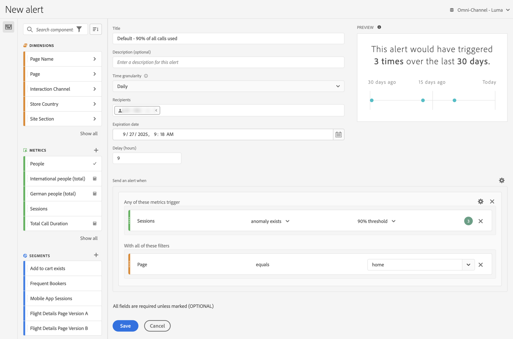

# Creación de alertas {#create-alerts}

<!-- markdownlint-disable MD034 -->

>[!CONTEXTUALHELP]
>id="components_alerts_timegranularity"
>title="Granularidad de tiempo"
>abstract="La granularidad de tiempo hace referencia a la frecuencia con la que se comprueba la alerta."

<!-- markdownlint-enable MD034 -->

>[!NOTE]
>
>El uso de alertas con detección de anomalías (también conocido como _Alertas inteligentes_) solo está disponible en las organizaciones con un paquete de Customer Journey Analytics Prime o Ultimate.

Las alertas de Customer Journey Analytics le permiten recibir notificaciones basadas en porcentajes modificados o puntos de datos específicos. Según el paquete de Customer Journey Analytics, también puede utilizar alertas para activarlas en función de los umbrales de anomalías. 

Para obtener información más detallada sobre las alertas, consulte [Información general sobre alertas](/help/components/c-intelligent-alerts/intelligent-alerts.md).

Para crear una alerta, haga lo siguiente:

<!-- Note that there are difference in how alerts are created in CJA vs AA. In AA you can create alerts from the Workspace menu and using a shortcut; these are not possible in CJA... -->

1. En Customer Journey Analytics, seleccione **[!UICONTROL Componentes]** > **[!UICONTROL Alertas]**. En el [Administrador de alertas](alert-manager.md), seleccione  **[!UICONTROL Añadir]** para crear una nueva alerta o seleccione cualquiera de las alertas enumeradas para modificar una alerta existente.

1. En Analysis Workspace, seleccione uno o más elementos de línea en una tabla de forma libre y seleccione **[!UICONTROL Crear alerta a partir de la selección]** en el menú contextual. Esta acción rellena instantáneamente el generador de alertas para crear una alerta con las métricas y los segmentos correctos.

Se muestra la interfaz [Generador de alertas](#alert-builder).

## Generador de alertas

La interfaz del Generador de alertas le resulta familiar a la interfaz que utiliza para generar segmentos o métricas calculadas en Customer Journey Analytics:

Especifique los siguientes detalles en el Generador de alertas para una alerta:

| Elemento | Descripción |
|---------|----------|
| **[!UICONTROL Título]** | Especifique un nombre para la alerta. El nombre de la alerta puede contener el nombre del umbral de informe o de métricas. |
| **[!UICONTROL Descripción (opcional)]** | Especifique una descripción para la alerta.  |
| **[!UICONTROL Granularidad de tiempo]** | Seleccione con qué frecuencia desea que se compruebe la métrica: diariamente, semanalmente o mensualmente.
<b>Nota</b>: para las vistas de datos con un [calendario personalizado](/help/data-views/create-dataview.md#calendar), la granularidad mensual no se admite en el Generador de alertas.<!--true?-->
 |
| **[!UICONTROL Destinatarios]** | Especifique hacia dónde se puede enviar la alerta. Se puede enviar una alerta a un usuario de Analytics, un grupo de Analytics o a una dirección de correo electrónico sin procesar o a un número de teléfono.
<b>Importante</b>: El número de teléfono debe estar precedido por `+` y un [código de país](https://countrycode.org/).

El correo electrónico que recibe un usuario después de una alerta:

 |
| **[!UICONTROL Fecha de caducidad]** | Establezca la fecha y la hora en que desea que la alerta caduque. |
| **[!UICONTROL Retraso]** | El tiempo necesario hasta que se completen los datos y hasta que estén disponibles para la creación de informes en Customer Journey Analytics varía según la organización, y suele oscilar entre 3 y 9 horas después del evento de datos. Para que las alertas sean precisas, los datos de evento de un intervalo de eventos determinado deben estar completos, lo que significa que Adobe ya no recibe datos de evento para el intervalo de eventos especificado.
Para tener en cuenta este retraso en el tiempo de ingesta, las alertas tienen un retraso predeterminado de 9 horas antes de enviarse.

Puede ajustar el retraso predeterminado de 9 horas a cualquier valor entre 0 y 24 horas. Sin embargo, si se reduce el retraso por debajo de 9 horas, puede indicar que está generando informes sobre datos incompletos, lo que da como resultado una información de alerta inexacta.

Considere los siguientes puntos a la hora de reducir el tiempo de demora:
<ul><li>**Comprenda la disponibilidad de los datos en comparación con su integridad**: los datos por lotes se incorporan a un conjunto de datos de Experience Platform solo después de un período de 3 a 9 horas. Para que las alertas sean precisas, la ingesta de datos debe ser completa, con todos los datos por lotes disponibles en el conjunto de datos.</li><li>**Determine cuánto tiempo tardan los datos en estar completos y disponibles en el conjunto de datos**: los tiempos de ingesta de datos difieren según la organización. Asegúrese de que el tiempo de demora que elija para el envío de alertas sea el mismo o menos frecuente que el tiempo que tardan los datos por lotes en estar disponibles en el conjunto de datos de Platform<!--add link? -->.</li>
**Sugerencia:** La forma más precisa de saber el tiempo necesario para completar e incorporar todos los datos por lotes en el conjunto de datos de Experience Platform es consultar a los ingenieros de datos de su organización.

También puede obtener una idea general de cuánto tiempo tarda la entrega por lotes en su organización en estar disponible en el conjunto de datos de Platform. Cree la siguiente tabla de forma libre en Analysis Workspace:
<ol><li>En una tabla de forma libre de Analysis Workspace, añada una métrica de [!UICONTROL **Eventos**] y una dimensión de [!UICONTROL **Día**].</li><li>Desglose la dimensión [!UICONTROL **Día**] mediante una dimensión [!UICONTROL **Horas**].
Las horas que carecen de datos se muestran como 0.
</li></ol><li>**Tenga en cuenta los errores en sus cálculos**: si reduce el tiempo de demora predeterminado, configure el retraso durante al menos una hora más que el tiempo que tarda su organización en completar la ingesta de datos. Por ejemplo, si hay un demora de 3 horas hasta que se complete la ingesta de datos, debe establecer el retraso en 4 horas.</li></ul>
Para obtener más información, consulte [Los tiempos de ingesta de datos varían en Customer Journey Analytics](/help/components/c-intelligent-alerts/alerts-feature-comparison.md#data-ingestion-times-vary-in-customer-journey-analytics) en el artículo [Comparación de características de alertas: Customer Journey Analytics y Adobe Analytics](/help/components/c-intelligent-alerts/alerts-feature-comparison.md). |
| **[!UICONTROL Enviar una alerta cuando]** | [!UICONTROL **déclencheur de cualquiera de estas métricas**]: <ol><li>Arrastre y suelte las métricas (incluidas las métricas calculadas) para crear déclencheur para la alerta.
Aparece un mensaje *componentes incompatibles* si no todas las métricas, dimensiones o segmentos de la alerta son compatibles con el grupo de informes seleccionado actualmente.

Determine el umbral (para una anomalía) que debe superar la métrica o el valor (en caso de superiores, inferiores, iguales o cambio de porcentaje) que se debe utilizar antes de configurar una alerta.</li><li>Seleccione una de las siguientes condiciones:<ul><li>existe anomalía</li><li>anomalía por encima de lo esperado</li><li>anomalía por debajo de lo esperado</li><li>mayor o igual que</li><li>menor o igual que</li><li>cambia por un</li></ul></li><li>Seleccione un valor de umbral o introduzca un valor.</li></ol>[!UICONTROL **Con todos estos filtros**]: arrastre y suelte los segmentos o dimensiones para añadir filtros a la alerta. Por ejemplo, si añade un segmento *Solo dispositivos móviles* significará que la regla solamente se activa para los dispositivos móviles. Puede añadir filtros adicionales mediante una instrucción AND. Puede añadir las reglas AND u OR si hace clic en el icono de engranaje.

Consulte [Alertas - casos de uso](alerts-use-cases.md) para ver casos de uso por ejemplo.
 |
| **[!UICONTROL Vista previa]** | La vista previa de alertas interactiva le muestra con qué frecuencia, aproximadamente, se activa una alerta en función de la experiencia pasada.
Por ejemplo, si establece la granularidad de tiempo a diario, en la vista previa podrá ver cuántas veces se activó una alerta para una métrica en particular durante los últimos 30 o 31 días.

Si considera que se activan demasiadas alertas, puede ajustar el umbral en [Gestionar alertas](/help/components/c-intelligent-alerts/alert-manager.md).

{width="50%"}
 |
