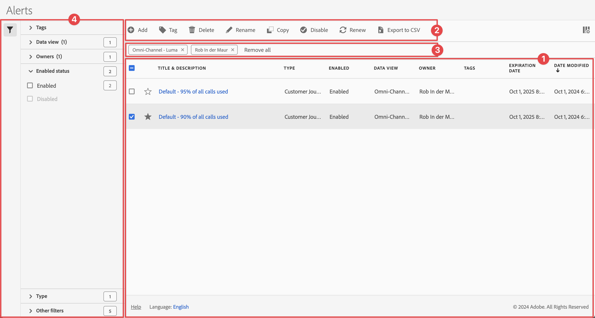
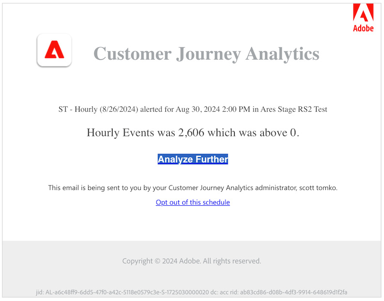

# Administración de alertas

Puede filtrar, etiquetar, eliminar, cambiar el nombre, copiar, habilitar, deshabilitar, renovar y exportar alertas desde una interfaz de administración central de [!UICONTROL Alerts]. Para administrar alertas:

* Seleccione **[!UICONTROL Componentes]** en la interfaz principal y luego seleccione **[!UICONTROL Alertas]**.

El Administrador de alertas tiene una estructura muy similar al [Administrador de filtros](/help/components/filters/manage-filters.md) y al [Administrador de métricas calculadas](/help/components/calc-metrics/cm-workflow/cm-manager.md).

## Administrador de alertas

El Administrador de alertas tiene los siguientes elementos de interfaz:

### Lista de alertas

La lista de alertas ➊ muestra todas las alertas que posee, las alertas que se han asignado a todos sus proyectos y las alertas que se han compartido con usted. La lista tiene las columnas siguientes:

| Columna | Descripción |
|---|---|
|  | Seleccione para favorecer a  o para anular la preferencia de  sobre una alerta. |
| **[!UICONTROL Título y descripción]** | Para editar la alerta, seleccione el vínculo del título, que abre el [Generador de alertas](alert-builder.md#alert-builder). |
| **[!UICONTROL Tipo]** | Muestra si se trata de una alerta de datos del Customer Journey Analytics o de una alerta de uso de llamadas al servidor. |
| **[!UICONTROL Habilitado]** | Indica si la alerta está habilitada o deshabilitada. |
| **[!UICONTROL Vista de datos]** | Las vistas de datos a las que se aplica esta alerta. |
| **[!UICONTROL Propietario]** | El propietario de la alerta. Si no es el administrador, solo verá las alertas que le pertenecen o que han compartido con usted. |
| **[!UICONTROL Etiquetas]** | Las etiquetas de esta alerta. |
| **[!UICONTROL Fecha de caducidad]** | La fecha y hora en que la alerta está configurada para caducar. |
| **[!UICONTROL Fecha de modificación]** | La fecha y la hora de la última modificación de la alerta. |

<!-- When "Last used" column is added, add this information as the description: Shows the date when the alert was last used. 
This information can help you determine whether a component is valuable to users in your organization, where it is used, and if it needs to be deleted or modified.

Consider the following when viewing this column:
<ul><li>This information does not include usage from the API, Report Builder, or Data Warehouse.</li><li>For some components, this column might not contain data if the component was last used prior to September 2023.</li></ul> -->

Use  para especificar qué columnas desea mostrar.

### Barra de acciones

Puede realizar acciones en las alertas mediante el ➋ de la barra de acciones. La barra de acciones contiene las siguientes acciones:

| Acción | Descripción |
|---|---|
|  **[!UICONTROL Agregar]** | Agregue otra alerta con el [Generador de alertas](alert-builder.md#alert-builder). |
|  [!UICONTROL *Buscar por título*] | Cuando no se selecciona ninguna alerta en la lista, buscar alertas mediante este campo de búsqueda. |
|  **[!UICONTROL Etiqueta]** | Etiquetar las alertas seleccionadas. En el cuadro de diálogo **[!UICONTROL Alerta de etiqueta]**, seleccione o anule la selección de las etiquetas de las alertas seleccionadas. Seleccione **[!UICONTROL Guardar]** para guardar las etiquetas de las alertas seleccionadas. |
|  **[!UICONTROL Eliminar]** | Eliminar las alertas seleccionadas. Se le pedirá una confirmación. |
|  **[!UICONTROL Cambiar nombre]** | Cambiar el nombre de una alerta seleccionada. Cuando se selecciona, puede cambiar el nombre de la alerta en línea. |
|  **[!UICONTROL Copiar]** | Copiar la alerta seleccionada. Las nuevas alertas se crean con el mismo nombre y sufijo `(Copy)`. |
|  **[!UICONTROL Habilitar]** o **[!UICONTROL Deshabilitar]** | Activar o desactivar las alertas seleccionadas. |
|  **[!UICONTROL Renovar]** | Renueva la fecha de caducidad de la alerta. La fecha de caducidad se extiende 1 año a partir del día en que seleccione esta opción, independientemente de la fecha de caducidad original. |
|  **[!UICONTROL Exportar a CSV]** | Exportar las alertas a un archivo de `Alerts List.csv`. |

### Barra de filtro activa

La ➌ de la barra de filtros muestra los filtros activos aplicados desde el panel de filtros a la lista de alertas (si los hay). Puede quitar rápidamente un filtro con . Si se especifica más de un filtro, puede quitar todos los filtros usando **[!UICONTROL Quitar todos]**.

### Panel Filtro

Puede filtrar la lista de alertas con el ➍ del panel izquierdo  **[!UICONTROL Filtro]**. El panel Filtro muestra el tipo de filtro y el número de alertas que respetan el filtro específico.

{{filterspanel}}

#### Sección de filtro de etiquetas

{{tagfiltersection}}

#### Sección Filtro de vista de datos

{{dataviewfiltersection}}

#### Sección de filtro Propietarios

{{ownerfiltersection}}

#### Sección de filtro de estado habilitado

{{enabledstatusfiltersection}}

#### Escriba la sección de filtro

{{typefiltersection}}

#### Otros filtros, sección de filtro

{{otherfiltersfiltersection}}

## Editar alertas

Puede editar una alerta

* En la lista [[!UICONTROL Alerta]](#alerts-list), seleccione el título de la alerta.

Utiliza el [Generador de alertas](alert-builder.md#alert-builder) para editar la alerta.

## Solución de problemas de una alerta

Cuando solucione un problema con una alerta, proporcione el número JID (ID de instancia de trabajo) a Asistencia técnica de Adobe. El número JID se encuentra en la parte inferior de la notificación de alerta por correo electrónico que recibe.

