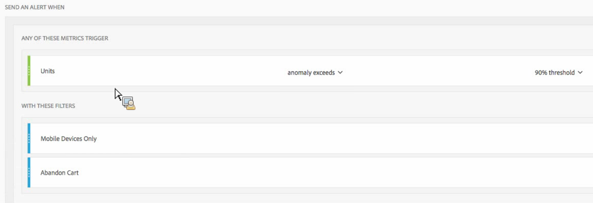

# Alertas inteligentes: Casos de uso

Puede crear alertas inteligentes como se describe en [Crear alertas](/help/components/c-intelligent-alerts/alert-builder.md).

Las secciones siguientes ilustran ejemplos de casos de uso que se deben tener en cuenta al crear alertas.

## Crear una alerta simple filtrada mediante dos filtros {#section_2E96FFFA93D44F7D8DBCEC97203204AA}

<!-- 

Update screenshots for better readability.

 -->

## Consolidar las alertas (apilar) en lugar de crear múltiples alertas {#section_B27B0856BA104B9FB6D0BBB317633F18}

El apilado de alertas garantiza que las alertas se combinen y que no obtenga diversas alertas independientes.

