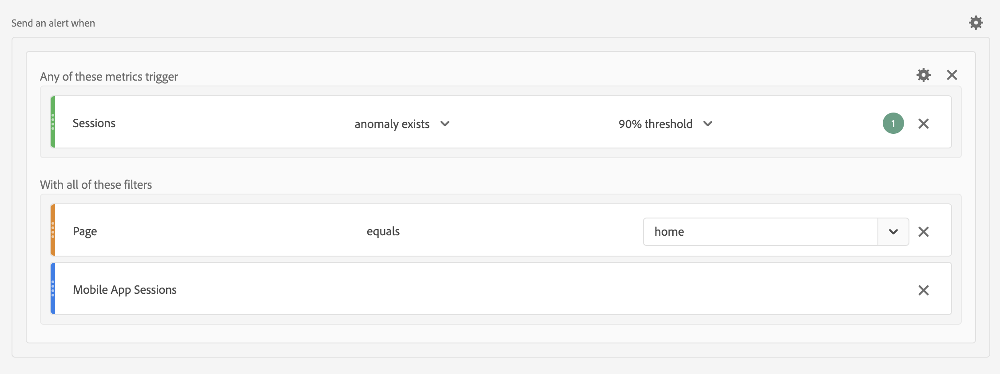
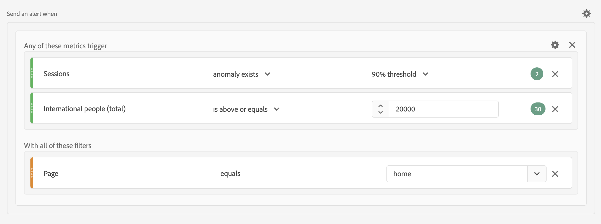

# Alertas: Casos de uso

Puede crear alertas tal como se describe en [Crear alertas](/help/components/c-intelligent-alerts/alert-builder.md).

Las secciones siguientes ilustran ejemplos de casos de uso que se deben tener en cuenta al crear alertas.

## Filtrar alertas

Puede crear alertas simples mediante filtros. Por ejemplo, defina una alerta sobre el número de sesiones para las personas que visitan la página de inicio a través de una sesión de aplicación móvil.

<!-- 

Update screenshots for better readability.

 -->

## Apilar alertas

Puede consolidar (apilar) alertas en lugar de crear múltiples alertas. El apilado de alertas garantiza que las alertas se combinen y que no obtenga varias alertas independientes. En el ejemplo siguiente, se envía una alerta cuando se activa cualquiera de los umbrales de métrica.

