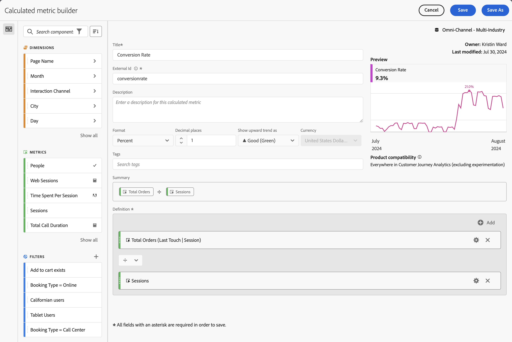
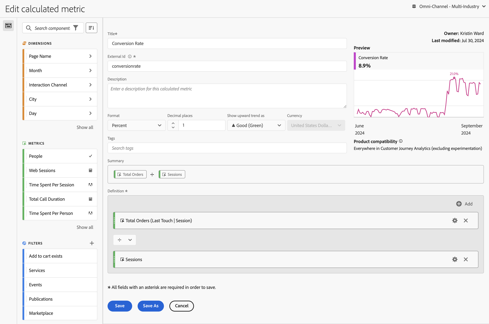

# Crear métricas calculadas {#build-metrics}

<!-- markdownlint-disable MD034 -->

>[!CONTEXTUALHELP]
>id="components_calculatedmetrics_productcompatibility"
>title="Compatibilidad del producto"
>abstract="Indica en qué parte de Customer Journey Analytics se puede utilizar esta métrica calculada, por ejemplo, en Analysis Workspace, Report Builder, etc. Algunas métricas calculadas no se pueden usar con la experimentación."
>additional-url="https://experienceleague.adobe.com/es/docs/analytics-platform/using/cja-workspace/panels/experimentation#use-in-experimentation" text="Uso de métricas calculadas en experimentación"

<!-- markdownlint-enable MD034 -->

<!-- markdownlint-disable MD034 -->

>[!CONTEXTUALHELP]
>id="components_calculatedmetrics_externalid"
>title="ID externo"
>abstract="Cambiar el ID externo puede afectar al modo en que la métrica calculada aparece en las fuentes externas, como las herramientas de inteligencia empresarial"

<!-- markdownlint-enable MD034 -->

El cuadro de diálogo **[!UICONTROL Creador de métricas calculadas]** se usa para crear métricas calculadas nuevas o editar las existentes. El cuadro de diálogo se titula **[!UICONTROL Nueva métrica calculada]** o **[!UICONTROL Editar métrica calculada]** para las métricas que cree o administre desde el administrador de [[!UICONTROL Métricas calculadas]](/help/components/calc-metrics/cm-workflow/cm-manager.md).

>[!BEGINTABS]

>[!TAB Generador de métricas calculadas]

>[!TAB Crear o editar métrica calculada]

>[!ENDTABS]

1. Especifica los siguientes detalles ( es obligatorio):

   | Elemento | Descripción |
   | --- | --- |
   | **[!UICONTROL Vista de datos]** | Puede seleccionar la vista de datos de la métrica calculada.  La métrica calculada que defina estará disponible en los proyectos de Workspace en función de la vista de datos seleccionada. |
   | **[!UICONTROL Métrica solo de proyecto]** | Un cuadro de información para explicar que la métrica solo es visible en el proyecto en el que se crea y que la métrica no se agregará a la lista de componentes. Habilite **[!UICONTROL Ponga esta métrica a disposición de todos sus proyectos y agréguela a su lista de componentes]** para cambiar esa configuración. Este cuadro de información solo está visible cuando crea una métrica en Workspace usando **[!UICONTROL Crear métrica a partir de la selección]** y ha seleccionado una función (como **[!UICONTROL Media]** o **[!UICONTROL Mediana]**). Y más tarde usar la [información de componente](/help/components/use-components-in-workspace.md#component-info) para editar esa métrica creada. |
   | **[!UICONTROL Título]**  | Asigne un nombre a la métrica calculada, por ejemplo, `Conversion Rate`. |
   | **[!UICONTROL ID externo]**  | Nombre de la métrica calculada al utilizar una herramienta de BI externa y la extensión de BI. El valor se define automáticamente como `undefined_xxx` a menos que reemplace el valor. |
   | **[!UICONTROL Descripción]** | Proporcione una descripción para el filtro, por ejemplo, `Calculated metric to define the conversion rate.`. No es necesario describir la fórmula para la métrica calculada, ya que la fórmula ya está disponible automáticamente en [!UICONTROL Resumen]. |
   | **[!UICONTROL Formato]** | Seleccione un formato para la métrica calculada: puede seleccionar entre **[!UICONTROL Decimal]**, **[!UICONTROL Hora]**, **[!UICONTROL Porcentaje]** y **[!UICONTROL Moneda]**. |
   | **[!UICONTROL Cifras decimales]** | Especifique el número de decimales para el formato seleccionado. Solo se habilita cuando el formato seleccionado es Decimal, Moneda y Porcentaje. |
   | **[!UICONTROL Mostrar tend ascendente como]** | Especifique si una tendencia al alza de la métrica calculada se muestra como ▲ **[!UICONTROL Bueno (Verde)]** o como ▼ **[!UICONTROL Malo (Rojo)]**. |
   | **[!UICONTROL Moneda]** | Especifique la moneda de la métrica calculada. Solo se habilita cuando el formato seleccionado es Moneda. |
   | **[!UICONTROL Etiquetas]** | Organice la métrica calculada creando o aplicando una o varias etiquetas. Empieza a escribir para buscar las etiquetas existentes que puedes seleccionar. O presione **[!UICONTROL ENTRAR]** para agregar una etiqueta nueva. Selecciona  para quitar una etiqueta. |
   | **[!UICONTROL Vista previa]** | La vista previa abarca los últimos 90 días y es una forma de medir si ha definido la métrica correctamente. |
   | **[!UICONTROL Resumen]** | Muestra un resumen de la definición de la métrica calculada.  Por ejemplo:  **[!UICONTROL Pedidos totales]**   **[!UICONTROL Sesiones]**. |
   | **[!UICONTROL Definición]**  | Defina su filtro con el [generador de definiciones](#definition-builder). |

1. Para comprobar si la definición de la métrica calculada es correcta, use la **[!UICONTROL Vista previa]** actualizada constantemente de los resultados de la métrica calculada. La **[!UICONTROL vista previa]** abarca los últimos 90 días y evalúa la definición de su métrica calculada de manera continua.

   La **[!UICONTROL compatibilidad del producto]** indica si la métrica calculada se puede usar en experimentación. Los valores posibles son:
   * **[!UICONTROL En cualquier lugar del Customer Journey Analytics]**: la métrica calculada se puede usar en todo el Customer Journey Analytics.
   * **[!UICONTROL En cualquier lugar del Customer Journey Analytics (excluida la experimentación)]**: la métrica calculada se puede usar en todo el Customer Journey Analytics, excepto en el panel Experimentación.

1. Seleccionar:
   * **[!UICONTROL Guardar]** para guardar la métrica calculada.
   * **[!UICONTROL Guardar como]** para guardar una copia de la métrica calculada.
   * **[!UICONTROL Cancelar]** para cancelar los cambios realizados en la métrica calculada o cancelar la creación de una nueva métrica calculada.

## Generador de definiciones

Puede usar el Generador de definiciones para arrastrar y soltar dimensiones, métricas, filtros y funciones para crear métricas personalizadas basadas en lógica, reglas y operadores de jerarquía de contenedor. En esa construcción, puede utilizar métricas estándar, métricas definidas por Adobes, métricas calculadas, filtros, dimensiones y funciones. Todos estos componentes están disponibles en el panel de componentes del Creador de métricas calculadas. Además, puede utilizar operadores y contenedores en la definición.

Solo las métricas se definen como componentes singulares en el área **[!UICONTROL Definición]**. Todos los demás componentes se definen como un contenedor, métricas de ajuste u otros contenedores. Consulte [Contenedores](#containers) para obtener más información.

### Métricas

Para agregar una métrica:

* Arrastre y suelte un componente  **[!UICONTROL Metrics]** del panel de componentes en **[!UICONTROL Arrastre y suelte aquí métricas, dimensiones, elementos de dimensión, filtros o funciones]**. Puede usar  en la barra de componentes para buscar componentes específicos.

Cuando se utiliza una métrica calculada como parte de la definición, la métrica calculada se expande.

Para modificar una métrica:

1. Seleccione  en un componente de métrica en el área de **[!UICONTROL Definición]**.
1. En el cuadro de diálogo emergente puede definir el tipo de métrica y un modelo de atribución. Consulte [Tipo de métrica y Atribución](m-metric-type-alloc.md).

Para suprimir una métrica:

* Seleccione  en la métrica.

### Operadores

Los operadores permiten especificar el operador entre componentes o contenedores. Los operadores aparecen automáticamente entre

* dos o más métricas en un contenedor,
* dos o más contenedores en un contenedor,
* una o más métricas y uno o más contenedores en un contenedor.

Puede seleccionar:

| Símbolo | Operador |
|:---:|---|
|  | Dividir (predeterminado) |
|  | Multiplicar |
|  | Restar |
|  | Agregar |

### Número estático

Puede agregar un número estático a la definición de métrica calculada. Para agregar un número estático:

* Seleccione  **[!UICONTROL Add]** desde un contenedor.
* Seleccione **[!UICONTROL Número estático]**. Aparece un contenedor de número estático.
* Seleccione [!UICONTROL *Haga clic para agregar un valor*] y escriba un valor.

### Contenedores

Las dimensiones, los filtros y las funciones se agregan como contenedores a una definición de métrica calculada. También puede agregar un contenedor genérico. Los contenedores funcionan como una expresión matemática y determinan el orden de las operaciones. Cualquier cosa dentro de un contenedor se procesa antes del siguiente componente o contenedor.

#### Contenedor de filtro

Utiliza el concepto de contenedor de filtros para crear una [métrica filtrada](metrics-with-segments.md). Puede construir un contenedor de filtros utilizando un filtro o un filtro que cree a partir de una dimensión.

* Para agregar un contenedor de filtro desde una dimensión:

   1. Arrastre y suelte un componente  **[!UICONTROL Dimension]** del panel Componentes en **[!UICONTROL Arrastre y suelte aquí métricas, dimensiones, elementos de dimensión, filtros o funciones]**. Puede usar  en la barra de componentes para buscar componentes específicos.
   1. En la ventana emergente **[!UICONTROL Crear filtro a partir del Dimension]**, defina la condición para el filtro. Seleccione en la lista de operadores y seleccione un valor o introduzca un valor. Por ejemplo, **[!UICONTROL Mes]** **[!UICONTROL es igual a]**  `Sep 2024`.
   1. Seleccione **[!UICONTROL Listo]**. Se agregó un contenedor de filtro a **[!UICONTROL Definition]**.

* Para agregar un contenedor de filtros desde un filtro, puede utilizar:

   * Arrastre y suelte un componente  **[!UICONTROL Filters]** del panel de componentes en **[!UICONTROL Arrastre y suelte aquí métricas, dimensiones, elementos de dimensión, filtros o funciones]**. Puede usar  en la barra de componentes para buscar filtros específicos.
Se agrega automáticamente un contenedor de filtro a **[!UICONTROL Definition]**, con el nombre del filtro.

   * Arrastre y suelte un componente  **[!UICONTROL Filters]** del panel de componentes a un contenedor genérico. El contenedor se modifica para convertirse en un contenedor de filtro.

   * Seleccione  **[!UICONTROL Add]** desde un contenedor:

      1. Seleccione **[!UICONTROL Filtro]**. Se agregó un contenedor de filtro a **[!UICONTROL Definition]**.
      1. En el nuevo contenedor de filtros, seleccione un filtro en el menú desplegable [!UICONTROL *Seleccionar...*].

  >[!TIP]
  >
  >Puede agregar más de un filtro a un contenedor.

  Los filtros del contenedor reciben el nombre del componente de filtro. Por ejemplo,  **[!UICONTROL Sesiones web]**. Seleccione  para mostrar una ventana emergente con detalles sobre el filtro. En la ventana emergente, seleccione  para editar la definición del filtro.

Para quitar un filtro de un contenedor:

* Seleccione  junto al nombre del filtro.

Consulte [Métricas filtradas](metrics-with-segments.md) para obtener más detalles y ejemplos.

#### Contenedor de funciones

Para agregar un contenedor de funciones, puede utilizar:

* Arrastrar y soltar:

   1. Arrastre y suelte un componente  **[!UICONTROL Functions]** del panel de componentes en **[!UICONTROL Arrastre y suelte las métricas, dimensiones, elementos de dimensión, filtros o funciones aquí]**. Puede usar  en la barra de componentes para buscar funciones específicas.
   1. Se agrega automáticamente un contenedor de funciones a **[!UICONTROL Definition]** con el nombre de la función.

* Seleccione  **[!UICONTROL Add]** desde un contenedor:

   1. Seleccione **[!UICONTROL Función]**.
   1. En el contenedor, seleccione una función del menú desplegable [!UICONTROL *Seleccionar...*].

El contenedor de funciones recibe el nombre del componente de funciones. Por ejemplo,  **[!UICONTROL SQUARE ROOT (metric)]**. Seleccione  para mostrar una ventana emergente con detalles sobre la función. Seleccione **[!UICONTROL Más información]** para obtener más información sobre la función.

Consulte [Usar funciones](cm-using-functions.md) para obtener detalles sobre cómo usar funciones y qué funciones están disponibles para crear una métrica calculada.

#### Contenedor genérico

Para agregar un contenedor genérico:

* Seleccione  **[!UICONTROL Add]** desde un contenedor
* Seleccione **[!UICONTROL Contenedor]**. Se agrega un nuevo contenedor genérico vacío a **[!UICONTROL Definition]**. Puede utilizar un contenedor genérico para anidar o crear una jerarquía en la definición de la métrica calculada.

#### Eliminar un contenedor

Para eliminar un contenedor, selecciona  en el nivel de contenedor.

>[!MORELIKETHIS]
>
>[Uso de funciones](cm-using-functions.md)
>[Filtros](/help/components/filters/filters-overview.md)
>

