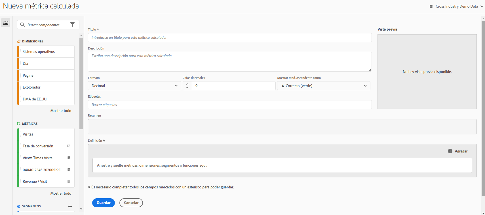

# Crear métricas

Customer Journey Analytics proporciona un lienzo al que arrastrar y en el que soltar las dimensiones, métricas, filtros y funciones para crear métricas personalizadas basadas en lógica, reglas y operadores de jerarquía de contenedor. Esta herramienta de desarrollo integrada le permite crear y guardar métricas calculadas simples o métricas calculadas avanzadas complejas.

## Comenzar a crear una métrica calculada

Puede empezar a crear una métrica calculada de cualquiera de las siguientes maneras:

* En Analysis Workspace, abra un proyecto y seleccione **[!UICONTROL Componentes]** > **[!UICONTROL Crear métrica]**.
* En Analysis Workspace, abra un proyecto y, a continuación, seleccione **Plus** junto al icono [!UICONTROL **Métricas**] en el carril izquierdo.
* Entrada [!DNL Customer Journey Analytics], vaya a **[!UICONTROL Componentes]** > **[!UICONTROL Métricas calculadas]**, luego seleccione **[!UICONTROL + Agregar]** en la parte superior de la página Métricas calculadas.

## Áreas del Creador de métricas calculadas

La siguiente imagen y la tabla adjunta explican algunas de las áreas y características principales del Creador de métricas calculadas.

| Campo | Descripción |
| --- | --- |
| Título | Es obligatorio nombrar la métrica. No puede guardar la métrica a menos que tenga un nombre. |
| Descripción | Proporciónele una descripción descriptiva que indique para qué se utiliza y para distinguirla de métricas similares. 
La descripción también aparece en el informe. Se recomienda NO añadir la fórmula en la descripción; en su lugar, describa para qué se debe o no utilizar la métrica. (La fórmula se genera a medida que crea la métrica, debajo del encabezado del Resumen. Como resultado, no hay necesidad de agregar la fórmula a la descripción). 
 |
| Formato | Las opciones incluyen Decimal, Hora, Porcentaje y Moneda. |
| Lugares decimales | Muestra cuántos lugares decimales se mostrarán en el informe. El número máximo de lugares decimales que puede especificar es 10. |
| Mostrar tendencia ascendente como... | Esta configuración de polaridad de métrica muestra si Analytics debe considerar una tendencia ascendente en la métrica como buena (verde) o mala (rojo). Como resultado, el gráfico del informe se mostrará en rojo o en verde cuando vaya hacia arriba. |
| Moneda | La moneda base para esta vista de datos. |
| Etiquetas | Etiquetar es una buena forma de organizar las métricas. Todos los usuarios pueden crear etiquetas y aplicar una o más a una métrica. Sin embargo, solo verá las etiquetas de los filtros que sean suyos o que se hayan compartido con usted. ¿Qué tipo de etiquetas debería crear? A continuación encontrará una serie de sugerencias para crear etiquetas útiles:<ul><li>**Nombres del equipo**, como Marketing social o Marketing móvil.</li><li>**Proyectos** (etiquetas de análisis), como análisis de Páginas de entrada.</li><li>**Categorías**, como Mujeres; Geografía.</li><li>**Flujos de trabajo**, como Por aprobar; Revisado para (una unidad comercial específica)</li></ul> |
| Resumen | 
La fórmula de Resumen se actualiza cada vez que realice cambios en la definición de la métrica. Esta fórmula también se muestra en el carril de métrica a la izquierda, al pasar el ratón por encima de una métrica y hacer clic en  icono. 
 |
| Definición | Aquí es donde arrastra las métricas/métricas calculadas, filtros o funciones para crear la métrica calculada. <ul><li>Si arrastra una métrica calculada, ampliará su definición de métrica automáticamente. </li> <li>Puede anidar definiciones en contenedores. Sin embargo, a diferencia de los contenedores de filtro, estos contenedores funcionan como una expresión matemática y determinan el orden de las operaciones. </li> </ul> |
| Operador | Dividido entre (  ) es el operador predeterminado, además de los operadores +, - y x. |
| Vista previa | Proporciona una lectura rápida de cualquier posible error. La vista previa abarca los últimos 90 días. Esta es una forma de calibrar inicialmente si ha seleccionado los componentes adecuados para su métrica. Un resultado inesperado significaría que debe volver a revisar la definición de la métrica. |
| Compatibilidad del producto | Para cualquier métrica calculada que cree en CJA, este valor siempre se muestra como [!UICONTROL **Datos completamente procesados**]. Las métricas calculadas solo pueden incluir datos de conjuntos de datos de evento. |
| Agregue | Puede añadir contenedores y números estáticos a la definición de todos los tipos de métricas calculadas. Para obtener métricas calculadas avanzadas, también puede añadir filtros y funciones.<ul><li>Los contenedores funcionan como una expresión matemática y determinan el orden de las operaciones. Así, cualquier cosa que se encuentre en un contenedor se procesará antes de la operación siguiente.</li><li>Al arrastrar un filtro a un contenedor, se filtra todo lo que hay en dicho contenedor. (solo métricas calculadas avanzadas).</li><li>Puede apilar múltiples filtros en un contenedor.</li></ul> |
| Icono de engranaje (Tipo de métrica, Atribución) | Si selecciona el icono de engranaje junto a una métrica, puede especificar el tipo de métrica y los modelos de atribución. |
| Icono de signo más (+) | Le permite crear un nuevo componente, como un nuevo filtro (que le dirige al Generador de segmentos). |
| Buscar componentes | Esta barra de búsqueda le permite buscar dimensiones, métricas, filtros (solo métricas calculadas avanzadas) y funciones (solo métricas calculadas avanzadas). |
| Lista de dimensiones | En lugar de salir del Creador de métricas calculadas para generar un filtro simple (en el Creador de filtros), como &quot;Página = Página principal&quot;, puede arrastrar Página y seleccionar Página principal directamente en el Creador de métricas calculadas. Esto conlleva un flujo de trabajo mucho más simplificado en lo relativo a la creación de métricas calculadas filtradas. |
| Lista de métricas | Las métricas se dividen en 3 categorías:<ul><li>Métricas estándar</li><li>Métricas calculadas</li><li>Plantillas de métricas, al final de la lista.</li></ul>Cuando pasa el ratón por encima de una métrica, puede ver el icono de información a su derecha. Si hace clic en este icono, le proporcionará la siguiente información:<ul><li>La fórmula de cómo se calcula.</li><li>Una vista previa de la tendencia de la métrica.</li><li>Un icono de edición (lápiz) en la parte superior derecha que le llevará al Creador de métricas calculadas donde puede editar esta métrica calculada.</li></ul> |
| Lista de filtros | (Solo métricas calculadas avanzadas) Como administrador, en esta lista se muestran todos los filtros creados en su compañía de inicio de sesión. Si es un usuario no administrador, en esta lista se muestran los segmentos que le pertenecen y los que han compartido con usted. |
| Lista de funciones | (Solo métricas calculadas avanzadas) Las funciones se dividen en dos listas: Básicas (utilizadas con más frecuencia) y Avanzadas. |
| Selector de la vista de datos | Este selector (en la parte superior derecha) le permite cambiar a una vista de datos diferente. |
