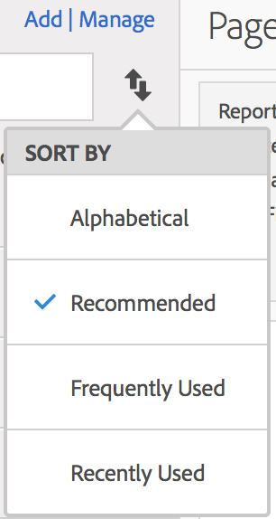

# Buscar métricas

Describe las dos formas principales de encontrar sus métricas: clasificación y filtrado.

## Clasificación {#sorting}

Cuando abra un informe y haga clic en el icono Métricas  que encontrará a la izquierda para que se muestre el carril Métricas, verá cuatro opciones de clasificación en la lista desplegable **[!UICONTROL Clasificar por]** del Selector de métricas:

| Opción | Cuándo utilizarla |
|---|---|
| Alfabético | Útil cuando sabe el nombre. |
| Recomendado | Métricas comunes que se utilizan en el informe: esto se recopila en segundo plano a partir de las métricas que suelen utilizar los usuarios con este informe. |
| Más utilizadas | Resulta útil cuando es un usuario sin experiencia y necesita ver qué se utiliza normalmente en el informe. |
| Más recientes | Resulta útil si trabaja en un proyecto y utiliza el mismo grupo de métricas una y otra vez. |

## Filtrado - selección avanzada {#filtering-advanced}

Tras abrir un informe y hacer clic en el icono Métricas, haga clic en **[!UICONTROL Administrar]**. A continuación, haga clic en el icono Filtrar. Puede filtrar de varias formas.

| Si desea | Clasificar por |
| --- | --- |
| Mostrar todas las métricas en esta vista de datos. | Otros filtros > Mostrar todo |
| Mostrar solo las métricas que tiene. | Otros filtros > Míos |
| Mostrar métricas compartidas conmigo por otra persona. | Seleccione Propietarios u Otros filtros > Compartido conmigo |
| Mostrar únicamente las métricas que han sido aprobadas por la empresa. | Aprobado |
| Filtrar las métricas de un proyecto en el que esté trabajando. | Una de las etiquetas. |