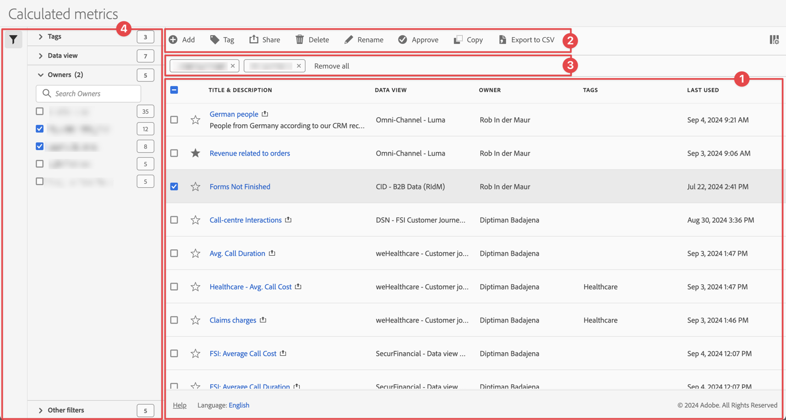

# Administrar métricas calculadas

Puede compartir, filtrar, etiquetar, aprobar, cambiar el nombre, copiar, eliminar, exportar métricas calculadas y marcar las métricas calculadas como favoritas desde una interfaz de administración central de [!UICONTROL Métricas calculadas]. Para administrar métricas calculadas:

* Seleccione **[!UICONTROL Componentes]** en la interfaz principal y luego seleccione **[!UICONTROL Métricas calculadas]**.

## Administrador de métricas calculadas

El Administrador de métricas calculadas tiene los siguientes elementos de interfaz:

### Lista de filtros

La lista de filtros ➊ muestra todas las métricas calculadas que posee o que han compartido con usted. La lista tiene las columnas siguientes:

<!-- I think this table incorrectly talks about quick calculated metrics -->

| Columna | Descripción |
| --- | --- | 
|  | Seleccione para favorecer a  o dejar de favorecer a  en una métrica calculada. Ver [Marcar métrica calculada como favorita](/help/components/filters/filters-favorite.md) |
| **[!UICONTROL Título y descripción]** | Para editar la métrica calculada, seleccione el vínculo del título, que abre el [Creador de métricas calculadas](cm-build-metrics.md). Se indica una métrica calculada compartida con . |
| **[!UICONTROL Vista de datos]** | Las vistas de datos a las que se aplica esta métrica calculada. |
| **[!UICONTROL Propietario]** | Propietario de la métrica calculada. Como usuario, solo verá las anotaciones que le pertenecen o las anotaciones que se han compartido con usted. |
| **[!UICONTROL Etiquetas]** | Enumera las etiquetas de esta métrica calculada. |
| **[!UICONTROL Compartido con]** | Indica cuántos individuos o grupos han compartido la métrica calculada con. Seleccione para abrir el cuadro de diálogo **[!UICONTROL Compartir métrica calculada]**. Consulte [Compartir métricas calculadas](cm-sharing.md) para obtener más información. |
| **[!UICONTROL Fecha de modificación]** | La fecha y la hora de la última modificación de la métrica calculada. |
| **[!UICONTROL Utilizado en]** | Muestra dónde se están utilizando actualmente las métricas calculadas y cuántas veces se están utilizando en cada área. 
Por ejemplo, si la métrica calculada se está utilizando en 40 proyectos y 2 alertas, el valor de esta columna se muestra como [!UICONTROL **42 componentes**]. 
Seleccione el valor de esta columna para ver el desglose de dónde se están utilizando las métricas calculadas (por ejemplo, [!UICONTROL **Proyectos (40)**], [!UICONTROL **Cuadros de resultados móviles (2)**]). Además, puede ver la lista de elementos en los que se utilizan las métricas calculadas. Por ejemplo, para ver la lista de proyectos donde se están usando, seleccione el vínculo [!UICONTROL **Proyectos (40)**].

Cada una de las siguientes áreas muestra el número de instancias de métricas calculadas que se están utilizando en esa área:
 <ul><li>[!UICONTROL **Proyectos**]
Contiene métricas calculadas que se [crearon en el creador de métricas calculadas](/help/components/calc-metrics/cm-workflow/cm-build-metrics.md) y que están disponibles para todos los proyectos.
</li><li>[!UICONTROL **Componentes ad hoc**]
Contiene métricas calculadas que fueron [creadas como métricas calculadas rápidas](/help/components/apply-create-metrics.md#create-calculated-metrics-for-a-single-project) y que están disponibles solamente dentro de un solo proyecto.
</li><li>[!UICONTROL **Proyectos programados**]</li><li>[!UICONTROL **Cuadros de resultados móviles**]</li><li>[!UICONTROL **Anotaciones**]</li><li>[!UICONTROL **Report Builder**]
Al seleccionar esta opción, se descarga un archivo CSV con las siguientes columnas de datos:
<ul><li>Nombre del Report Builder</li><li>Último acceso</li><li>Identificador de usuario de IMS de último acceso</li><li>Último nombre de usuario accedido</li></ul></li></ul>
Esta información puede ayudarle a determinar si un componente es valioso para los usuarios de su organización, dónde se utiliza y si debe eliminarse o modificarse.

Tenga en cuenta lo siguiente cuando vea esta columna:
<ul><li>Esta información solo está disponible para los administradores del sistema.</li><li>La columna [!UICONTROL **Utilizada en**] no se muestra de manera predeterminada. Use  para configurar la visualización de esta columna.</li><li>Esta información no incluye el uso de la API o la Data Warehouse.</li><li>Si no hay datos en esta columna para un componente determinado pero tiene una fecha de [!UICONTROL **Último uso**], es posible que el componente se haya utilizado en un análisis sin que se haya guardado.</li><li>La información de uso está disponible a partir de septiembre de 2023.</li></ul>
Puede usar el [Diccionario de datos](/help/components/data-dictionary/data-dictionary-overview.md) junto con esta información para ayudarle a realizar un seguimiento y comprender mejor cómo se utilizan los componentes en su organización.
 |
| **[!UICONTROL Último uso]** | La última vez que se utilizó la métrica calculada. |

{style="table-layout:auto"}

Use  para especificar qué columnas desea mostrar.

### Barra de acciones

Puede realizar acciones en los filtros mediante el ➋ de barra de acciones. La barra de acciones contiene las siguientes acciones:

| Acción | Descripción |
|---|---|
|  **[!UICONTROL Agregar]** | Agregar otra métrica calculada con el [Creador de métricas calculadas](cm-build-metrics.md). |
|  [!UICONTROL *Buscar por título*] | Cuando no se selecciona ninguna métrica calculada en la lista, busque filtros mediante este campo de búsqueda. |
|  **[!UICONTROL Etiqueta]** | Etiquete las métricas calculadas seleccionadas. En el cuadro de diálogo **[!UICONTROL Métrica calculada de etiquetas]**, seleccione o anule la selección de las etiquetas de la métrica calculada seleccionada. Seleccione **[!UICONTROL Guardar]** para guardar las etiquetas de las métricas calculadas seleccionadas. Consulte [Etiquetar métricas calculadas](cm-tagging.md) para obtener más información. |
|  **[!UICONTROL Compartir]** | Compartir las métricas calculadas seleccionadas. En el cuadro de diálogo **[!UICONTROL Compartir métricas calculadas]**, puede  *Buscar individuos o grupos* o puede seleccionar **[!UICONTROL Organización]** o **[!UICONTROL Grupos]**. Seleccione **[!UICONTROL Guardar]** para guardar los detalles de uso compartido de las métricas calculadas seleccionadas. Consulte [Compartir métricas calculadas](cm-sharing.md) para obtener más información. |
|  **[!UICONTROL Eliminar]** | Eliminar las métricas calculadas seleccionadas. Se le pedirá una confirmación. |
|  **[!UICONTROL Cambiar nombre]** | Cambiar el nombre de una única métrica calculada seleccionada. Cuando se selecciona, puede cambiar el nombre de la métrica calculada en línea. |
|  **[!UICONTROL Aprobar]** | Aprobar las métricas calculadas seleccionadas. Ver [Aprobar métricas calculadas](cm-approving.md). |
|  **[!UICONTROL Copiar]** | Copie las métricas calculadas seleccionadas. Las nuevas métricas calculadas se crean con el mismo nombre y sufijo `(Copy)` |
|  **[!UICONTROL Exportar a CSV]** | Exportar las métricas calculadas a un archivo de `Calculated  metric List.csv`. |

### Barra de filtro activa

La ➌ de la barra de filtros muestra los filtros activos aplicados desde el panel de filtros a la lista de métricas calculadas (si las hay). Puede quitar rápidamente un filtro con . Si se especifica más de un filtro, puede quitar todos los filtros usando **[!UICONTROL Quitar todos]**.

### Panel Filtro

Puede filtrar la lista de métricas calculadas mediante el ➍ del panel izquierdo  **[!UICONTROL Filtro]**. El panel Filtro muestra el tipo de filtro y el número de métricas calculadas que respetan el filtro específico. Seleccione  para alternar la visualización del panel de filtros.

Ver [Filtrar la lista de métricas calculadas](cm-filter.md) para obtener más información.

<!-- OLD CONTENT 

The Calculated metric manager shows you all the filters you own and that have been shared with you. Admin-level users can see all custom metrics in the organization. This overview presents the user interface and the capabilities of the Calculated metric manager.

## Access the Calculated metrics manager

1. In Customer Journey Analytics, select [!UICONTROL **Components**] > [!UICONTROL **Calculated metrics**].

## Available actions in the Calculated metrics manager

In the Calculated metrics manager, you can:

* [Filter calculated metrics](/help/components/calc-metrics/cm-workflow/cm-filter.md)

* [Mark calculated metrics as favorites](/help/components/calc-metrics/cm-workflow/cm-favorite.md)

* [Approve calculated metrics](/help/components/calc-metrics/cm-workflow/cm-approving.md)

* [Tag calculated metrics](/help/components/calc-metrics/cm-workflow/cm-tagging.md)

* [Share calculated metrics](/help/components/calc-metrics/cm-workflow/cm-sharing.md)

* Export a calculated metric to a CSV file. 

* [Copy calculated metrics](/help/components/calc-metrics/cm-workflow/cm-copy.md)

* Delete calculated metrics

## Configure columns

You can configure the information displayed for each calculated metric in the Calculated metrics manager by configuring the columns that are displayed.

To configure the visible columns in the Calculated metrics manager:

1. In Customer Journey Analytics, select the **[!UICONTROL Components]** tab, then select **[!UICONTROL Calculated metrics]**. 

1. In the Calculated metrics manager, select the **Customize columns** icon , then select the columns that you want to be displayed in the Calculated metrics manager.

   The following columns are available:

   | Column title  | Description |
   |---|---|
   | Favorites  | Displays star icons next to each calculated metric, allowing you to mark calculated metrics as favorites. For more information, see [Mark calculated metrics as favorites](/help/components/calc-metrics/cm-workflow/cm-favorite.md). |
   | Title and description | These values are provided in the Calculated metric builder. To edit the title and description, select the title link to open the Calculated metric builder.  |
   | Report suite | Indicates in which report suite the metric was last saved.  |
   | Owner | Indicates who owns the custom metric. As a non-admin, you can see only metrics you own or those that were shared with you.  |
   | Tags | Shows tags that were applied to the metric, either by you or by people who shared the calculated metric with you.  |
   | Shared with | Lists individuals or groups (admin only) or All (admin only) that you shared the calculated metric with. 
When a calculated metric is being shared, a share icon displays next to the calculated metric name.
  |
   | Date modified | Indicates the date when the custom metric was last modified.  |
   | Used in | Shows where calculated metrics are currently being used, and how many times they are being used in each area. 
For example, if the calculated metric is being used in 40 projects and 2 alerts, then the value of this column shows as [!UICONTROL **42 components**]. 
Select the value in this column to see the breakdown of where the calculated metrics are being used (for example, [!UICONTROL **Projects (40)**], [!UICONTROL **Mobile Scorecards (2)**]). Furthermore, you can view the list of items where the calculated metrics are being used. For example, to see the list of projects where they are being used, select the [!UICONTROL **Projects (40)**] link.

Each of the following areas shows the number of instances of calculated metrics being used in that area:
 <ul><li>[!UICONTROL **Projects**]
Contains calculated metrics that were [created in the calculated metric builder](/help/components/apply-create-metrics.md#create-calculated-metrics-for-all-projects) and are available for all projects.
</li><li>[!UICONTROL **Ad hoc components**]
Contains calculated metrics that were [created as quick calculated metrics ](/help/components/apply-create-metrics.md#create-calculated-metrics-for-a-single-project) and are available only within a single project.
</li><li>[!UICONTROL **Scheduled projects**]</li><li>[!UICONTROL **Mobile Scorecards**]</li><li>[!UICONTROL **Annotations**]</li><li>[!UICONTROL **Report Builder**]
Selecting this option downloads a CSV file, with the following columns of data:
<ul><li>Report Builder Name</li><li>Last accessed</li><li>Last accessed IMS User ID</li><li>Last accessed user name</li></ul>
When viewing information for Report Builder, usage information is available starting in September 2024.
</li></ul>
This information can help you determine whether a component is valuable to users in your organization, where it is used, and if it needs to be deleted or modified.

Consider the following when viewing this column:
<ul><li>This information is available only to system administrators.</li><li>The [!UICONTROL **Used in**] column does not display by default. [Configure columns](#configure-columns) to display it.</li><li>If a calculated metric includes another calculated metric in its definition, any use of that calculated metric is not shown in the [!UICONTROL **Used in**] column. If a calculated metric is included in the definition of another type of component (such as a filter), then usage is shown in the [!UICONTROL **Used in**] column.</li><li>This information does not include usage from the API or Data Warehouse.</li><li>If there is no data in this column for a given component but it has a [!UICONTROL **Last used**] date, the component might have been used in an analysis without being saved.</li><li>Usage information is available starting in September 2023.</li></ul>
You can use the [Data Dictionary](/help/components/data-dictionary/data-dictionary-overview.md) along with this information to help you keep track of and better understand how components are being used in your organization.
 |
   | Last used | Shows the date when the calculated metric was last used in any of the following component types: <ul><li>Calculated metrics</li><li>Projects</li><li>Scheduled projects</li></ul> 
This information can help you determine whether a component is valuable to users in your organization, or whether it should be deleted.

Consider the following when viewing this column:
<ul><li>This information does not include usage from the API, Report Builder, or Data Warehouse.</li><li>For some components, this column might not contain data if the component was last used prior to September 2023.</li><li>This information is available only to system administrators.</li></ul>
You can use the [Data Dictionary](/help/components/data-dictionary/data-dictionary-overview.md) along with this information to help you keep track of and better understand how components are being used in your organization. |

   {style="table-layout:auto"}

-->