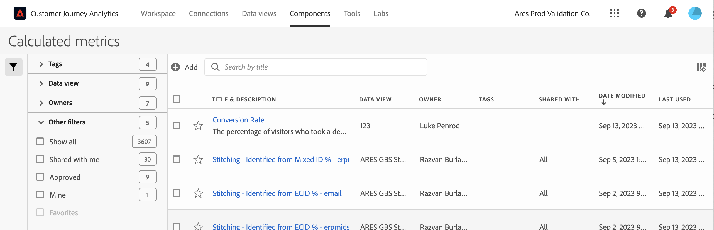

# Administrador de métricas calculadas

La página Métricas calculadas ofrece numerosas maneras de conservar las métricas, como compartir, filtrar, etiquetar, aprobar, copiar, eliminar y marcar como favorito.

El Administrador de métricas calculadas le muestra todos los filtros que posee y que han compartido con usted. Los usuarios con nivel de administrador pueden ver todas las métricas personalizadas de la organización. Esta introducción presenta la interfaz de usuario y las capacidades del Administrador de métricas calculadas.

## Acceso al Administrador de métricas calculadas

1. En Customer Journey Analytics, seleccione [!UICONTROL **Componentes**] > [!UICONTROL **Métricas calculadas**].

## Acciones disponibles en el Administrador de métricas calculadas

En el Administrador de métricas calculadas, puede:

* [Filtrar métricas calculadas](/help/components/calc-metrics/cm-workflow/cm-filter.md)

* [Marcar métricas calculadas como favoritas](/help/components/calc-metrics/cm-workflow/cm-favorite.md)

* [Aprobar métricas calculadas](/help/components/calc-metrics/cm-workflow/cm-approving.md)

* [Etiquetar métricas calculadas](/help/components/calc-metrics/cm-workflow/cm-tagging.md)

* [Compartir métricas calculadas](/help/components/calc-metrics/cm-workflow/cm-sharing.md)

* Exportar una métrica calculada a un archivo CSV.

* [Copiar métricas calculadas](/help/components/calc-metrics/cm-workflow/cm-copy.md)

* Eliminar métricas calculadas

## Configuración de columnas

Puede configurar la información mostrada para cada métrica calculada en el Administrador de métricas calculadas configurando las columnas que se muestran.

Para configurar las columnas visibles en el Administrador de métricas calculadas:

1. En Customer Journey Analytics, seleccione la opción **[!UICONTROL Componentes]** pestaña, luego seleccione **[!UICONTROL Métricas calculadas]**.

1. En el Administrador de métricas calculadas, seleccione la **Personalizar columnas** icono A continuación, seleccione las columnas que desea mostrar en el Administrador de métricas calculadas.

   Las columnas disponibles son las siguientes:

   | Título de columna | Descripción |
   |---|---|
   | Favoritos | Muestra iconos de estrella junto a cada métrica calculada, lo que le permite marcar las métricas calculadas como favoritas. Para obtener más información, consulte [Marcar métricas calculadas como favoritas](/help/components/calc-metrics/cm-workflow/cm-favorite.md). |
   | Título y descripción | Estos valores se proporcionan en el Creador de métricas calculadas. Para editar el título y la descripción, seleccione el vínculo del título para abrir el Creador de métricas calculadas. |
   | Grupo de informes | Indica en qué grupo de informes se guardó por última vez la métrica. |
   | Propietario | Indica quién es el propietario de la métrica personalizada. Si no es el administrador, solo podrá ver las métricas que le pertenecen o que compartieron con usted. |
   | Etiquetas | Muestra las etiquetas que se aplicaron a la métrica, tanto por su parte como por parte de las personas que compartieron la métrica calculada con usted. |
   | Compartido con | Enumera las personas o los grupos (solo administrador) o todos (solo administrador) con los que compartió la métrica calculada. 
Cuando se comparte una métrica calculada, aparece un icono de uso compartido junto al nombre de la métrica calculada.
 |
   | Fecha de modificación | Indica la fecha en la que se modificó por última vez la métrica personalizada. |
   | Utilizado en | Muestra cuántos componentes se están utilizando actualmente en la métrica calculada. 
Por ejemplo, si la métrica calculada se está utilizando en 40 proyectos y 2 alertas, el valor de esta columna se muestra como [!UICONTROL **42 componentes**].
 
Seleccione el valor de esta columna para ver el desglose de dónde se está utilizando la métrica calculada (por ejemplo, [!UICONTROL **Proyectos (40)**], [!UICONTROL **Alertas (2)**]).

Las métricas calculadas se pueden utilizar en cualquiera de los siguientes tipos de componentes:
 <ul><li>Proyectos</li><li>Proyectos programados</li></ul>
Esta información puede ayudarle a determinar si un componente es valioso para los usuarios de su organización, dónde se utiliza y si debe eliminarse o modificarse.

Esta información no incluye el uso de la API, el Report Builder o la Data Warehouse.

Puede usar el complemento [Diccionario de datos](/help/components/data-dictionary/data-dictionary-overview.md) junto con esta información, para ayudarle a realizar un seguimiento y comprender mejor cómo se utilizan los componentes en su organización.

El [!UICONTROL **Utilizado en**] no se muestra de forma predeterminada. [Configuración de columnas](#configure-columns) para mostrarlo.
 |
   | Último uso | Muestra la fecha en la que se utilizó por última vez la métrica calculada en cualquiera de los siguientes tipos de componentes: <ul><li>Métricas calculadas </li><li>Proyectos</li><li>Proyectos programados</li></ul> 
Esta información puede ayudarle a determinar si un componente es valioso para los usuarios de su organización o si se debe eliminar.

Esta información no incluye el uso de la API o del Report Builder.

Puede usar el complemento [Diccionario de datos](/help/components/data-dictionary/data-dictionary-overview.md) junto con esta información, para ayudarle a realizar un seguimiento y comprender mejor cómo se utilizan los componentes en su organización. |

   {style="table-layout:auto"}
