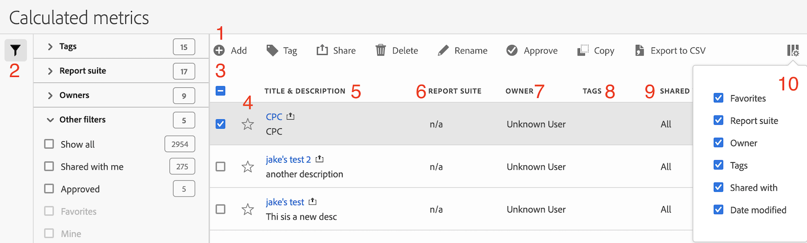

# Administrador de métricas calculadas

La página Métricas calculadas ofrece numerosas maneras de conservar las métricas, como compartir, filtrar, etiquetar, aprobar, copiar, eliminar y marcar como favorito.

El Administrador de métricas calculadas le muestra todos los filtros que posee y que han compartido con usted. Los usuarios con nivel de administrador pueden ver todas las métricas personalizadas de la organización. Esta introducción presenta la interfaz de usuario y las capacidades del Administrador de métricas calculadas. Acceda a ella

## Acceso al Administrador de métricas calculadas

1. En Adobe Analytics, seleccione [!UICONTROL **Componentes**] > [!UICONTROL **Métricas calculadas**].

## Áreas del Administrador de métricas calculadas

En la siguiente imagen y en la tabla adjunta se explican algunas de las áreas y características principales del Administrador de métricas calculadas.

| Ubicación en la imagen | Nombre y función |
|---|---|
| 1 | **Barra de herramientas del Administrador de métricas calculadas:** Después de seleccionar una métrica, aparece esta barra de herramientas. La mayoría de las tareas de administración se pueden completar desde esta barra de herramientas. |
| 2 | **Filtro:** Puede filtrar por etiquetas, grupos de informes, propietarios, todos (solo administrador), compartidos conmigo, míos, favoritos y aprobados (solo administrador). |
| 3 | **Seleccionar cuadros:** Seleccione una métrica personalizada para administrarla. |
| 4 | **Favoritos:** Si se selecciona la estrella junto a una métrica, esta se marca como favorita. |
| 5 | **Títulos y descripciones de segmentos:** Estos valores se proporcionan en el Creador de métricas calculadas. Para editar el título y la descripción, seleccione el vínculo del título para abrir el Creador de métricas calculadas. |
| 6 | **Grupo de informes:** Indica en qué grupo de informes se guardó por última vez la métrica. |
| 7 | **Propietario:** Indica a quién pertenece la métrica personalizada. Si no es el administrador, solo podrá ver las métricas que le pertenecen o que compartieron con usted. |
| 8 | **Etiquetas:** Muestra las etiquetas que se aplicaron a la métrica, tanto por su parte como por parte de las personas que compartieron el segmento con usted. |
| 9 | **Compartido con:** Enumera las personas o los grupos (solo administrador) o todos (solo administrador) con los que compartió el segmento. |
| 10 | **Selector de columna:** Permite seleccionar o deseleccionar columnas en la página Métricas calculadas para poder personalizar la vista. |
| No se muestra en la imagen | **Fecha de modificación:** Indica la fecha en la que se modificó por última vez la métrica personalizada. |

{style="table-layout:auto"}
