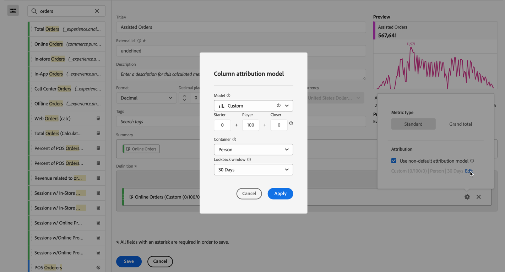
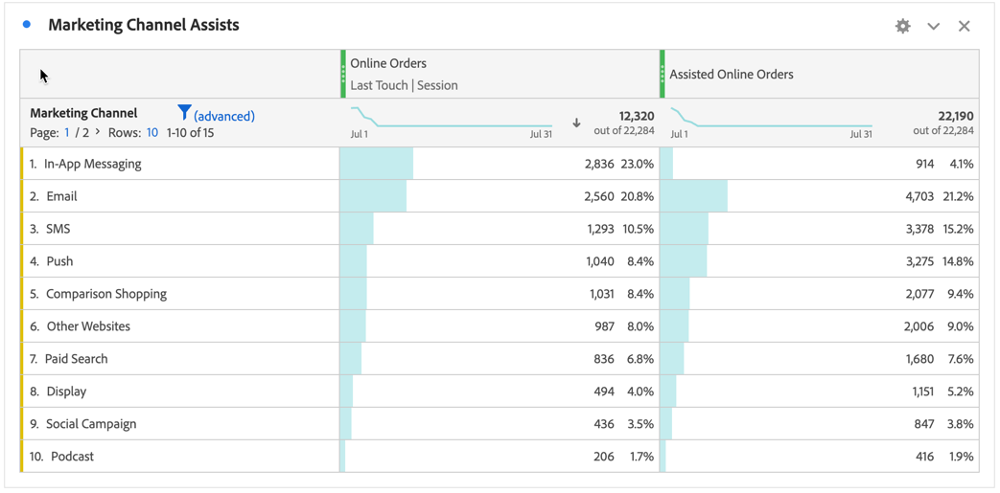

# Crear una métrica calculada más compleja

Este artículo explica un ejemplo más complejo de una métrica calculada. Estas métricas calculadas muestran qué canales de marketing ayudan a dirigir las solicitudes. Este tipo de métrica calculada se puede adaptar a cualquier dimensión o evento de éxito.

1. Comience a crear una métrica calculada, tal como se describe en [Crear métricas](/help/components/calc-metrics/cm-workflow/cm-build-metrics.md).

1. En el Creador de métricas calculadas, asigne un nombre a la métrica `Assisted Online Orders` o similar.

1. Seleccione la métrica **[!UICONTROL Pedidos en línea]** de los componentes **[!UICONTROL Métricas]** y arrastre la métrica al área **[!UICONTROL Definición]**.

   1. Seleccione  para la métrica.
   1. Seleccione **[!UICONTROL Usar modelo de atribución no predeterminado]**.
   1. Ajuste el modelo de atribución en el **[!UICONTROL modelo de atribución de columna]**.
      1. Seleccione **[!UICONTROL Personalizado]** para **[!UICONTROL Modelo]**. Establece **[!UICONTROL Starter]** en `0`, **[!UICONTROL Player]** en `100` y **[!UICONTROL Closer]** en `0`.
      1. Seleccionar **[!UICONTROL Visitante]** para **[!UICONTROL Contenedor]**.
      1. Seleccione **[!UICONTROL 30 días]** para **[!UICONTROL ventana retrospectiva]**.

      1. Seleccione **[!UICONTROL Aplicar]**.

      

1. Seleccione **[!UICONTROL Guardar]** para guardar la métrica calculada.

Para utilizar la métrica calculada:

1. En Analysis Workspace, cree una tabla de forma libre con la dimensión **[!UICONTROL Canal de marketing]**, **[!UICONTROL Pedidos en línea]** y la nueva métrica **[!UICONTROL Pedidos en línea asistidos]**.

   

1. (Opcional) Comparta la métrica con otros usuarios de su organización, tal como se describe en [Compartir métricas calculadas](/help/components/calc-metrics/cm-workflow/cm-sharing.md).

Esta es una manera fácil de saber qué canales de marketing ayudaron a tramitar las solicitudes. Como alternativa, en una tabla de forma libre, puede seleccionar cualquier métrica y, en el menú contextual, ajustar el modelo de atribución directamente desde la tabla.
