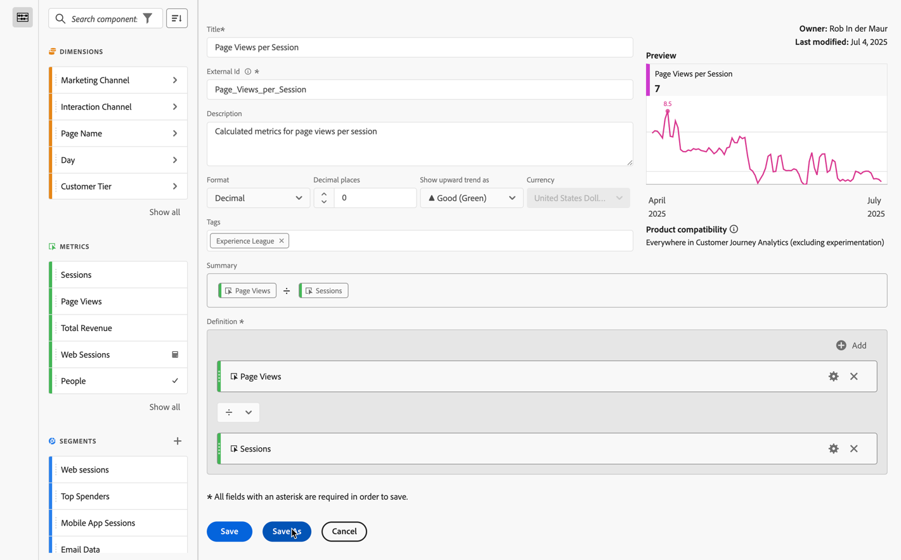

# Crear una métrica calculada simple

La siguiente información explica cómo crear una métrica *Vistas de página por visitas* simple.

1. Comience a crear una métrica, como se describe en [Crear métricas](/help/components/calc-metrics/cm-workflow/cm-build-metrics.md).
1. Asigne a la métrica el nombre `Page Views per Session` o algo similar.
1. Asigne a la métrica una **[!UICONTROL descripción]** fácil de usar para mostrar para qué se utiliza la métrica.
1. Seleccione el **[!UICONTROL formato]** correcto. Para este ejemplo, elija **[!UICONTROL Decimal]**.
1. Decida cuántos lugares decimales desea que muestre su informe.
1. En el menú desplegable **[!UICONTROL Mostrar tendencia ascendente como]**, seleccione ▲ **[!UICONTROL Bueno (verde)]**.
1. Agregue una **[!UICONTROL Etiqueta]** para organizar sus métricas.
1. Para esta métrica calculada, primero arrastre **[!UICONTROL Vistas de página]** desde los componentes de **[!UICONTROL Métricas]** a la sección **[!UICONTROL Definición]** del lienzo.
1. A continuación, arrastre **[!UICONTROL Sesiones]** desde los componentes de **[!UICONTROL Métricas]** y suelte la métrica debajo de **[!UICONTROL Vistas de página]** (espere hasta que aparezca la línea azul antes de soltar la métrica).
1. Seleccione el operador dividir . (Dividir es el operador predeterminado).
1. Puede ver una **[!UICONTROL vista previa]** de la métrica mientras la está generando.
1. **[!UICONTROL Compatibilidad del producto]** muestra si la métrica calculada es compatible en cualquier lugar de Customer Journey Analytics (excluida la experimentación).

   
1. Seleccione **[!UICONTROL Guardar]**.

   Observe que la fórmula de **[!UICONTROL Resumen]** se actualiza cada vez que realice cambios en la definición de la métrica.

1. (Opcional) Para compartir, aprobar, (volver a) etiquetar, cambiar el nombre o eliminar una métrica, puede ir a [Administrador de métricas calculadas](/help/components/calc-metrics/cm-workflow/cm-manager.md).

