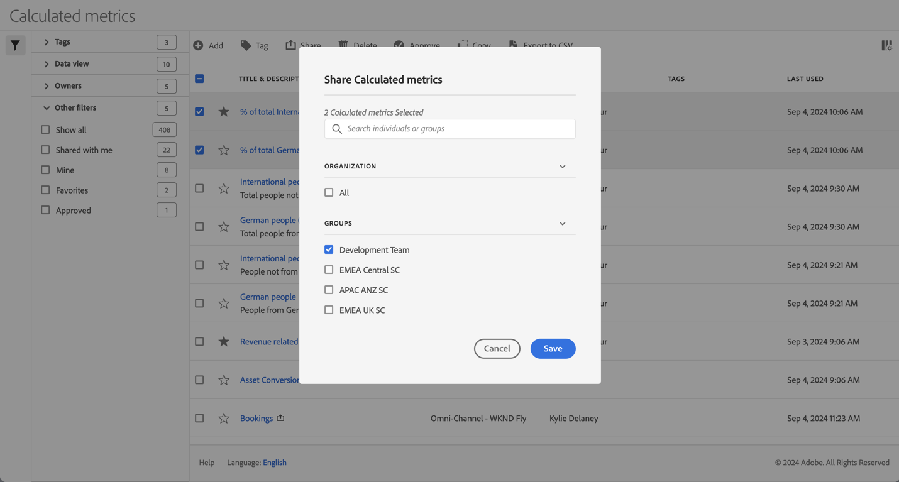

# Compartir métricas calculadas

En [Administrador de métricas calculadas](cm-manager.md), puede compartir métricas calculadas. En función de sus permisos, puede compartir métricas calculadas con toda su organización, con grupos o con usuarios individuales:

* **Administradores**: Los administradores pueden compartir métricas calculadas con toda la organización, con grupos dentro de una organización y con usuarios individuales. Consulte la [Documentación de Admin Console](https://helpx.adobe.com/es/enterprise/using/manage-products.html) para obtener más información.
* **No administradores**: Los no administradores solo pueden compartir la métrica calculada que han creado y solo con usuarios individuales. |

Para compartir una o más métricas calculadas:

1. En [Administrador de métricas calculadas](cm-manager.md), seleccione una o varias de las métricas calculadas que desee compartir.
1. En la barra de acciones, seleccione  **[!UICONTROL Compartir]**.
1. En el diálogo **[!UICONTROL Compartir métrica calculada]**:

   

   1. (Opcionalmente) use  para *Buscar personas o grupos* y limitar la lista de grupos o personas con los que desea compartir las métricas calculadas.

   1. Seleccione una o más opciones de la sección **[!UICONTROL Organización]** o **[!UICONTROL Grupos]**, o busque y seleccione una o más personas. Las opciones disponibles dependen de la función que tenga.

   1. Seleccione **[!UICONTROL Guardar]** para compartir las métricas calculadas. Seleccione **[!UICONTROL Cancelar]** para cancelar.

## Prácticas recomendadas

A continuación se describen algunas prácticas recomendadas sobre cuándo debe compartir métricas calculadas y con quién debe compartirlas.

* Como administrador, comparta solamente una métrica calculada con Todos si está convencido de que alguien en su organización se siente cómodo con la métrica calculada. También se puede considerar favorecer estas métricas calculadas. Ver [Marcar una métrica calculada como favorita](cm-favorite.md) para obtener más información.

* Como administrador, comparta una métrica calculada con un grupo específico si esa métrica calculada proporciona valor empresarial para los usuarios que forman parte de ese grupo.

* Como administrador o usuario individual, comparta una métrica calculada con una o más personas para validar una métrica calculada. Si los segmentos no resultan útiles, puede eliminar la métrica calculada.

<!--

Depending on your permissions, you can share metrics with your whole organization, groups, or individual users.

|  Role | Permissions |
|---|---|
|  Administrator  | Can share metrics with All, with Groups, and with Users. Groups are set up as permission groups in the Admin console.  |
|  Non-Administrator  | Can share metrics only with individual users.  |

To share a calculated metric:

1. In the Calculated metrics manager, mark the checkbox next to the metric you want to share.

   

1. Select the **[!UICONTROL Share]** icon. 

   The Share Calculated metric dialog box displays.

   

1. Select **[!UICONTROL Share]**.

1. Choose who you want to share with:

   * **[!UICONTROL All]** (Administrators only): Shares with all users in the organization.

     Consider sharing with all only if it's of use to the entire company and everyone is comfortable using it. In this case, you should also consider making it an [approved metric](/help/components/calc-metrics/cm-workflow/cm-approving.md).
   
   * **[!UICONTROL Groups]** (Administrators only): Select any groups you want to share with.

     Consider sharing with a group if the metric provides good business value for that team.
   
   * **[!UICONTROL Individual users]**: Search for and select the individual users you want to share with.

      This is the only share option available to all users. Administrators might want to use this option to vet and validate a metric prior to making it available to a group or to everyone. If the metric isn't useful, it can be discarded. Administrators should not officially approve this type of metric.

1. Select **[!UICONTROL Share]**.

   The Shared icon appears next to the metric: .

1. You can filter on metrics shared with you by going to **[!UICONTROL Filters]** > **[!UICONTROL Other Filters]** > **[!UICONTROL Shared with Me]**.

1. (Optional) To filter the list of calculated metrics in the Calculated metrics manager to show only metrics that are shared with you, select the **Filter** icon, expand **[!UICONTROL Other filters]**, then select **[!UICONTROL Shared with me]**.

-->