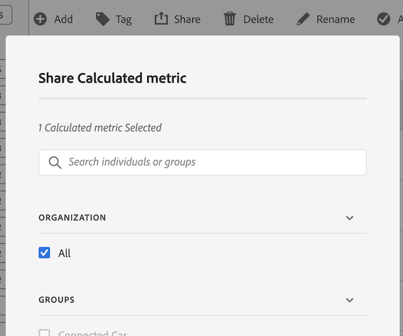

# Compartir métricas calculadas

En función de sus permisos, puede compartir métricas con toda su organización, con grupos o con usuarios individuales.

| Función | Permisos |
|---|---|
| Administrador | Puede compartir métricas con Todos, con Grupos y con Usuarios. Los grupos se establecen como grupos de permisos en la Admin Console. |
| No administrador | Puede compartir métricas únicamente con usuarios individuales. |

¿Cuándo debe compartir métricas con toda la compañía en vez de con un grupo de usuarios o personas? A continuación se indica una serie de prácticas recomendadas seguir:

* Como administrador, comparta una métrica con **[!UICONTROL Todos]** si resulta útil para toda la compañía y si todos se sienten cómodos al utilizarla. En este caso, debe considerar la posibilidad de marcarla como métrica aprobada.
* Como administrador, comparta una métrica con un **[!UICONTROL Grupo]** específico si la métrica aporta valor empresarial al equipo.
* Como administrador o usuario individual, comparta una métrica con otras personas para examinarla y validarla. Si finalmente no resulta útil, descártela. No apruebe oficialmente este tipo de métricas.

1. En el Administrador de métricas calculadas, marque la casilla que aparece junto a la métrica que desea compartir. Aparece la barra de tareas:

   

1. Haga clic en el icono **[!UICONTROL Compartir]**.

   

   Si es administrador, puede seleccionar **[!UICONTROL Todos]** o elegir entre **[!UICONTROL Grupos]** y **[!UICONTROL Usuarios]** de su organización. Si no es administrador, solo verá usuarios individuales. Utilice el campo **[!UICONTROL Buscar]** para buscar grupos o usuarios

1. Haga clic en **[!UICONTROL Compartir]**.

   El icono Compartido aparece junto a la métrica:  

1. Puede filtrar las métricas que se han compartido con usted accediendo a **[!UICONTROL Filtros]** > **[!UICONTROL Otros filtros]** > **[!UICONTROL Compartido conmigo]**.
