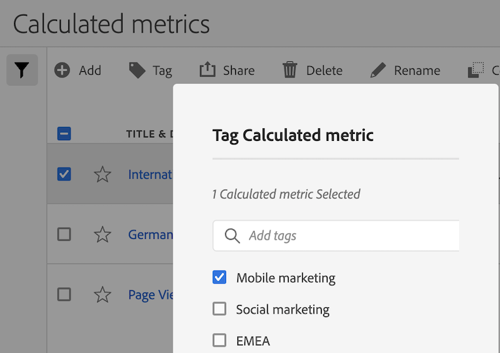

# Etiquetar métricas calculadas

En [Administrador de métricas calculadas](cm-manager.md), puede usar etiquetas para organizar las métricas calculadas. Los administradores pueden etiquetar todas las métricas calculadas. Los usuarios que no son administradores pueden etiquetar solo las métricas calculadas que han creado o que se han compartido con ellos.

Para etiquetar una o más métricas calculadas:

1. En el [Administrador de métricas calculadas](cm-manager.md), seleccione una o varias de las métricas calculadas que desee etiquetar.
1. En la barra de acciones, seleccione  **[!UICONTROL Etiqueta]**.
1. En el diálogo **[!UICONTROL Etiquetar métricas calculadas]**

   

   1. (opcionalmente) use  para buscar y limitar la lista de etiquetas.

   2. Según la lista de etiquetas:

      * seleccione una o varias etiquetas existentes de la lista, o bien
      * escriba una etiqueta nueva y presione **[!UICONTROL ENTRAR]**. Repita el proceso para agregar más de una etiqueta nueva.

1. Seleccione **[!UICONTROL Guardar]** para guardar las etiquetas de las métricas calculadas. Seleccione **[!UICONTROL Cancelar]** para cancelar.

Una vez guardadas, las etiquetas se enumeran en el campo [!UICONTROL Etiqueta] para la métrica calculada seleccionada en el [Creador de métricas calculadas](cm-tagging.md).

<!--

In the Calculated metric manager, you can organize filters by tagging them.

All users can create tags for calculated metrics and apply one or more tags to a metric. However, you can see tags only for those calculated metrics that you own or that have been shared with you. 

>[!TIP]
>
>The most useful types of tags are usually tags that are based on the following criteria:
>
>* **Team names**, such as Social Marketing or Mobile Marketing.
>* **Project** (analysis tags), such as Entry-page analysis.
>* **Categories**, such as Women's or Geography.
>* **Workflows**, such as To be approved or Curated for (a specific business unit).

## Apply tags to a calculated metric

1. In Customer Journey Analytics, select [!UICONTROL **Components**] > [!UICONTROL **Calculated metrics**].

1. In the Calculated metrics manager, select the checkbox next to any metrics that you want to tag.

   

1. In the [!UICONTROL **Tag Calculated metric**] dialog box: 

   * Add a new tag. Type the name in the **[!UICONTROL Add tags]** field, then press Enter.
   * Select one or more existing tags to apply to the selected metrics.

1. Select [!UICONTROL **Save**] to apply the tags.

## View applied tags

1. In Customer Journey Analytics, select [!UICONTROL **Components**] > [!UICONTROL **Calculated metrics**] to go to the Calculated metrics manager.

1. In the Calculated metrics manager, tags appear in the [!UICONTROL **Tags**] column. (Click the gear icon on the top-right to manage your columns.)

## Filter metrics by tags

1. In Customer Journey Analytics, select [!UICONTROL **Components**] > [!UICONTROL **Calculated metrics**] to go to the Calculated metrics manager.

1. In the Calculated metrics manager, select the **Filter** icon, then select the tags that you want to filter by. 

   Only metrics that have the filter you select are shown.

-->

