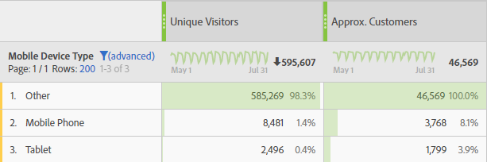

# Uso de funciones

Las funciones le permiten filtrar, ordenar los datos y realizar análisis estadísticos simples y complejos.

Para obtener una lista de todas las funciones, consulte [Funciones básicas](/help/components/calc-metrics/cm-functions.md) y [Funciones avanzadas](/help/components/calc-metrics/cm-adv-functions.md).


>[!NOTE]
>
>Cuando [!DNL metric] se identifica como un argumento en una función, también se permiten otras expresiones de métricas. Por ejemplo, [!DNL MAXV(metrics)] también permite [!DNL MAXV(PageViews + Visits).]
>

>[!NOTE]
>
>Cuando se incluyen funciones en la Definición del creador de métricas calculadas, aplique siempre la función antes de arrastrar métricas o filtros.
>

## Funciones de tabla en comparación con funciones de fila

Una función de tabla es una en la que el resultado es el mismo para cada fila de la tabla. Una función de fila es una en la que el resultado es diferente para cada fila de la tabla.

## ¿Qué significa el parámetro Include-Zeros?

Indica si se incluyen ceros en el cálculo. En algunas ocasiones cero significa &quot;nada&quot;, pero en ocasiones es importante.

Por ejemplo, si tiene una métrica Ingresos y, a continuación, agrega una métrica Vistas de página al informe, de repente hay más filas para sus ingresos todas con valor de cero. Probablemente no desea que esto afecte a ningún valor MEAN, MIN, QUARTILE, etc. los cálculos que tiene en la columna de ingresos. En este caso, debería marcar el parámetro para incluir ceros.

Por otra parte, si tiene dos métricas en las que está interesado, puede que no sea justo afirmar que una tiene una media superior o mínima porque algunas de sus filas eran ceros, por lo que no debería marcar el parámetro para incluir ceros.

<!-- This video is way too outdated and too much AA oriented to comfortably show as part of CJA functionality 

Watch this [video](https://youtu.be/SSyWvomnewI) to understand the use of functions.

-->

+++ Funciones básicas


## Valor absoluto (Fila)

Devuelve el valor absoluto de un número. El valor absoluto de un número es el número con un valor positivo.

```
ABS(metric)
```

| Argumento | Descripción |
|---|---|
| *métrica* | La métrica de la cual desea el valor absoluto. |

## Máximo de columna

Devuelve el mayor valor en un conjunto de elementos de una dimensión para una columna de métrica. MAXV evalúa de forma vertical dentro de una única columna (métrica) entre elementos de dimensión.

```
MAXV(metric)
```

| Argumento | Descripción |
|---|---|
| *métrica* | Una métrica que le gustaría evaluar. |

## Mínimo de columna

Devuelve el menor valor en un conjunto de elementos de una dimensión para una columna de métrica. MINV evalúa de forma vertical dentro de una única columna (métrica) entre elementos de dimensión.

```
MINV(metric)
```

| Argumento | Descripción |
|---|---|
| *métrica* | Una métrica que le gustaría evaluar. |

## Suma de columna

Suma todos los valores numéricos de una métrica dentro de una columna (entre los elementos de una dimensión).

```
SUM(metric)
```

| Argumento | Descripción |
|---|---|
| *métrica* | La métrica de la cual desea el valor total o la suma. |

## Recuento (Tabla)

Devuelve un número, o recuento, de valores distintos de cero para una métrica dentro de una columna (el número de elementos únicos incluidos dentro de una dimensión).

```
COUNT(metric)
```

| Argumento | Descripción |
|---|---|
| *métrica* | La métrica que desea contar. |

## Exponente (Fila)

Devuelve *e* elevado a la potencia de un número determinado. La constante *e* es igual a 2,71828182845904, la base del logaritmo natural. EXP es la inversa de LN, el logaritmo natural de un número.

```
EXP(metric)
```

| Argumento | Descripción |
|---|---|
| *métrica* | El exponente aplicado a la base *e*. |

## Exponenciación

Operador de potencia


pow(x,y) = x<sup>y</sup> = x *x* x*... (y veces)


## Media (Tabla)

Devuelve la media aritmética, o el promedio, de una métrica en una columna.

```
MEAN(metric)
```

| Argumento | Descripción |
|---|---|
| *métrica* | La métrica de la cual desea la media. |

## Mediana (Tabla)

Devuelve la mediana de una métrica en una columna. La mediana es el número central de un conjunto de números; es decir, la mitad de los valores son mayores o iguales que la mediana y la mitad son menores o iguales que la mediana.

```
MEDIAN(metric)
```

| Argumento | Descripción |
|---|---|
| *métrica* | La métrica de la cual desea la mediana. |

## Módulo

El resto de la columna 1/columna 2, utilizando la división euclídea.

Devuelve el resto tras dividir x entre y.

```
x = floor(x/y) + modulo(x,y)
```

El valor devuelto tiene el mismo signo que la entrada (o es cero).

```
modulo(4,3) = 1 
modulo(-4,3) = -1 
modulo(-3,3) = 0
```

Para obtener siempre un número positivo, utilice

```
modulo(modulo(x,y)+y,y)
```

## Percentil (Tabla)

Devuelve el percentil k-ésimo de los valores de una métrica. Puede utilizar esta función para establecer un umbral de aceptación. Por ejemplo, puede decidir si se examinan los elementos de la dimensión cuyo valor es superior al percentil 90.

```
PERCENTILE(metric,k)
```

<table id="table_35CD840ACFB44CD9979881DB8823CC53"> 
 <thead> 
  <tr> 
   <th colname="col1" class="entry"> Argumento </th> 
   <th colname="col2" class="entry"> Descripción </th> 
  </tr> 
 </thead>
 <tbody> 
  <tr> 
   <td colname="col1"> <i>métrica</i> </td> 
   <td colname="col2"> La columna de métrica que define la posición relativa. </td> 
  </tr> 
  <tr> 
   <td colname="col1"> <p>k </p> </td> 
   <td colname="col2"> El valor en porcentaje dentro del rango de 0 a 100, ambos incluidos. </td> 
  </tr> 
 </tbody> 
</table>

## Cuartil (Tabla)

Devuelve el cuartil de los valores de una métrica. Por ejemplo, los cuartiles se pueden utilizar para encontrar el primer 25 % de los productos que generan los mayores ingresos. MINV, MEDIAN y MAXV devuelven el mismo valor que QUARTILE cuando el cuartil es igual a 0 (cero), 2 y 4, respectivamente.

```
QUARTILE(metric,quart)
```

<table id="table_64EA3DAAE77541439D59FAF0353F83A2"> 
 <thead> 
  <tr> 
   <th colname="col1" class="entry"> Argumento </th> 
   <th colname="col2" class="entry"> Descripción </th> 
  </tr> 
 </thead>
 <tbody> 
  <tr> 
   <td colname="col1"> <i>métrica</i> </td> 
   <td colname="col2"> La métrica de la cual desea el valor de cuartil. </td> 
  </tr> 
  <tr> 
   <td colname="col1"> <p>cuarto </p> </td> 
   <td colname="col2"> Indica qué *valor debe devolver. </td> 
  </tr> 
 </tbody> 
</table>

&#42;Si *cuarto* = 0, QUARTILE devuelve el valor mínimo. Si *cuarto* = 1, QUARTILE muestra el primer cuartil (porcentaje 25). Si *cuarto* = 2, QUARTILE muestra el primer cuartil (porcentaje 50). Si *cuarto* = 3, QUARTILE muestra el primer cuartil (porcentaje 75). Si *cuarto* = 4, QUARTILE devuelve el valor máximo.

## Ronda

Devuelve el entero más próximo a un valor determinado. Por ejemplo, si desea evitar los decimales en una moneda de un informe en los ingresos y un producto tiene el valor de 569,34 $, utilice la fórmula Round(*Revenue*) para redondear al dólar más próximo o 569 $. Un producto de 569,51 $ se redondeará al dólar más cercano o 570 $.

```
ROUND(metric)
```

| Argumento | Descripción |
|---|---|
| *entero* | La métrica que desee redondear. |

Redondear sin un parámetro de dígito es lo mismo que redondear con un parámetro de dígito de 0, es decir, redondear al entero más próximo. Con un parámetro de dígito devuelve ese número de dígitos a la derecha del decimal. Si el dígito es negativo, devuelve ceros a la izquierda del decimal.

```
round( 314.15, 0) = 314 
round( 314.15, 1) = 314.1 
round( 314.15, -1) = 310 
round( 314.15, -2) = 300
```

## Recuento de fila

Devuelve el número de filas de una determinada columna (el número de elementos únicos incluidos dentro de una dimensión). “Únicos excedidos” cuenta como 1.

## Máximo de fila

Máximo de las columnas de cada fila.

## Mínimo de fila

Mínimo de las columnas de cada fila.

## Suma de fila

Suma de las columnas de cada fila.

## Raíz cuadrada (Fila)

Devuelve la raíz cuadrada positiva de un número. La raíz cuadrada de un número es el valor de dicho número elevado a la potencia de 1/2.

```
SQRT(metric)
```

| Argumento | Descripción |
|---|---|
| *entero* | La métrica de la cual desea la raíz cuadrada. |

## Desviación estándar (Tabla)

Devuelve la desviación estándar, o la raíz cuadrada de la varianza, de una recopilación de datos de muestra.

La ecuación de STDEV es:


donde x es la media de muestra (*métrica*) y *n* es el tamaño de la muestra.

```
STDEV(metric)
```

<table id="table_8BCF2E4B02434AABAAD026FB3C4E8B2F"> 
 <tbody> 
  <tr> 
   <td> <b> Argumento</b> </td> 
   <td> <b> Descripción</b> </td> 
  </tr> 
  <tr> 
   <td> <b> <i> métrica</i> </b> </td> 
   <td> <p> La métrica de la cual desee la desviación estándar. </p> </td> 
  </tr> 
 </tbody> 
</table>

## Varianza (Tabla)

Devuelve la varianza de una recopilación de datos de muestra.

La ecuación de VARIANCE es:


donde x es la media de la muestra, MEAN(*metric*) y *n* es el tamaño de la muestra.

```
VARIANCE(metric)
```

| Argumento | Descripción |
|---|---|
| *métrica* | La métrica de la cual desea la varianza. |

Para calcular una varianza para ver una columna entera de números. A partir de una lista de números, calcule primero el promedio. Cuando tenga el promedio, examine cada entrada y realice lo siguiente:

1. Reste el promedio del número.

2. Multiplique el resultado por sí mismo.

3. Súmelo al total.

Cuando repita la operación sobre toda la columna, obtendrá un único total. A continuación, divida el total entre el número de elementos de la columna. El número resultante es la varianza de la columna. Esta es un número único, aunque aparece como una columna de números.

En el caso de una columna de tres elementos:

1

2

3

El promedio de esta columna es 2. La variación de la columna será ((1 - 2)<sup>2</sup> + (2 - 2)<sup>2</sup> + (3 - 2)<sup>2</sup>/3 = 2/3.

+++

+++ Funciones avanzadas


## AND

Devuelve el valor de su argumento. Utilice NOT para asegurarse de que un valor no es igual a un valor en concreto.

>[!NOTE]
>
>0 (cero) significa Falso y cualquier otro valor es Verdadero.

```
AND(logical_test1,[logical_test2],...)
```

| Argumento | Descripción |
|---|---|
| *prueba_lógica1* | Requerido. Cualquier valor o expresión que pueda evaluarse como TRUE o FALSE. |
| *prueba_lógica2* | Opcional. Condiciones adicionales que desee evaluar como TRUE o FALSE. |

## Número aproximado de elementos distintos (dimensión)

Devuelve el número aproximado de elementos distintos de dimensiones para la dimensión seleccionada. Esta función usa el método HyperLogLog (HLL) de números aproximados de elementos distintos.  Está configurada para garantizar que el valor se encuentre en el 5 % del 95 % del valor actual del tiempo.

```
Approximate Count Distinct (dimension)
```

| Argumento |  |
|---|---|
| *dimensión* | Dimensión de la que se quiere obtener el número aproximado de elementos distintos. |

### Caso práctico de ejemplo

El número aproximado de elementos distintos (eVar del ID del cliente) es un caso práctico común para esta función.

Definición para una nueva métrica calculada “Clientes aproximados”:


Así es como se podría usar la métrica “Clientes aproximados” en un informe:



### Comparación de funciones de recuento

La función Approximate Count Distinct() es una mejora de las funciones Count() y RowCount() porque la métrica que se crea puede usarse en cualquier informe dimensional para representar un número aproximado de elementos para una dimensión distinta. Por ejemplo, un recuento de los ID de cliente que se usan en un informe sobre tipos de dispositivos móviles.

Esta función será ligeramente menos precisa que Count() y RowCount() porque usa el método HLL, mientras que Count() y RowCount() son recuentos exactos.

## Arcocoseno (Fila)

Devuelve el arcocoseno o la inversa del coseno de una métrica. El arcocoseno es el ángulo cuyo coseno es un número. El ángulo devuelto se da en radianes dentro del rango de 0 (cero) a pi. Si desea convertir el resultado de radianes a grados, multiplíquelo por 180/PI( ).

```
ACOS(metric)
```

| Argumento |  |
|---|---|
| *métrica* | El coseno del ángulo que desee desde -1 a 1. |

## Arcoseno (Fila)

Devuelve el arcoseno o la inversa del seno de un número. El arcoseno es el ángulo cuyo seno es un número. El ángulo devuelto se da en radianes dentro del rango de -pi/2 a pi/2. Para expresar el arcoseno en grados, multiplique el resultado por 180/PI( ).

```
ASIN(metric)
```

| Argumento |  |
|---|---|
| *métrica* | El coseno del ángulo que desee desde -1 a 1. |

## Arcotangente (Fila)

Devuelve el arcotangente o la inversa de la tangente de un número. El arcotangente es el ángulo cuya tangente es un número. El ángulo devuelto se da en radianes dentro del rango de -pi/2 a pi/2. Para expresar el arcotangente en grados, multiplique el resultado por 180/PI( ).

```
ATAN(metric)
```

| Argumento |  |
|---|---|
| *métrica* | El coseno del ángulo que desee desde -1 a 1. |

## Regresión exponencial: Y predicha (Fila)

Calcula los valores Y predichos (metric_Y), dados los valores x conocidos (metric_X) usando el método de &quot;mínimos cuadrados&quot; para calcular la línea que mejor se ajusta según la fórmula.

```
ESTIMATE.EXP(metric_X, metric_Y)
```

| Argumento | Descripción |
|---|---|
| *metric_X* | Una métrica que le gustaría designar como datos dependientes. |
| *metric_Y* | Una métrica que le gustaría designar como datos independientes. |

## Cdf-T

Devuelve el porcentaje de valores en una distribución t de Student con n grados de libertad que tiene un valor z inferior al de x.

```
cdf_t( -∞, n ) = 0
cdf_t(  ∞, n ) = 1
cdf_t( 3, 5 ) ? 0.99865
cdf_t( -2, 7 ) ? 0.0227501
cdf_t( x, ∞ ) ? cdf_z( x )
```

## Cdf-Z

Devuelve el porcentaje de valores en una distribución normal que tienen un valor de z inferior al valor de x.

```
cdf_z( -∞ ) = 0
cdf_z( ∞ ) = 1
cdf_z( 0 ) = 0.5
cdf_z( 2 ) ? 0.97725
cdf_z( -3 ) ? 0.0013499
```

## Techo (Fila)

Devuelve el menor entero igual o mayor que un valor determinado. Por ejemplo, si desea evitar los decimales en una moneda de un informe en los ingresos y un producto tiene el valor de 569,34 $, utilice la fórmula CEILING(*Ingresos*) para redondear hacia arriba al dólar más próximo o 570 $.

```
CEILING(metric)
```

| Argumento | Descripción |
|---|---|
| *métrica* | La métrica que desee redondear. |

## Confianza

[!UICONTROL Confianza]: es una medida probabilística de cuánta evidencia existe de que una variante determinada es la misma que la de control. Una mayor confianza indica menos evidencia para el supuesto de que la variante de control y la que no es de control tienen un rendimiento igual.

```
fx Confidence (normalizing-container, success-metric, control, significance-threshold)
```

| Argumento | Descripción |
| --- | --- |
| Contenedor de normalización | La base (Personas, Sesiones o Eventos) en que se ejecutará una prueba. |
| Métrica de éxito | La métrica o métricas con las que un usuario compara variantes. |
| Control | La variante con la que se comparan todas las demás variantes del experimento. Introduzca el nombre del elemento de dimensión de variante de control. |
| Umbral de relevancia | El umbral en esta función se establece en un 95 % de forma predeterminada. |

{style="table-layout:auto"}

## Coseno (Fila)

Devuelve el coseno de un ángulo determinado. Si el ángulo es en grados, multiplique el ángulo por PI( )/180.

```
COS(metric)
```

| Argumento | Descripción |
|---|---|
| *métrica* | El ángulo en radianes del cual desea el coseno. |

## Raíz cúbica

Devuelve la raíz cúbica positiva de un número. La raíz cúbica de un número es el valor de dicho número elevado a la potencia de 1/3.

```
CBRT(metric)
```

| Argumento | Descripción |
|---|---|
| *métrica* | La métrica de la cual desea la raíz cúbica. |

## Acumulativo

Devuelve la suma de X para las últimas N filas (según lo solicite la dimensión, utilizando valores hash para los campos basados en cadenas).

Si N &lt;= 0 utiliza todas las filas anteriores. Como se ordena por la dimensión, solo resulta útil en dimensiones que tienen un orden natural como la fecha o la longitud de ruta.

```
| Date | Rev  | cumul(0,Rev) | cumul(2,Rev) |
|------+------+--------------+--------------|
| May  | $500 | $500         | $500         |
| June | $200 | $700         | $700         |
| July | $400 | $1100        | $600         |
```

## Media acumulada

Devuelve el promedio de las últimas N filas.

Si N &lt;= 0 utiliza todas las filas anteriores. Como se ordena por la dimensión, solo resulta útil en dimensiones que tienen un orden natural como la fecha o la longitud de ruta.

>[!NOTE]
>
>Esto no funcionará de la forma esperada con métricas de tasa, tales como ingresos o personas. Calcula la media de las tasas, en lugar de sumar los ingresos y las personas del último N y después dividirlas. En su lugar utilice

```
cumul(revenue)/cumul(person)
```

## Igual

Devuelve elementos que coinciden exactamente con un valor numérico o de cadena.

## Regresión exponencial: coeficiente de correlación (Tabla)

Devuelve el coeficiente de correlación, *r*, entre dos columnas de métricas (*metric_A* y *metric_B*) en la ecuación de regresión.

```
CORREL.EXP(metric_X, metric_Y)
```

| Argumento | Descripción |
|---|---|
| *metric_X* | Una métrica que le gustaría correlacionar con *metric_Y*. |
| *metric_Y* | Una métrica que le gustaría correlacionar con *metric_X*. |

## Regresión exponencial: intersección (Tabla)

Devuelve la intersección, *b*, entre dos columnas de métricas (*metric_X* y *metric_Y*) para

```
INTERCEPT.EXP(metric_X, metric_Y)
```

| Argumento | Descripción |
|---|---|
| *metric_X* | Una métrica que le gustaría designar como datos dependientes. |
| *metric_Y* | Una métrica que le gustaría designar como datos independientes. |

## Regresión exponencial: pendiente (Tabla)

Devuelve la pendiente, *a*, entre dos columnas de métricas (*metric_X* y *metric_Y*) para

```
SLOPE.EXP(metric_X, metric_Y)
```

| Argumento | Descripción |
|---|---|
| *metric_X* | Una métrica que le gustaría designar como datos dependientes. |
| *metric_Y* | Una métrica que le gustaría designar como datos independientes. |

## Suelo (Fila)

Devuelve el mayor entero igual o menor a un valor determinado. Por ejemplo, si desea evitar los decimales en una moneda de un informe en los ingresos y un producto tiene el valor de 569,34 $, utilice la fórmula FLOOR(*Revenue*) para redondear hacia arriba al dólar más próximo o 569 $.

```
FLOOR(metric)
```

| Argumento | Descripción |
|---|---|
| *métrica* | La métrica que desee redondear. |

## Mayor que

Devuelve elementos cuyo recuento numérico sea mayor que el valor introducido.

## Mayor o igual que

Devuelve elementos cuyo recuento numérico sea mayor o igual que el valor introducido.

## Coseno hiperbólico (Fila)

Devuelve el coseno hiperbólico de un número.

```
COSH(metric)
```

| Argumento | Descripción |
|---|---|
| *métrica* | El ángulo en radianes del cual desea encontrar el coseno hiperbólico. |

## Seno hiperbólico (Fila)

Devuelve el seno hiperbólico de un número.

```
SINH(metric)
```

| Argumento | Descripción |
|---|---|
| *métrica* | El ángulo en radianes del cual desea encontrar el seno hiperbólico. |

## Tangente hiperbólica (Fila)

Devuelve la tangente hiperbólica de un número.

```
TANH(metric)
```

| Argumento | Descripción |
|---|---|
| *métrica* | El ángulo en radianes del cual desea encontrar la tangente hiperbólica. |

## IF (Fila)

La función IF devuelve un valor si una condición que haya especificada se evalúa como TRUE y otro valor si esa condición se evalúa como FALSE.

```
IF(logical_test, [value_if_true], [value_if_false])
```

| Argumento | Descripción |
|---|---|
| *logical_test* | Requerido. Cualquier valor o expresión que pueda evaluarse como TRUE o FALSE. |
| *[value_if_true]* | El valor que desea que sea devuelto si el argumento *logical_test* se evalúa como TRUE. (Este argumento es 0 de forma predeterminada si no se incluye). |
| *[value_if_false]* | El valor que desea que sea devuelto si el argumento *logical_test* se evalúa como FALSE. (Este argumento es 0 de forma predeterminada si no se incluye). |

## Menor que

Devuelve elementos cuyo recuento numérico sea menor que el valor introducido.

## Menor o igual que

Devuelve elementos cuyo recuento numérico sea menor o igual que el valor introducido.

## Alza

Devuelve el alza que una variante en particular tenía en las conversiones sobre una variante de control. Es la diferencia de rendimiento entre una variante determinada y la línea de base, dividida por el rendimiento de la línea de base, expresada como porcentaje.

```
fx Lift (normalizing-container, success-metric, control)
```

| Argumento | Descripción |
| --- | --- |
| Contenedor de normalización | La base (Personas, Sesiones o Eventos) en que se ejecutará una prueba. |
| Métrica de éxito | La métrica o métricas con las que un usuario compara variantes. |
| Control | La variante con la que se comparan todas las demás variantes del experimento. Introduzca el nombre del elemento de dimensión de variante de control. |

{style="table-layout:auto"}

## Regresión lineal: coeficiente de correlación

Y = a X + b. Devuelve el coeficiente de correlación.

## Regresión lineal: intercepción

Y = a X + b. Devuelve b.

## Regresión lineal: Y predicha

Y = a X + b. Devuelve Y.

## Regresión lineal: pendiente

Y = a X + b. Devuelve a.

## Logaritmo decimal (Fila)

Devuelve el logaritmo decimal de un número.

```
LOG10(metric)
```

| Argumento | Descripción |
|---|---|
| *métrica* | El número real positivo del cual desea el logaritmo decimal. |

## Regresión logarítmica: coeficiente de correlación (Tabla)

Devuelve el coeficiente de correlación, *r*, entre dos columnas de métricas (*metric_X* y *metric_Y*) en la ecuación de regresión [!DNL Y = a ln(X) + b]. Se calcula mediante la ecuación CORREL.

```
CORREL.LOG(metric_X,metric_Y)
```

| Argumento | Descripción |
|---|---|
| *metric_X* | Una métrica que le gustaría correlacionar con *metric_Y*. |
| *metric_Y* | Una métrica que le gustaría correlacionar con *metric_X*. |

## Regresión logarítmica: intersección (Tabla)

Devuelve la intersección *b* como la regresión con menos cuadrados entre dos columnas de métricas (*metric_X* y *metric_Y*) para la ecuación de regresión [!DNL Y = a ln(X) + b]. Se calcula mediante la ecuación INTERCEPT.

```
INTERCEPT.LOG(metric_X, metric_Y)
```

| Argumento | Descripción |
|---|---|
| *metric_X* | Una métrica que le gustaría designar como datos dependientes. |
| *metric_Y* | Una métrica que le gustaría designar como datos independientes. |

## Regresión de registro: Y predicha (fila)

Calcula los valores [!DNL y] predichos (metric_Y), dados los valores [!DNL x] conocidos (metric_X) con el método de &quot;menos cuadrados&quot; para calcular la mejor opción basándose en [!DNL Y = a ln(X) + b]. Se calcula mediante la ecuación ESTIMATE.

En el análisis de regresión, esta función calcula los valores [!DNL y] predichos (*metric_Y*), dados los valores [!DNL x] conocidos (*metric_X*) usando el logaritmo para calcular la mejor opción para la ecuación de regresión [!DNL Y = a ln(X) + b]. Los valores [!DNL a] se corresponden con cada valor x y [!DNL b] es un valor constante.

```
ESTIMATE.LOG(metric_X, metric_Y)
```

| Argumento | Descripción |
|---|---|
| *metric_X* | Una métrica que le gustaría designar como datos dependientes. |
| *metric_Y* | Una métrica que le gustaría designar como datos independientes. |

## Regresión logarítmica: pendiente (Tabla)

Devuelve la pendiente, *a*, entre dos columnas de métricas (*metric_X* y *metric_Y*) en la ecuación de regresión [!DNL Y = a ln(X) + b]. Se calcula mediante la ecuación SLOPE.

```
SLOPE.LOG(metric_A, metric_B)
```

| Argumento | Descripción |
|---|---|
| *metric_A* | Una métrica que le gustaría designar como datos dependientes. |
| *metric_B* | Una métrica que le gustaría designar como datos independientes. |

## Logaritmo natural

Devuelve el logaritmo natural de un número. Los logaritmos naturales se basan en la constante *e* (2,71828182845904). El logaritmo natural es la inversa de la función exponencial.

```
LN(metric)
```

| Argumento | Descripción |
|---|---|
| *métrica* | El número real positivo del cual desea el logaritmo natural. |

## NOT

Devuelve 1 si el número es 0 o devuelve 0 si es otro número.

```
NOT(logical)
```

| Argumento | Descripción |
|---|---|
| *lógico* | Requerido. Un valor o expresión que puede evaluarse como TRUE o FALSE. |

Si utiliza NOT, es necesario conocer si las expresiones (&lt;, >, =, &lt;> , etc.) devuelven valores 0 o 1.

## Distinto a

Devuelve todos los elementos que no contienen la coincidencia exacta del valor introducido.

## O (Fila)

Devuelve TRUE si algún argumento es TRUE o devuelve FALSE si todos los argumentos son FALSE.

>[!NOTE]
>
>0 (cero) significa Falso y cualquier otro valor es Verdadero.

```
OR(logical_test1,[logical_test2],...)
```

| Argumento | Descripción |
|---|---|
| *prueba_lógica1* | Requerido. Cualquier valor o expresión que pueda evaluarse como TRUE o FALSE. |
| *prueba_lógica2* | Opcional. Condiciones adicionales que desee evaluar como TRUE o FALSE. |

## Pi

Devuelve la constante PI, 3,14159265358979, con una precisión de 15 dígitos.

```
PI()
```

La función [!DNL PI] no tiene argumentos.

## Regresión potencial: coeficiente de correlación (Tabla)

Devuelve el coeficiente de correlación, *r*, entre dos columnas de métricas (*metric_X* y *metric_Y*) para [!DNL Y = b*X].

```
CORREL.POWER(metric_X, metric_Y)
```

| Argumento | Descripción |
|---|---|
| *metric_X* | Una métrica que le gustaría correlacionar con *metric_Y*. |
| *metric_Y* | Una métrica que le gustaría correlacionar con *metric_X*. |

## Regresión potencial: intersección (Tabla)

Devuelve la intersección, *b*, entre dos columnas de métricas (*metric_X* y *metric_Y*) para [!DNL Y = b*X].

```
 INTERCEPT.POWER(metric_X, metric_Y)
```

| Argumento | Descripción |
|---|---|
| *metric_X* | Una métrica que le gustaría designar como datos dependientes. |
| *metric_Y* | Una métrica que le gustaría designar como datos independientes. |

## Regresión potencial: Y predicha (Fila)

Calcula los valores [!DNL y] predichos ([!DNL metric_Y]), dados los valores [!DNL x] conocidos ([!DNL metric_X]) utilizando el método de “menos cuadrados” para calcular la mejor opción de línea para [!DNL Y = b*X].

```
 ESTIMATE.POWER(metric_X, metric_Y)
```

| Argumento | Descripción |
|---|---|
| *metric_X* | Una métrica que le gustaría designar como datos dependientes. |
| *metric_Y* | Una métrica que le gustaría designar como datos independientes. |

## Regresión potencial: pendiente (Tabla)

Devuelve la pendiente, *a*, entre dos columnas de métricas (*metric_X* y *metric_Y*) para [!DNL Y = b*X]a.

```
SLOPE.POWER(metric_X, metric_Y)
```

| Argumento | Descripción |
|---|---|
| *metric_X* | Una métrica que le gustaría designar como datos dependientes. |
| *metric_Y* | Una métrica que le gustaría designar como datos independientes. |

## Regresión cuadrática: coeficiente de correlación (Tabla)

Devuelve el coeficiente de correlación *r*, entre dos columnas de métricas (*metric_X* y *metric_Y*) para [!DNL Y=(a*X+b)]****.

```
CORREL.QUADRATIC(metric_X, metric_Y)
```

| Argumento | Descripción |
|---|---|
| *metric_X* | Una métrica que le gustaría correlacionar con *metric_Y*. |
| *metric_Y* | Una métrica que le gustaría correlacionar con *metric_X*. |

## Regresión cuadrática: intersección (Tabla)

Devuelve la intersección, *b*, entre dos columnas de métricas (*metric_X* y *metric_Y*) para [!DNL Y=(a*X+b)]****.

```
INTERCEPT.POWER(metric_X, metric_Y)
```

| Argumento | Descripción |
|---|---|
| *metric_X* | Una métrica que le gustaría designar como datos dependientes. |
| *metric_Y* | Una métrica que le gustaría designar como datos independientes. |

## Regresión cuadrática: Y predicha (Fila)

Calcula los valores [!DNL y] predichos (metric_Y), dados los valores [!DNL x] conocidos (metric_X) utilizando el método de los menos cuadrados para calcular la mejor opción de línea para [!DNL Y=(a*X+b)]****.

```
ESTIMATE.QUADRATIC(metric_A, metric_B)
```

| Argumento | Descripción |
|---|---|
| *metric_A* | Una métrica que le gustaría designar como datos dependientes. |
| *metric_B* | Una métrica que le gustaría designar como datos dependientes. |

## Regresión cuadrática: pendiente (Tabla)

Devuelve la pendiente, *a*, entre dos columnas de métricas (*metric_X* y metric_Y) para [!DNL Y=(a*X+b)]****.

```
SLOPE.QUADRATIC(metric_X, metric_Y)
```

| Argumento | Descripción |
|---|---|
| *metric_X* | Una métrica que le gustaría designar como datos dependientes. |
| *metric_Y* | Una métrica que le gustaría designar como datos independientes. |

## Regresión recíproca: coeficiente de correlación (Tabla)

Devuelve el coeficiente de correlación, *r*, entre dos columnas de métricas (*metric_X* y *metric_Y*) para [!DNL Y = a/X+b].

```
CORREL.RECIPROCAL(metric_X, metric_Y)
```

| Argumento | Descripción |
|---|---|
| *metric_X* | Una métrica que le gustaría correlacionar con *metric_Y*. |
| *metric_Y* | Una métrica que le gustaría correlacionar con *metric_X*. |

## Regresión recíproca: intersección (Tabla)

Devuelve la intersección, *b*, entre dos columnas de métricas (*metric_X* y *metric_Y*) para [!DNL Y = a/X+b].

```
INTERCEPT.RECIPROCAL(metric_A, metric_B)
```

| Argumento | Descripción |
|---|---|
| *metric_X* | Una métrica que le gustaría designar como datos dependientes. |
| *metric_Y* | Una métrica que le gustaría designar como datos independientes. |

## Regresión recíproca: Y predicha (Fila)

Calcula los valores [!DNL y] predichos (metric_Y), dados los valores [!DNL x] conocidos (metric_X) utilizando el método de los menos cuadrados para calcular la mejor opción de línea para [!DNL Y = a/X+b].

```
ESTIMATE.RECIPROCAL(metric_X, metric_Y)
```

| Argumento | Descripción |
|---|---|
| *metric_X* | Una métrica que le gustaría designar como datos dependientes. |
| *metric_Y* | Una métrica que le gustaría designar como datos independientes. |

## Regresión recíproca: pendiente (Tabla)

Devuelve la pendiente, *a*, entre dos columnas de métricas (*metric_X* y *metric_Y*) para [!DNL Y = a/X+b]a.

```
SLOPE.RECIPROCAL(metric_X, metric_Y)
```

| Argumento | Descripción |
|---|---|
| *metric_X* | Una métrica que le gustaría designar como datos dependientes. |
| *metric_Y* | Una métrica que le gustaría designar como datos independientes. |

## Seno (Fila)

Devuelve el seno de un ángulo determinado. Si el ángulo es en grados, multiplique el ángulo por PI( )/180.

```
SIN(metric)
```

| Argumento | Descripción |
|---|---|
| *métrica* | El ángulo en radianes del cual desea el seno. |

## Unidad tipificada

Es el nombre por el que también se conoce una variable estandarizada, concretamente, la desviación de la media dividida por la desviación estándar.

## Prueba T

Realiza una prueba T con una distribución m con una unidad tipificada de col y n grados de libertad.

La firma es `t_test( x, n, m )`. Debajo, simplemente llama `m*cdf_t(-abs(x),n)`. (esto es similar a la función z-test que ejecuta `m*cdf_z(-abs(x))`.

Aquí, `m` es la cantidad de colas y `n`, los grados de la libertad. Estos deben ser números (constantes en todo el informe, es decir, que no se modifiquen de fila a fila).

`X` es la estadística t-test y es normalmente una fórmula (por ejemplo, zscore) basada en una métrica y se evaluará en cada fila.

El valor de retorno es la probabilidad de ver la estadística test x dados los grados de libertad y el número de colas.

**Ejemplos:**

1. Úselo para buscar periféricos:

   ```
   t_test( zscore(bouncerate), row-count-1, 2)
   ```

1. Combínelo con `if` para ignorar cualquier tasa de devolución alta o baja y haga un recuento de visitas en el resto:

   ```
   if ( t_test( z-score(bouncerate), row-count, 2) < 0.01, 0, visits )
   ```

## Tangente

Devuelve la tangente de un ángulo determinado. Si el ángulo es en grados, multiplique el ángulo por PI( )/180.

```
TAN (metric)
```

| Argumento | Descripción |
|---|---|
| *métrica* | El ángulo en radianes del cual desea la tangente. |

## Variable estandarizada (Fila)

Devuelve la variable estandarizada, o una puntuación normal, basada en una distribución normal. La variable estandarizada es el número de desviaciones estándar a las que se encuentra una observación con respecto a la media. Una variable estandarizada de 0 (cero) significa que la puntuación es la misma que la media. Una variable estandarizada puede ser positiva o negativa, lo cual indica si está por encima o por debajo de la media y a cuantas desviaciones estándar.

La ecuación de variable estandarizada es:


donde [!DNL x] es la puntuación sin procesar, [!DNL μ] es la media de población y [!DNL σ] es la desviación estándar de la población.

>[!NOTE]
>
>[!DNL μ] (mu) y [!DNL σ] (sigma) se calculan automáticamente a partir de la métrica.

Puntuación Z(métrica)

<table id="table_AEA3622A58F54EA495468A9402651E1B">
 <thead>
  <tr>
   <th colname="col1" class="entry"> Argumento </th>
   <th colname="col2" class="entry"> Descripción </th>
  </tr>
 </thead>
 <tbody>
  <tr>
   <td colname="col1"> <i>métrica</i> </td>
   <td colname="col2"> <p> Devuelve el valor del primer argumento distinto a cero. </p> </td>
  </tr>
 </tbody>
</table>

## Prueba Z

Realiza una prueba Z con una distribución n con una variable estandarizada de A.

Devuelve la probabilidad de que la fila actual pueda verse por casualidad en la columna.

>[!NOTE]
>
>Asume que los valores se distribuyen de forma normal.

+++

