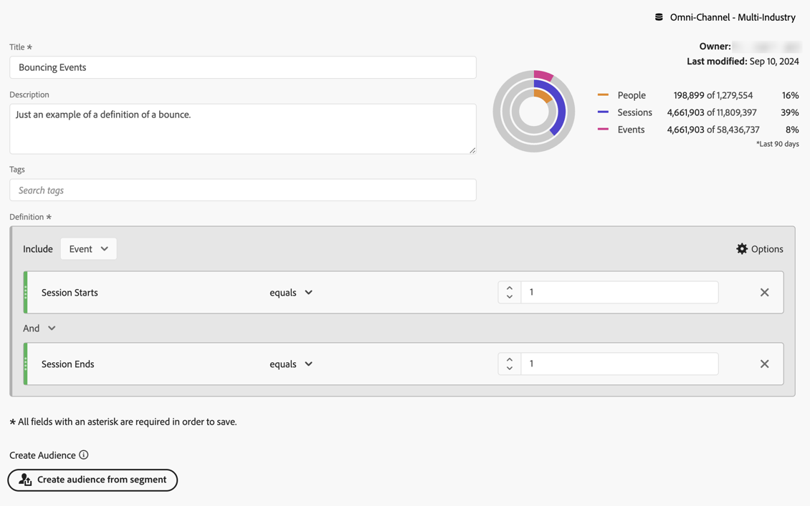
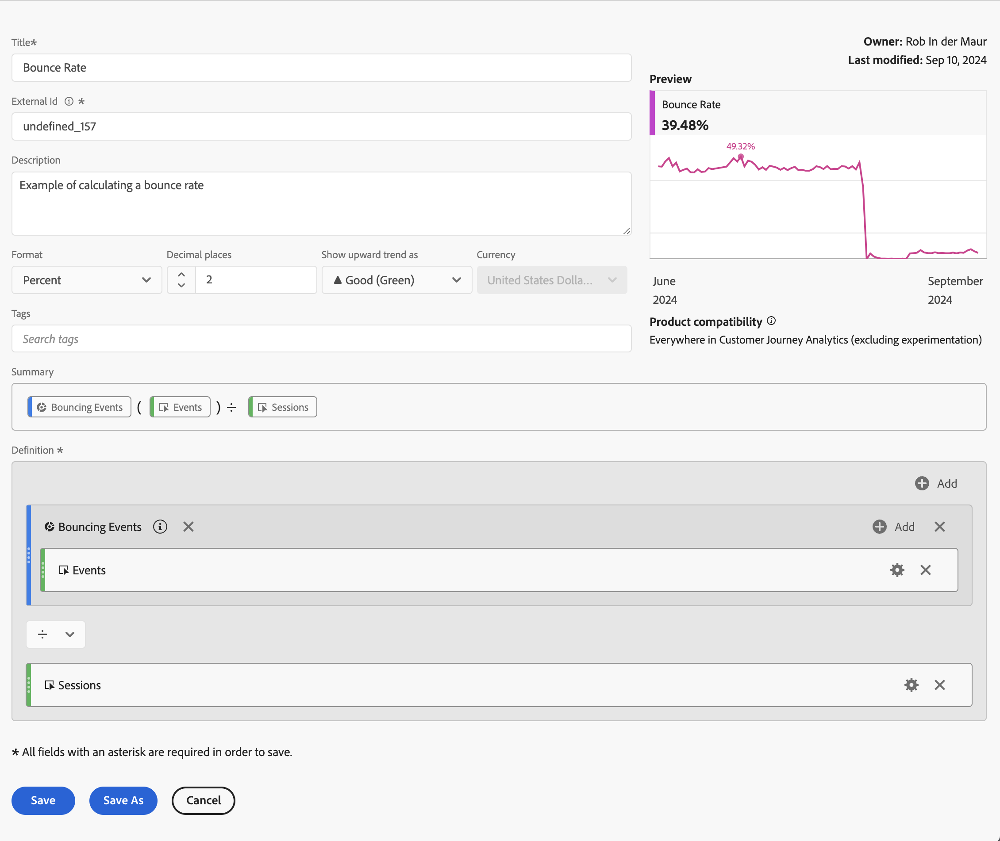
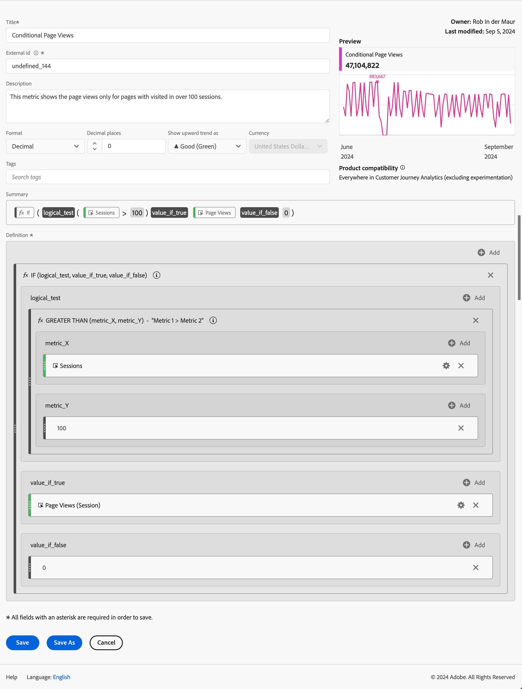
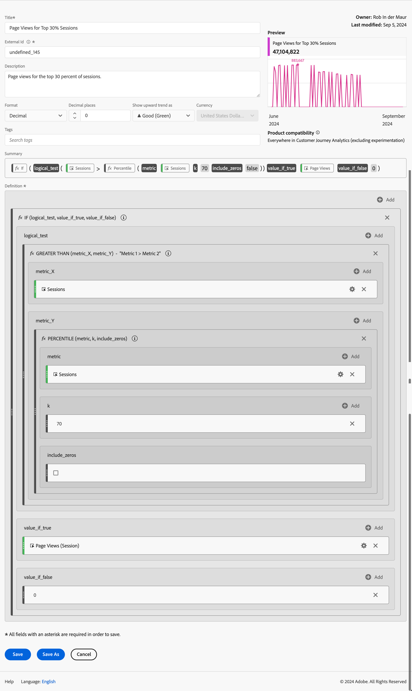

# Ejemplos de métricas calculadas

Este artículo muestra ejemplos de cómo definir métricas calculadas más avanzadas.

## Porcentaje de rebote

Desea calcular la tasa de salida hacia otro sitio.

+++ Detalles

La definición de una devolución está sujeta a otra discusión, pero en este ejemplo se define un filtro de Eventos rechazados en el que Inicio de sesión es igual a 1 y Fin de sesión es igual a 1. Utilice este filtro para definir la tasa de sesiones devueltas a las sesiones.

### Filtro

### Métrica calculada

### Campos derivados

También puede definir una [tasa de salida hacia otro sitio usando campos derivados](/help/data-views/derived-fields/derived-fields.md#bounces).

Los campos derivados forman parte de una vista de datos que tiene la ventaja de que no todos los usuarios pueden anular o modificar la definición de una métrica de Tasa de salida hacia otro sitio. Esa ventaja también introdujo una limitación. Los usuarios que no tienen acceso a una vista de datos no pueden utilizar campos derivados y tienen que recurrir a filtros y métricas calculadas para definir una tasa de salida hacia otro sitio.

Consulte para obtener más información sobre cómo calcular las devoluciones y la tasa de devoluciones en Customer Journey Analytics, esta [publicación de blog](https://experienceleaguecommunities.adobe.com/t5/adobe-analytics-blogs/calculating-bounces-amp-bounce-rate-in-adobe-customer-journey/ba-p/706446).

+++

## Vistas de página condicionales

Desea definir una métrica calculada que calcule solamente las vistas de página de las páginas que se han visitado en más de 100 sesiones.

+++ Detalles

+++

## Vistas de página de las principales sesiones del 30 %

Desea definir una métrica calculada que calcule solamente las vistas de página de las sesiones del 30 % principales.

+++ Detalles

+++
