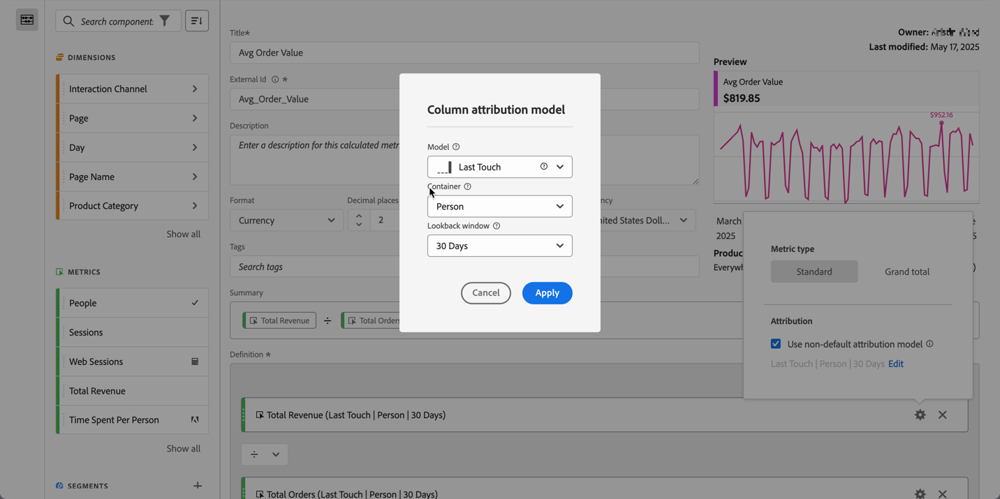

# Tipo de métrica y atribución

Puede configurar el tipo de métrica y [modelo de atribución](#attribution-models) para una métrica en una definición de métrica calculada.

1. Seleccione  en el componente de métrica.
1. En el cuadro de diálogo emergente:

   

   * Especifique el **[!UICONTROL tipo de métrica]**:

     | Tipo de métrica | Definición |
     |---|---|
     | **[!UICONTROL Estándar]** | Si una fórmula consiste en una única métrica estándar, muestra datos idénticos a los de su métrica no calculada homóloga. Las métricas estándar son útiles para crear métricas calculadas específicas para cada elemento de línea individual. 
Por ejemplo,  **[!UICONTROL Pedidos]**   **[!UICONTROL Sesiones]** toma los pedidos de ese elemento de línea específico y lo divide por el número de sesiones de ese elemento de línea específico. |
     | **[!UICONTROL Total general]** | Use **[!UICONTROL Total general]** para el período de informe en cada elemento de línea. Si una fórmula consiste en una única métrica de total general, la métrica calculada muestra el mismo número de total general en cada elemento de línea. Las métricas de total general son útiles cuando desea crear métricas calculadas que se comparen con los datos totales. 
Por ejemplo,  **[!UICONTROL Pedidos]**   **[!UICONTROL Sesiones totales]** muestra la proporción de pedidos en todas las sesiones, no solo las sesiones en el elemento de línea específico. En este ejemplo, especifique **[!UICONTROL Total general]** para la métrica  **[!UICONTROL Sesiones]** en la métrica calculada, lo que la convertirá automáticamente en  **[!UICONTROL Sesiones totales]**. |

   * Especifique **[!UICONTROL Atribución]**.

      1. Puede hacer lo siguiente:

         * Deshabilite **[!UICONTROL Usar modelo de atribución no predeterminado]** para usar el modelo de atribución de columna predeterminado, que es Último toque, con una ventana retrospectiva de 30 días.
         * Habilitar **[!UICONTROL Usar modelo de atribución no predeterminado]**. En el cuadro de diálogo **[!UICONTROL Modelo de atribución de columna]**,

            * Seleccione un **[!UICONTROL Modelo]** de los modelos de atribución.
            * Seleccione una **[!UICONTROL ventana retrospectiva]**. Si selecciona **[!UICONTROL Tiempo personalizado]**, puede definir el período de tiempo en **[!UICONTROL Minuto(s)]** hasta **[!UICONTROL Trimestre(s)]**. Consulte [Ventana retrospectiva](#lookback-window) para obtener más información

      1. Seleccione **[!UICONTROL Aplicar]** para aplicar el modelo de atribución no predeterminado. Seleccione Cancelar para cancelar.

     Si ya ha definido un modelo de atribución no predeterminado, seleccione **[!UICONTROL Editar]** para modificar la selección.

Consulte [Ejemplo](#example) para ver un ejemplo del uso de un modelo de atribución y una ventana retrospectiva.

## Atribución {#attribution}

<!-- markdownlint-disable MD034 -->

>[!CONTEXTUALHELP]
>id="components_calculatedmetrics_nondefaultattributionmodel"
>title="Uso de modelos de atribución no predeterminados"
>abstract="Habilite un modelo de atribución no predeterminado para la métrica seleccionada."

<!-- markdownlint-enable MD034 -->

<!-- markdownlint-disable MD034 -->

>[!CONTEXTUALHELP]
>id="components_calculatedmetrics_attributionmodel"
>title="Modelo"
>abstract="Seleccione un modelo de atribución para la métrica."

<!-- markdownlint-enable MD034 -->

<!-- markdownlint-disable MD034 -->

>[!CONTEXTUALHELP]
>id="components_calculatedmetrics_attribution_lasttouch"
>title="Último contacto"
>abstract="El 100 % del crédito se destina al último valor de dimensión visto por un visitante."

<!-- markdownlint-enable MD034 -->

<!-- markdownlint-disable MD034 -->

>[!CONTEXTUALHELP]
>id="components_calculatedmetrics_attribution_firsttouch"
>title="Primer contacto"
>abstract="El 100 % del crédito se destina al primer valor de dimensión visto por un visitante."

<!-- markdownlint-enable MD034 -->

<!-- markdownlint-disable MD034 -->

>[!CONTEXTUALHELP]
>id="components_calculatedmetrics_attribution_linear"
>title="Lineal"
>abstract="El crédito se distribuye de manera uniforme en todos los valores de dimensión."

<!-- markdownlint-enable MD034 -->

<!-- markdownlint-disable MD034 -->

>[!CONTEXTUALHELP]
>id="components_calculatedmetrics_attribution_participation"
>title="Participación"
>abstract="100 % de crédito a cada valor de dimensión visto por un visitante. Los totales de columna están sobreestimados."

<!-- markdownlint-enable MD034 -->

<!-- markdownlint-disable MD034 -->

>[!CONTEXTUALHELP]
>id="components_calculatedmetrics_attribution_sametouch"
>title="Mismo contacto"
>abstract="El crédito se otorga solo a los valores de dimensión que se producen en el mismo evento que la conversión."

<!-- markdownlint-enable MD034 -->

<!-- markdownlint-disable MD034 -->

>[!CONTEXTUALHELP]
>id="components_calculatedmetrics_attribution_ushaped"
>title="Forma de U"
>abstract="40 % de crédito al primer valor de dimensión, 40 % al último, 20 % compartido por el medio."

<!-- markdownlint-enable MD034 -->

<!-- markdownlint-disable MD034 -->

>[!CONTEXTUALHELP]
>id="components_calculatedmetrics_attribution_jcurve"
>title="Curva J"
>abstract="60 % de crédito al último valor de dimensión, 20 % al primero y 20 % compartido por el medio."

<!-- markdownlint-enable MD034 -->

<!-- markdownlint-disable MD034 -->

>[!CONTEXTUALHELP]
>id="components_calculatedmetrics_attribution_inversej"
>title="J inversa"
>abstract="60 % de crédito al primer valor de dimensión, 20 % al último, 20 % compartido por el medio."

<!-- markdownlint-enable MD034 -->

<!-- markdownlint-disable MD034 -->

>[!CONTEXTUALHELP]
>id="components_calculatedmetrics_attribution_timedecay"
>title="Deterioro de tiempo"
>abstract="Los valores de dimensión más cercanos en el tiempo a una conversión obtienen la mayor cantidad de crédito."

<!-- markdownlint-enable MD034 -->

<!-- markdownlint-disable MD034 -->

>[!CONTEXTUALHELP]
>id="components_calculatedmetrics_attribution_custom"
>title="Personalizado"
>abstract="Defina su propia ponderación de atribución basada en la posición."

<!-- markdownlint-enable MD034 -->

<!-- markdownlint-disable MD034 -->

>[!CONTEXTUALHELP]
>id="components_calculatedmetrics_attribution_algorithmic"
>title="Algorítmico"
>abstract="El crédito se determina de forma dinámica mediante un algoritmo estadístico."

<!-- markdownlint-enable MD034 -->

{{attribution-models-details}}

### Ventana retroactiva {#lookback-window}

<!-- markdownlint-disable MD034 -->

>[!CONTEXTUALHELP]
>id="components_calculatedmetrics_attribution_lookbackwindow"
>title="Ventana retroactiva"
>abstract="Este ajuste determina la ventana de atribución de datos que se aplicará a cada conversión."

<!-- markdownlint-enable MD034 -->

{{attribution-lookback-window}}

### Ejemplo de atribución {#attribution-example}

Consideremos el siguiente ejemplo:

1. El 15 de septiembre, una persona llega a su sitio a través de un anuncio de búsqueda de pago y luego lo abandona.
1. El 18 de septiembre, la persona regresa a su sitio a través de un vínculo de medios sociales que obtuvo de un amigo. Agregan varios artículos al carro, pero no compran nada.
1. El 24 de septiembre, su equipo de marketing les enviará un correo electrónico con un cupón para algunos de los artículos del carrito. Aplican el cupón, pero visitan otros sitios para ver si hay otros cupones disponibles. Encontraron otro a través de un anuncio y finalmente hicieron una compra por valor de 50 dólares.

Según la ventana retrospectiva y el modelo de atribución, los canales reciben crédito diferente. A continuación se muestran algunos ejemplos:

* Con **primer contacto** y una **ventana retrospectiva de sesión**, la atribución solo se fijará en la tercera visita. Entre el correo electrónico y la visualización, el correo electrónico fue el primero, por lo que el correo electrónico recibe un 100% de crédito por la compra de 50 dólares.

* Con **primer contacto** y una **ventana retrospectiva de persona**, la atribución se fijará en las tres visitas. La búsqueda de pago fue la primera, así que recibe un 100% de crédito por la compra de 50 dólares.

* Con **linear** y una ventana retrospectiva de **sesión**, el crédito se divide entre el correo electrónico y la visualización. Cada uno de estos canales recibe un crédito de 25 dólares.
Con **linear** y una **ventana retrospectiva de persona**, el crédito se divide entre la búsqueda de pago, el medio social, el correo electrónico y la visualización. Cada canal recibe un crédito de 12,50 dólares por esta compra.

* Con **J-shape** y una **ventana retrospectiva de persona**, el crédito se divide entre la búsqueda de pago, el medio social, el correo electrónico y la visualización.

   * Se otorga un crédito del 60 % a la visualización, es decir, 30 dólares.
   * El 20 % de crédito se asigna a la búsqueda de pago, 10 dólares en este caso.
   * El 20% restante se divide entre el medio social y el correo electrónico, lo que otorga 5 dólares a cada uno.

* Con **Deterioro de tiempo** y una **ventana retrospectiva de persona**, el crédito se divide entre la búsqueda de pago, el medio social, el correo electrónico y la visualización. Con la semivida de 7 días predeterminada:

   * Diferencia de cero días entre el punto de contacto de visualización y la conversión. `2^(-0/7) = 1`
   * Diferencia de cero días entre el punto de contacto del correo electrónico y la conversión. `2^(-0/7) = 1`
   * Diferencia de seis días entre el punto de contacto social y la conversión. `2^(-6/7) = 0.552`
   * Diferencia de nueve días entre el punto de contacto de búsqueda de pago y la conversión. `2^(-9/7) = 0.41`
   * La normalización de estos valores resulta en lo siguiente:

      * Visualización: 33,8 %, 16,88 dólares
      * Correo electrónico: 33,8 % 16,88 dólares
      * Medio social: 18,6 %, 9,32 dólares
      * Búsqueda de pago: 13,8 %, 6,92 dólares

Los eventos de conversión que generalmente tienen números enteros se dividen si el crédito pertenece a más de un canal. Por ejemplo, si dos canales contribuyen a un pedido mediante un modelo de atribución lineal, ambos canales obtienen 0,5 de ese pedido. Estas métricas parciales se suman en todas las personas y luego se redondean al entero más cercano para los informes.

>[!MORELIKETHIS]
>
>[Configuración del componente de atribución](/help/data-views/component-settings/attribution.md)
>[Métrica de participación ](participation-metric.md)
>

