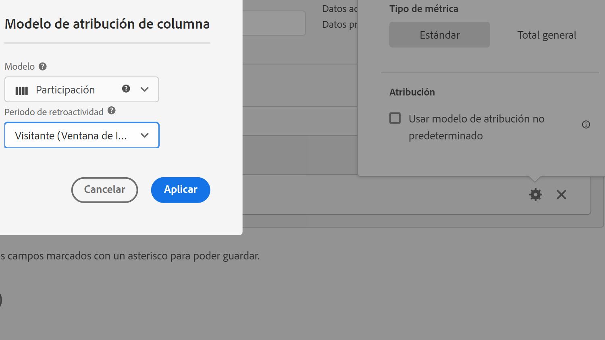

# Tipo de métrica y atribución

Si selecciona el icono de engranaje junto a una métrica, puede especificar el tipo de métrica y el modelo de atribución.

## Tipo de métrica

| Tipo de métrica | Definición |
|---|---|
| Estándar | Estas métricas son las mismas métricas utilizadas en los informes de [!DNL Analytics] estándares. Si una fórmula consiste en una única métrica estándar, muestra datos idénticos a los de su métrica no calculada homóloga. Las métricas estándar son útiles para crear métricas calculadas específicas para cada elemento de línea individual. Por ejemplo, [Pedidos] / [Visitas] toma pedidos de ese elemento de línea en concreto y lo divide por el número de visitas de ese elemento de línea específico. |
| Total | Utilice el total para el periodo de generación de informes de cada elemento de línea. Si una fórmula consiste en una única métrica total, muestra el mismo número total en cada elemento de línea. Las métricas totales son útiles para crear métricas calculadas que se comparan con los datos totales del sitio. Por ejemplo, [Pedidos] / [Visitas totales] muestra la proporción de pedidos en comparación con TODAS las visitas de su sitio, no solo las visitas de una línea en concreto. |

## Atribución

>[!IMPORTANT]
>Para obtener una lista completa de los modelos de atribución no predeterminados y de las ventanas retroactivas, consulte [Modelos de atribución y ventanas retroactivas](/help/analysis-workspace/attribution/models.md).

