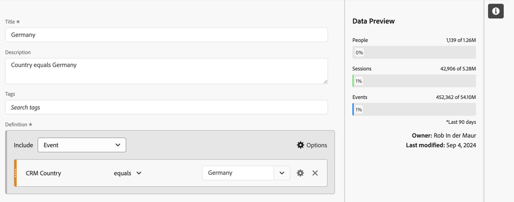
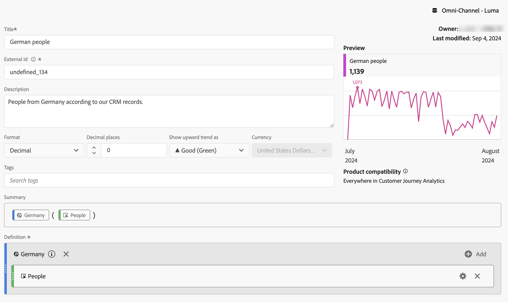
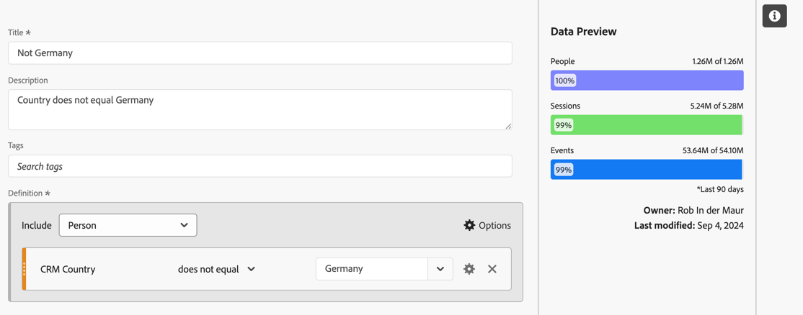
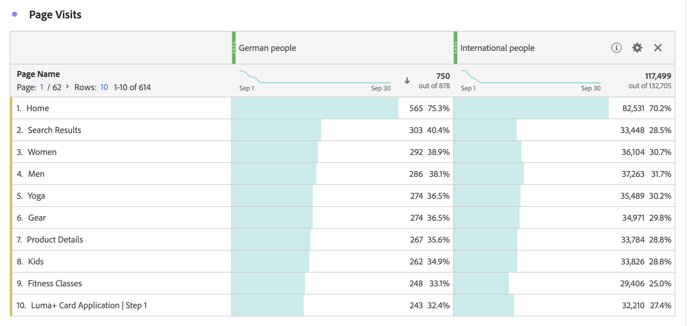
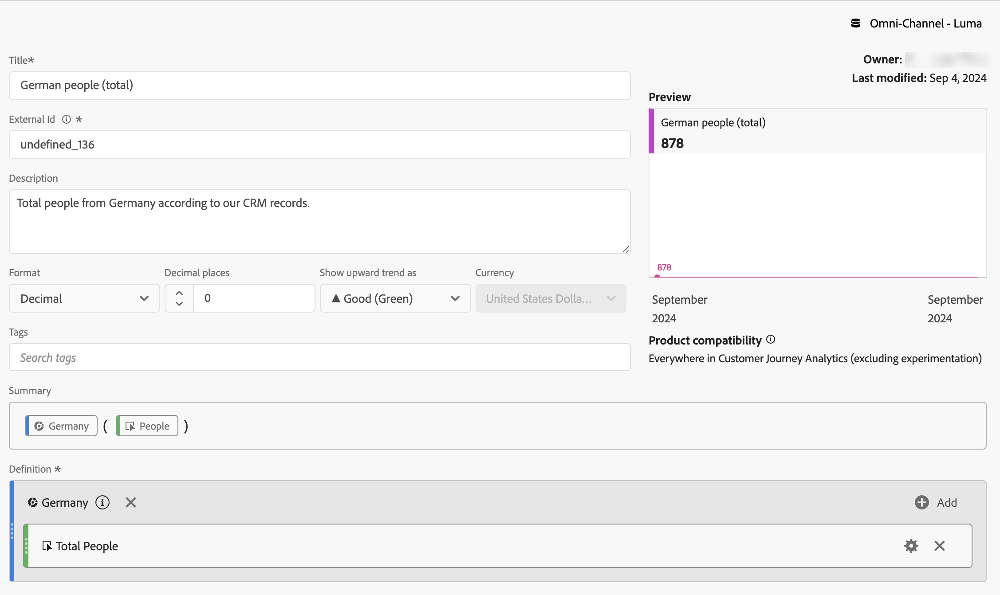
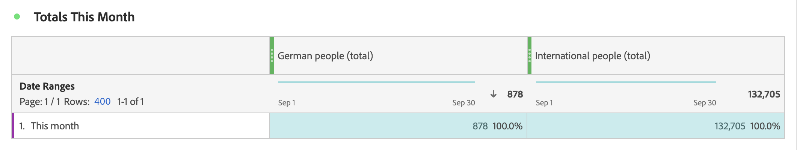
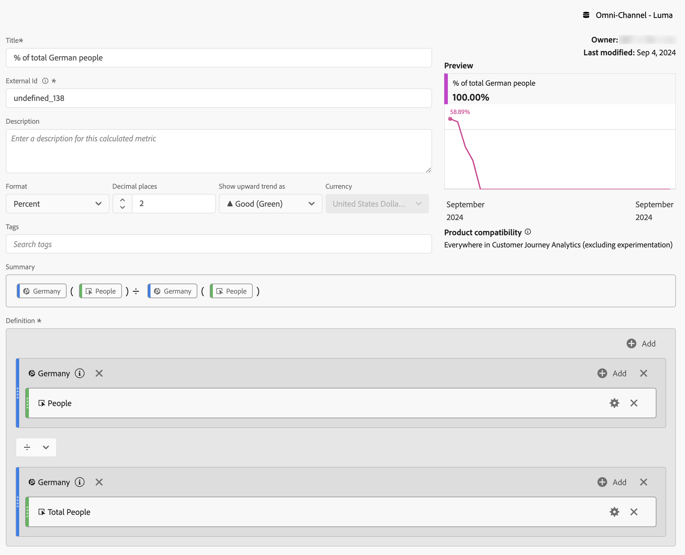
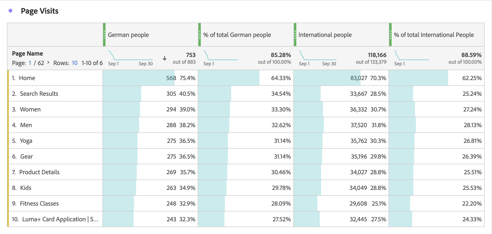

# Métricas filtradas

En el [Creador de métricas calculadas](cm-build-metrics.md#definition-builder), puede aplicar filtros dentro de su definición de métrica. La aplicación de filtros es útil si desea utilizar métricas para un subconjunto de los datos en el análisis.

>[!NOTE]
>
>Las definiciones de filtros se actualizan a través de [Generador de filtros](/help/components/filters/filter-builder.md). Si realiza un cambio en un filtro, este se actualiza automáticamente en todos los lugares en los que se utiliza, incluso si el filtro forma parte de una definición de métrica calculada.
>

Desea comparar las métricas de los alemanes que interactúan con su marca con las de otros fuera de Alemania. Por lo tanto, puede responder preguntas como:

1. ¿Cuántas personas alemanas o internacionales están visitando tus [páginas más populares](#popular-pages)?
1. ¿Cuántas personas alemanas versus internacionales en [total](#totals) han interactuado en línea con su marca este mes?
1. ¿Cuáles son los [porcentajes](#percentages) de alemanes y personas internacionales que han visitado tus páginas populares?

Consulte las secciones siguientes para ilustrar cómo las métricas filtradas pueden ayudarle a responder a estas preguntas. Si procede, se hace referencia a documentación más detallada.

## Páginas populares

1. [Cree una métrica calculada](cm-workflow.md) a partir de un proyecto de Workspace, denominado `German people`.
1. Desde el [Creador de métricas calculadas](cm-build-metrics.md), [cree un filtro](/help/components/filters/filter-builder.md), con el título `Germany`, que use el campo País de CRM a partir de los datos de CRM para determinar de dónde proviene una persona.

   >[!TIP]
   >
   >En el Creador de métricas calculadas, puede crear un filtro directamente mediante el panel Componentes.
   >   

   El filtro podría tener el aspecto siguiente.

   

1. De nuevo en el Creador de métricas calculadas, utilice el filtro para actualizar la métrica calculada.

   

Repita los pasos anteriores para la versión internacional de la métrica calculada.

1. Cree una métrica calculada a partir del proyecto de Workspace, con el título `International people`.
1. Desde el Creador de métricas calculadas, cree un filtro, con el título `Not Germany`, que use el campo País de CRM a partir de los datos de CRM para determinar de dónde proviene una persona.

   El filtro debe tener el aspecto siguiente:.

   

1. De nuevo en el Creador de métricas calculadas, utilice el filtro para actualizar la métrica calculada.

   

1. Cree un proyecto en Analysis Workspace, donde vea las páginas visitadas por personas alemanas e internacionales.

   

## Totales

1. Cree dos nuevos filtros basados en el Total general. Abra todos los filtros creados anteriormente, cambie el nombre del filtro, establezca el **[!UICONTROL Tipo de métrica]** para **[!UICONTROL Personas]** en **[!UICONTROL Total general]** y use **[!UICONTROL Guardar como]** para guardar el filtro con el nuevo nombre. Por ejemplo:

   

1. Agregue una nueva visualización de tabla de forma libre a su proyecto de Workspace, que muestra las páginas totales de este mes.

   

## Porcentajes

1. Cree dos nuevas métricas calculadas que calculen un porcentaje a partir de las métricas calculadas creadas anteriormente.

   

1. Actualice el proyecto de Workspace.

   

+++ Este es un vídeo que ilustra cómo utilizar una métrica calculada filtrada como métrica sin implementación.

>[!VIDEO](https://video.tv.adobe.com/v/25407/?quality=12)

{{videoaa}}

+++
