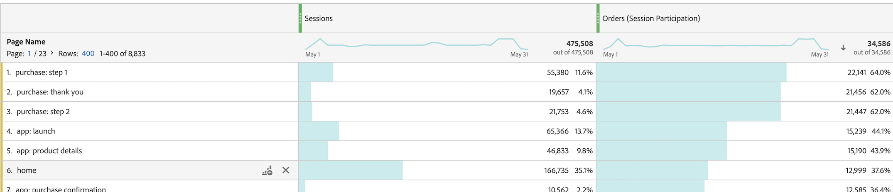

# Métrica de participación

Veamos un caso de uso sencillo. Usted es el propietario de cierto contenido y quiere averiguar las páginas que han contribuido (es decir, participado) a obtener visitas que contenían un registro por correo electrónico. A continuación se muestra cómo:

>[!NOTE]
>
>Anteriormente, este procedimiento se realizaba mediante Herramientas de administración. Aún puede habilitar métricas de participación en Herramientas de administración, pero solo para los eventos personalizados 1-100.

Veamos un caso de uso sencillo. Usted es el propietario de cierto contenido y quiere averiguar las páginas que han contribuido a obtener visitas que contenían un registro por correo electrónico. A continuación se muestra cómo:

1. Cree una nueva métrica en el Creador de métricas calculadas.
1. Arrastre el evento de éxito “Pedidos” al lienzo Definición.
1. Cambie el [modelo de atribución](/help/components/calc-metrics/cm-workflow/m-metric-type-alloc.md) de ese evento a **[!UICONTROL Participación]** en el icono de engranajes de **[!UICONTROL Configuración]**. Seleccione **[!UICONTROL Visita]** retrospectiva. La definición debería tener un aspecto parecido al siguiente:

   

1. Guarde la métrica.
1. Utilice la métrica calculada en un informe **[!UICONTROL Páginas]**.

   

1. (Opcional) Comparta la métrica con otros usuarios de su organización.
