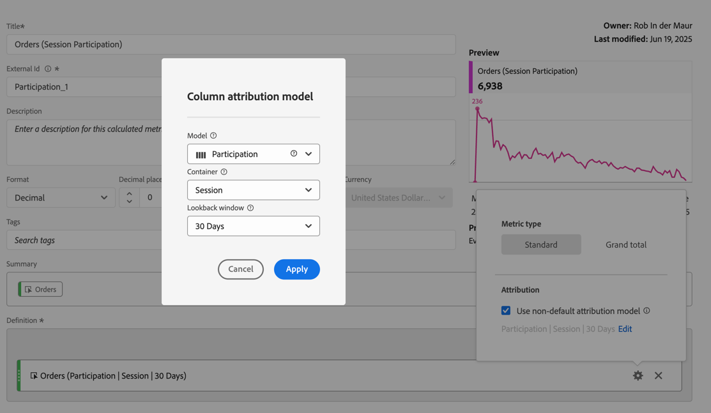
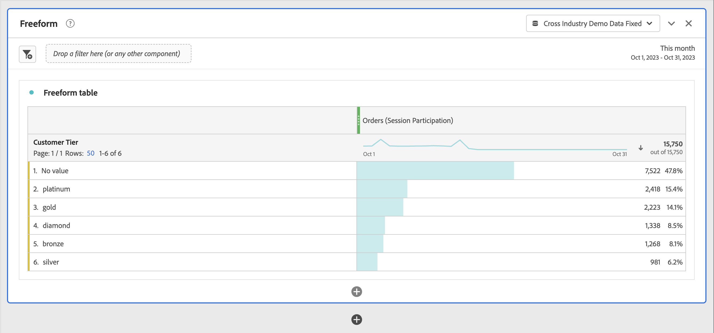

# Métricas de participación

Las métricas de participación se utilizan para cuantificar la forma en que los valores individuales de una dimensión (como Vistas de página) contribuyen a las sesiones que contienen una métrica específica (como Pedidos) o participan en ellas.

>[!NOTE]
>
>Los administradores pueden crear métricas con modelos de atribución no predeterminados, como Participación, como parte de una [vista de datos](https://experienceleague.adobe.com/en/docs/analytics-platform/using/cja-dataviews/data-views). Consulte [Configuración del componente de atribución](../../../data-views/component-settings/attribution.md) para obtener más información.

Los pasos siguientes muestran cómo cualquier usuario con [Crear permiso de métrica calculada](/help/technotes//access-control.md#user-level-access) puede crear una métrica de participación.

1. [Cree una métrica calculada](cm-workflow.md) y, en el [creador de métricas calculadas](cm-build-metrics.md), asigne un nombre a la métrica `Participation` o similar.
1. Arrastre una métrica que contenga un evento de éxito, por ejemplo [!DNL Orders], al área [!UICONTROL **[!UICONTROL Definición]**].
1. Seleccione  para la métrica.
1. En la ventana emergente que aparece, seleccione **[!UICONTROL Usar un modelo de atribución no predeterminado]** para definir el [modelo de atribución](/help/components/calc-metrics/cm-workflow/m-metric-type-alloc.md) de ese evento en **[!UICONTROL Participación]** y seleccione **[!UICONTROL Sesión]** para la [!UICONTROL ventana retrospectiva]. Seleccione **[!UICONTROL Aplicar]** para confirmar.

   

   **(Partición|Sesión)** se ha agregado al nombre del componente de métrica.

1. Seleccione [!UICONTROL **Guardar**] para guardar la métrica.
1. Utilice la métrica calculada en el informe. Por ejemplo, use la métrica [!DNL Orders (Session Participation)] calculada en un informe para mostrar qué nivel de cliente contribuyó a sesiones que contenían un pedido o participó en ellas.

   
