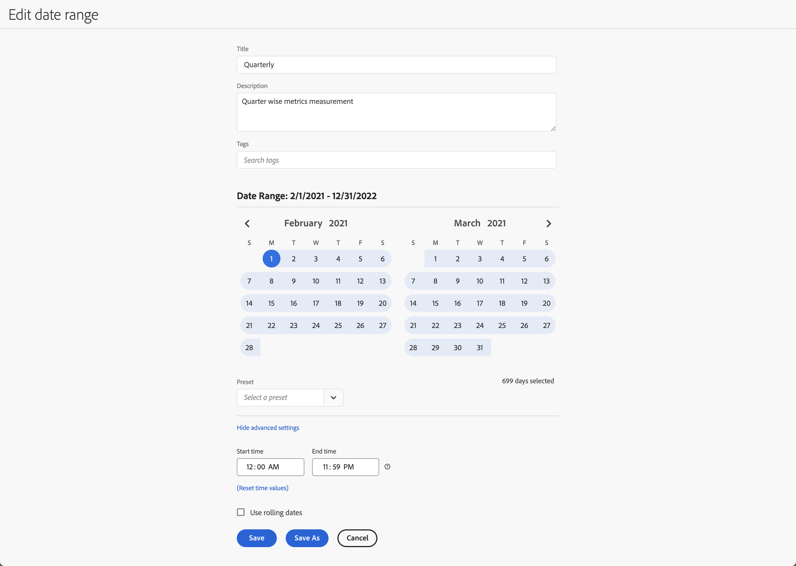

# Crear intervalos de fechas


Cualquiera puede crear un intervalo de fechas personalizado. Puede crear un intervalo de fecha de las siguientes maneras:


* **A**. En la interfaz principal, seleccione **[!UICONTROL Componentes]** y seleccione **[!UICONTROL Intervalo de fecha]**. Seleccione  **[!UICONTROL Add]** del administrador de [[!UICONTROL intervalo de fechas]](/help/components/date-ranges/manage.md).
* **B**. En un proyecto de Workspace, en el menú contextual de una visualización, seleccione **[!UICONTROL Intervalo de fechas personalizado a este intervalo de fechas]**.
* **C**. En un proyecto de Workspace, seleccione **[!UICONTROL Componentes]** en el menú y seleccione **[!UICONTROL Crear intervalo de fechas]**
* **D**. En un proyecto de Workspace, use el acceso directo **[!UICONTROL ctrl+mayús+d]** (Windows) o **[!UICONTROL mayús+comando+d]** (macOS).
* **E**. En un proyecto de Workspace, en el panel izquierdo Componentes, seleccione  en  **Intervalos de fechas**.
* **F**. En una visualización compatible, como una visualización de líneas, desde el menú contextual de un punto de datos, seleccione **[!UICONTROL Anotar selección]**.

Para definir la anotación, utilice el [[!UICONTROL Generador de intervalos de fechas]](#annotation-builder):

<!-- Should we really mention API here. If so, we can do it all over the place in the docs...
| **Use the [Customer Journey Analytics Annotations API](https://developer.adobe.com/cja-apis/docs/endpoints/annotations/)** | The Customer Journey Analytics Annotations APIs allow you to create, update, or retrieve annotations programmatically through Adobe Developer. These APIs use the same data and methods that Adobe uses inside the product UI. |
-->


## Generador de intervalos de fechas {#date-range-builder}

<!-- markdownlint-disable MD034 -->

>[!CONTEXTUALHELP]
>id="components_dateranges_endtime"
>title="Hora de finalización"
>abstract="Las horas de finalización siempre incluyen 59 segundos."

<!-- markdownlint-enable MD034 -->


El cuadro de diálogo **[!UICONTROL Nuevo intervalo de fechas]** o **[!UICONTROL Editar intervalo de fechas]** se usa para crear intervalos de fechas nuevos o editar los existentes.




1. Especifique un **[!UICONTROL Título]** para el intervalo de fechas. Por ejemplo, **[!UICONTROL trimestral]**.
1. Opcionalmente, especifique **[!UICONTROL Descripción]**.
1. Organice el filtro creando o aplicando una o más **[!UICONTROL Etiquetas]**. Empieza a escribir para buscar las etiquetas existentes que puedes seleccionar. O presione **[!UICONTROL ENTRAR]** para agregar una etiqueta nueva. Seleccione  para quitar una etiqueta. |
1. Seleccione un **[!UICONTROL intervalo de fechas]** seleccionando primero la fecha de inicio y luego la fecha de finalización.
También puedes seleccionar un **[!UICONTROL ajuste preestablecido]** en el menú desplegable [!UICONTROL *Seleccionar un ajuste preestablecido*].

1. De manera opcional, selecciona **[!UICONTROL Mostrar configuración avanzada]** para:

   * Especifica **[!UICONTROL Hora de inicio]** y **[!UICONTROL Hora de finalización]** distintas de las `12:00 AM` (`0:00`) y `11:59 PM` (`23:59`) predeterminadas. Los tiempos de finalización siempre incluyen 59 segundos. Para un intervalo de fechas que abarca muchos días, la hora de inicio se aplica al primer día del intervalo de fechas y la hora de finalización se aplica al último día del intervalo de fechas. Usa **[!UICONTROL (Restablecer valores de tiempo)]** para restablecer los valores predeterminados de las horas de inicio y finalización.
   * **[!UICONTROL Usar fechas móviles]**. Si se habilita, los intervalos de fechas preestablecidos como **[!UICONTROL últimos 7 días completos]** se actualizarán dinámicamente como el progreso actual de fecha y hora. Si está desactivado, estos ajustes preestablecidos no se actualizan una vez aplicados.

     Puede seleccionar el texto entre corchetes (por ejemplo **[!UICONTROL inicio fijo - desplazamiento trimestral]**) para ampliar el panel y especificar detalles para **[!UICONTROL Inicio]** y **[!UICONTROL Final]**.

     

      1. Selecciona **[!UICONTROL Inicio de]**, **[!UICONTROL Fin de]** o **[!UICONTROL Día fijo]**.
      1. Cuando hayas seleccionado **[!UICONTROL Inicio de]** o **[!UICONTROL Final de]**, puedes generar una expresión completa. Por ejemplo: **[!UICONTROL Fin de]** **[!UICONTROL trimestre actual]** **[!UICONTROL minus]** `20` **[!UICONTROL días]**. Elige el valor apropiado para cada parte individual de la expresión.
         * Selecciona valor para actual. Por ejemplo, **[!UICONTROL trimestre actual]**.
         * Selecciona un valor para realizar cálculos adicionales. Por ejemplo, **[!UICONTROL minus]**.
         * Cuando haya especificado un cálculo adicional, especifique un valor. Por ejemplo, `20`.
         * Cuando haya especificado un cálculo adicional, seleccione el período de tiempo que desea utilizar para el cálculo. Por ejemplo, **[!UICONTROL días]**.

     Selecciona **[!UICONTROL Ocultar detalles]** para ocultar los detalles del cálculo de fechas móviles.

1. Seleccione :
   * **[!UICONTROL Guardar]** para guardar el intervalo de fechas.
   * **[!UICONTROL Guardar como]** para guardar una copia del intervalo de fechas.
   * **[!UICONTROL Cancelar]** para cancelar los cambios realizados en el intervalo de fechas o cancelar la creación de un nuevo intervalo de fechas.


<!--


You can create a date range using either of the following two methods:

* Directly in a workspace project by clicking the '`+`' button next to the list of date range components on the left
* Within the date range manager

To create a date range in the date range manager:

1. Log in to [analytics.adobe.com](https://analytics.adobe.com) using your AdobeID credentials.
1. Navigate to [!UICONTROL Components] > [!UICONTROL Date Ranges].
1. Click the [!UICONTROL Add] button to open the modal window that creates a date range.

## Create a date range modal window

The modal window has four fields you can edit:

* **Date range**: The date range you want for this component.
* **Title**: The name you want for this component. The title is used in workspace projects.
* **Description**: The description you want for this component. The description is seen when clicking the  icon.
* **Tags**: Use tags to organize your date ranges. A date range can belong to multiple tags.

## Selecting a date range

When clicking the date range in the modal window, you have several options:

* **Calendar**: Select the start and end date.
* **Use rolling dates**: Check this box if you want the date range to change as time goes on. Do not check this box if you want your date range to remain static.
* **Select preset**: Use this drop-down selection if you want a custom date range based on a range that Adobe offers by default. When you select a preset, you can further customize the date range to suit your needs. It does not affect the preset that Adobe offers.

## Rolling date ranges

If you want a rolling date range, you can customize when it rolls. You can control when the start and end dates roll independently of each other.

* **When the date starts**: Choose if the date starts at the beginning of a time period, at the end of a time period, or use a fixed day.
* **The time period to use**: Choose how often the date range rolls. You can have it roll every day, every week, every month, every quarter, or every year.
* **Offset**: Choose the offset of the date range. You can add or subtract days, weeks, months, quarters, or years.

## Rolling date examples

Some date ranges can be useful in certain reports.

Year-to-date:

```text
Start: Start of current year
End: End of current day
```

Last Thursday to this Thursday:

```text
Start: Start of current week minus 3 days
End: Start of current week plus 4 days
```

Fiscal year (for example, if a fiscal year starts in December)

```text
Start: Start of current year minus 1 month
End: End of current year minus 1 month
```


-->
