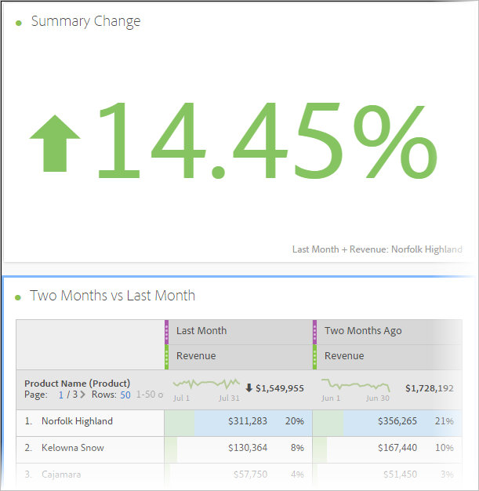

# Crear intervalos de fechas

Puede crear intervalos de fechas personalizados en Analysis Workspace y guardarlos como componentes de tiempo.

Para obtener información acerca de cómo agregar intervalos de fechas existentes a un proyecto, vea [Resumen de calendario e intervalos de fechas](/help/components/date-ranges/calendar.md).

Para crear un intervalo de fechas personalizado:

1. En Adobe Analytics, seleccione **[!UICONTROL Componentes]** > **[!UICONTROL Intervalos de fechas]**.

   

1. Seleccione [!UICONTROL **Crear nuevo intervalo de fechas**].

1. En el Generador de intervalos de fechas, especifique la siguiente información:

   | Opción | Descripción |
   |---------|----------|
   | [!UICONTROL **Título**] | El título del intervalo de fechas tal como aparecerá cuando los usuarios lo seleccionen en Analysis Workspace. |
   | [!UICONTROL **Descripción**] | Una descripción para el intervalo de fechas. |
   | [!UICONTROL **Etiquetas**] | Las etiquetas que desee aplicar al intervalo de fechas. |
   | [!UICONTROL **Intervalo de fecha**] | Permite elegir un intervalo de fechas personalizado. De forma predeterminada, se seleccionan los últimos 30 días. |
   | [!UICONTROL **Ajuste preestablecido**] | Elija de una lista de intervalos de fechas preestablecidos, como [!UICONTROL **Ayer**], [!UICONTROL **Últimos 7 días**], [!UICONTROL **Últimos 30 días**], etc. |
   | [!UICONTROL **Hora de inicio**] | Hora del día a la que comienza el intervalo de fechas. |
   | [!UICONTROL **Hora de finalización**] | Hora del día a la que finaliza el intervalo de fechas. |
   | [!UICONTROL **Usar fechas móviles**] | Las fechas móviles le permiten generar un informe dinámico que observa un periodo de tiempo anterior o posterior basándose en el momento en el que ejecuta el informe. Por ejemplo, si desea un informe sobre todos los pedidos realizados el “último mes” (basándose en el campo Fecha de creación) y se ejecuta dicho informe en diciembre, verá los pedidos realizados en noviembre. Si ejecutara ese mismo informe en enero, vería los pedidos realizados en diciembre.<ul><li>**[!UICONTROL Vista previa de fecha]**: indica qué periodo de tiempo incluye el calendario móvil.</li><li>**[!UICONTROL Inicio]**: puede elegir entre el día, la semana, el mes, el trimestre o el año actuales.</li><li>**[!UICONTROL Fin]**: puede elegir entre el día, la semana, el mes, el trimestre o el año actuales.</li></ul> Seleccionado de forma predeterminada. |

1. Seleccione [!UICONTROL **Guardar**].

## Ejemplo: Intervalo de fechas para &quot;Dos meses atrás&quot; {#section_C4109C57CB444BB2A79CC8082BD67294}

El siguiente intervalo de fechas personalizado muestra un intervalo de fechas para “dos meses atrás”, con una visualización de cambio de resumen que muestra el cambio direccional.

El intervalo de fechas personalizado se muestra en la parte superior del panel de componente [!UICONTROL Intervalo de fechas] del proyecto:

Puede arrastrar este intervalo de fechas personalizado en un columna a lo largo de un intervalo de fechas móvil mensual mediante el valor preestablecido Último mes para ver una comparación. Agregue una visualización de cambio de resumen y seleccione los totales de cada columna para mostrar un cambio direccional:

## Ejemplo: Uso de un intervalo de fechas móvil de 7 días {#section_7EF63B2E9FF54D2E9144C4F76956A8DD}

Puede crear un intervalo de fechas que especifique una ventana móvil de 7 días y que termine hace una semana:

Usar *`rolling daily`*.

* La configuración de inicio sería *`current day minus 6 days`*.

* La configuración de fin sería *`current day minus 7 days`*.

Este intervalo de fechas puede ser un componente que arrastre en cualquier tabla de forma libre.
